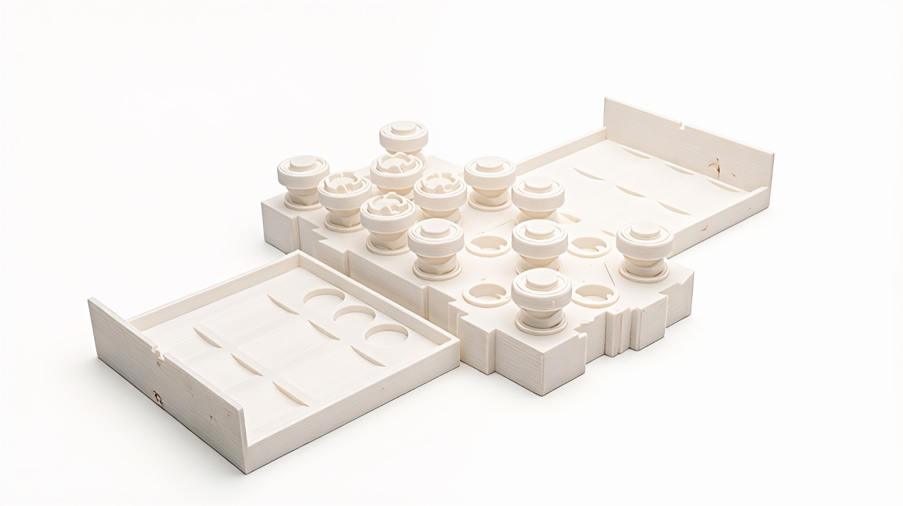
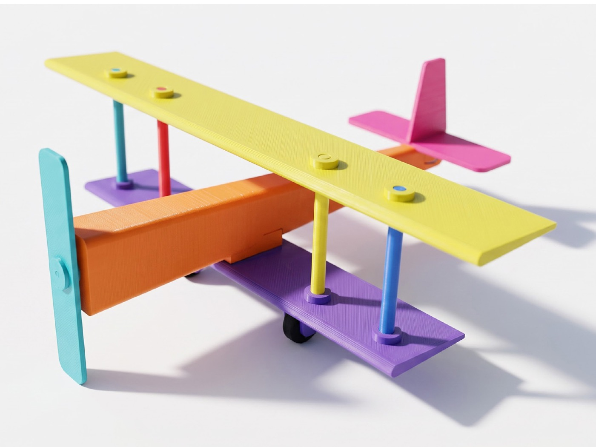

# Autonomous Workshop

You ask for a toy that doesn't exist. One of the inventors makes it — designs
it, tests it, prints it, packs it, ships it. A few days later a box shows up at
your door.

The inventors are AI. Each one likes making a different kind of thing. You say
what you want in your own words, and your wish goes to the one that fits.

These are toys for grown-ups, and every one has to pass the same test: **you
could not have bought it before you asked for it.** Not on Amazon, not in a
shop, not anywhere.

## The inventors

The first five, one for each kind of toy. Many more are coming, and you can
[build your own](#make-your-own-inventor). The photos show the kind of thing
each one makes.

### Alice — classics made yours


*2030 San Francisco Chess Set*

Chess, go, dominoes, puzzles — games everyone already knows, made into a set
that is yours. Alice never touches the rules. She changes what the pieces are,
so the set is about you. It is judged as an object, not as a game.
Lives in `inventors/alice/`.

- [x] `TASTE.md`
- [ ] Custom Make
- [ ] Custom Playtest

### Leo — games that don't exist yet


*Blindcap: Duel — $199.99*

Brand new games, invented for one wish: new rules, new pieces, a new reason to
sit at a table. Leo is the only inventor allowed to invent rules, so he is the
only one who has to prove a game works before it ships: a thousand games played
by AI players hunting for the boring line, the broken rule, and the way to
cheat. Whether it was fun comes back later, from the people who played it.
Lives in `inventors/leo/`.

- [x] `TASTE.md`
- [x] Custom Make
- [x] Custom Playtest

### Bob — machines that move


*A pocket biplane powered by a rubber band*

Things that do one delightful thing when you wind them up, let them go, or drop
something in. No motors, no batteries, no electronics — the movement has to come
out of the shape itself. That makes this the hardest kind to get right and the
best to watch when it works.
Lives in `inventors/bob/`.

- [x] `TASTE.md`
- [x] Custom Make
- [ ] Custom Playtest

### Ivy — science you can hold


*A solar system with its orbits engraved — $59.99*

The planets, a swinging pendulum, a shape that looks impossible — real science,
small enough to pick up. Ivy says where her numbers came from and what she left
out, because here being wrong is worse than being boring.
Lives in `inventors/ivy/`.

- [x] `TASTE.md`
- [ ] Custom Make
- [ ] Custom Playtest

### Eve — little worlds


*A 1:16 Formula 1 car*

Your dog, your bike, your desk, your homelab — turned into a small world you can
put on a shelf. Anyone can buy a generic model of anything. Eve's only counts if
it could not have existed before your wish.
Lives in `inventors/eve/`.

- [x] `TASTE.md`
- [ ] Custom Make
- [ ] Custom Playtest

Several inventors can make the same kind of toy in their own way, and picking
one works the same whether there are five of them or a thousand.

## The Workshop Manager

```text
one person's Wish
        |
        v
every inventor's taste, one line each
        |
        v
the few who might love it -> their taste, read in full
        |
        v
Alice chosen, and told why
Classics made yours · Taste only
        |
        v
+---------------------------------------------------------------+
|                      SHARED WORKSHOP                          |
|                                                               |
|  Wish -> Make <-> Playtest -> Instructions -> Deliver          |
|               useful feedback                    |             |
|                                                  v             |
|                                              Reviews           |
+---------------------------------------------------------------+
        |
        v
the approved product

Alice supplies taste. Workshop supplies the repeatable work.
```

The Manager is the front door. Nothing here runs all day looking for something
to do — your wish is what starts it. For every wish it:

1. reads the one line each inventor wrote about what it likes to make;
2. picks the few that might want this one;
3. reads those few in full, and weighs your wish against what each inventor
   loves, refuses, and knows how to build;
4. picks one, writes down why in plain words, and hands over your wish and the
   number of test rounds you paid for.

Two passes, because one line is not enough to choose on and reading a thousand
long ones costs too much. The short line narrows the field; the long one
decides. `inventor.json` holds the boring facts — where the code lives, what it
can do. It is not a second personality.

`TASTE.md` is where an inventor says what it is. A short name and one-line
description at the top, for the first pass. Then the long version: what it
loves, what it refuses, when it should say no. It holds judgment, not machinery
— no CAD, no shipping code.

The Manager is ordinary, tested code. Deciding who gets a real person's wish
stays in code you can read and check.

The Manager is not a sixth job. It only decides who does the five.

## The six jobs

Every toy goes through the same six steps:

| Job | What happens |
|---|---|
| **Wish** | Keep exactly what the person asked for, word for word, and give it to the chosen inventor. |
| **Make** | Invent the thing and draw the parts so they can really be printed. |
| **Playtest** | AI players play it, poke at it, and try to break it, then tell Make what is wrong — round after round until it passes or the rounds run out. |
| **Instructions** | Write the honest product page and the paper that goes in the box — rules for a game, instructions for anything else. |
| **Deliver** | Print it, check it by hand, pack it, and hand it to a carrier. |
| **Reviews** | Read what the people who got it say about living with it, and feed that into the next toy. |

Playtest is simulation. AI players run the game or handle the object thousands
of times: are the rules sound, is it balanced, can you cheat, does it move, do
the parts fit, is the science right, will it print. It is fast, it is cheap, and
it finds what is broken.

What it cannot tell you is whether someone loved it. That answer only exists
after a real person opens the box, and it comes back as **Reviews** — in their
words, after delivery. Reviews never hold a toy up; they change the next one.

For **games that don't exist yet**, nothing gets written up or shipped until at
least **1,000 full games** have been played from a fixed seed by four kinds of
AI player — one optimising, one social, one exploring, one trying to break it —
covering the rules, the endings, the balance, the tactics, and the ways to
cheat.

One kind of proof still never stands in for another: a picture cannot prove the
parts fit, and a shipping label cannot prove a carrier took the box.

## Three ways to build an inventor

Start with the least you need.

| Level | The inventor brings | The Workshop brings |
|---|---|---|
| **Taste only** (`taste-only`) | `TASTE.md` and a thin profile | Make, Playtest and its feedback loop, Instructions, Deliver, storage, files, and connections |
| **Custom Make** (`custom-make`) | `TASTE.md` and its own Make | Playtest and its loop, Instructions, Deliver, storage, files, and connections |
| **Custom Make + Playtest** (`custom-playtest`) | `TASTE.md`, its own Make, and its own Playtest | The loop around them, Instructions, Deliver, storage, files, and connections |

Its own Playtest requires its own Make. Instructions and Deliver are always
shared, so the page, the print, and the box always describe the exact thing that
passed.

A custom Make is one function. `workshop create inventor … --level custom-make`
writes it for you, already wired up and waiting:

```python
from inventor_workshop import Made, MakeContext, Need, WaitingFor


def make(context: MakeContext) -> Made:
    # context.wish   — the person's words, unchanged
    # context.taste  — this inventor's TASTE.md
    # context.feedback — what Playtest said last round, empty on round 1
    # context.workspace — an empty folder to write parts into
    raise WaitingFor(Need("make", "inventor-make", "not connected yet",
                          "Return a Made record bound to exact artifact bytes."))
```

Replace the wait: design the thing, write the files into `context.workspace`,
and return a `Made`. Until you do, a run stops and says what it is waiting for
instead of inventing a result.

A custom Playtest is the same shape. `--level custom-playtest` writes this one
too:

```python
from inventor_workshop import Playtested, PlaytestContext, Need, WaitingFor


def playtest(context: PlaytestContext) -> Playtested:
    # context.made — the exact revision to test, bytes and all
    # everything else is the same as Make
    raise WaitingFor(Need("playtest", "inventor-playtest", "not connected yet",
                          "Return Playtested evidence for the exact Make."))
```

Test the thing and return `Playtested`: the evidence, tied to the exact bytes
you were handed, plus a list of `Feedback` — a code, an area, a severity
(`note`, `improve`, or `block`), what you found, and what to change. Anything
worse than a note sends the toy back to Make with your notes in
`context.feedback`, and round 2 begins. That loop is the whole job: Make and
Playtest talking until the evidence passes or the rounds run out.

### Examples

Each inventor has taken one toy through the shared contracts — all five kinds,
all three levels. *Playtest rounds* is how many times that wish paid for
Playtest to test the toy and send it back to Make.

| Inventor | Toy | Level | Playtest rounds |
|---|---|---|---:|
| Alice | [Five-Job Checkers](inventors/alice/toys/five-job-checkers/) | Taste only | 2 |
| Leo | [Counterorbit](inventors/leo/toys/counterorbit/) | Custom Make + Playtest | 10 |
| Bob | [Comet Geneva](inventors/bob/toys/comet-geneva/) | Custom Make | 4 |
| Ivy | [Montauk Tide Orrery](inventors/ivy/toys/montauk-tide-orrery/) | Taste only | 3 |
| Eve | [Rackhaven: Night Shift](inventors/eve/toys/rackhaven-night-shift/) | Taste only | 3 |

Open one to see the render, the CAD source, the STEP and STL files, and the
receipt for the run. Every check a computer can do has passed — the geometry is
real, the files reimport, the parts should print. What is missing is the part no
computer can do: nobody has printed these and put them in someone's hands. Until
that happens the last two jobs stay locked, and the receipt says so instead of
calling the toy finished.


## How many rounds you get

Checkout decides how many times an inventor may improve a toy before it has to
pass or stop:

```python
quick = workshop.run(wish, playtest_rounds=2)
deep = workshop.run(wish, playtest_rounds=10)
```

The words of a wish can never buy money or compute — only checkout can. Passing
early ends it early. Running out of rounds stops the toy before it is written up
or shipped. More rounds buy more tries, never an easier bar.

## Make your own inventor

You need Python 3.9 or newer. Creating one checks the layout and runs its own
smoke tests before the inventor can receive a wish.

```bash
git clone https://github.com/autonomous-ai/autonomous-workshop.git
cd autonomous-workshop
python3 -m venv .venv
. .venv/bin/activate
python -m pip install -e .

workshop create inventor ada \
  --name Ada \
  --description "Choose Ada for Wish-shaped hand-cranked creatures; not static models, tabletop rules, or science explainers." \
  --lane moving-machines \
  --level custom-make \
  --root .
```

The other kinds are `classics-made-yours`, `invented-games`,
`holdable-science`, and `little-worlds`. Write a `TASTE.md` nobody could mistake
for another inventor's, then add only the custom parts it really needs.

```bash
python -m pip install -e inventors/ada
ada run --playtest-rounds 4 first-wish \
  "I wish my bicycle became a hand-cranked climbing creature"
```

With no model, CAD worker, printer, or carrier connected, a run says exactly
what it is waiting for. It never passes off a placeholder as a finished toy.

See [Build an inventor](docs/BUILD_AN_INVENTOR.md) and
[Workshop architecture](docs/ARCHITECTURE.md).

## What is in here

Shared code lives at the root. Only an inventor's taste and its own hooks live
under `inventors/`.

- `inventors/` — the first five, any you add, and each inventor's
  `toys/<toy-name>/` creations
- `src/inventor_workshop/` — picking an inventor, the six jobs, the shared runner
- `skills/` — locked CAD and STEP knowledge for making parts
- `schemas/` — the shapes files and proof have to take
- `docs/` — how it is built and how to add an inventor
- `tests/` — the rules the Workshop must never break
- `tools/` — checks for locks, provenance, and secrets

## What the Workshop will not fake

- Proof that is missing, old, broken, timed out, or of the wrong kind is not a
  pass.
- Proof follows the exact bytes of the thing it tested, through every repair.
- Change the rules or the parts and the proof that depended on them is void.
- A generated picture counts as proof only when it shows the exact thing that
  passed. Concept art stays labelled as concept art.
- When a step outside the Workshop ends unclear — a print, an upload, a handover
  — it waits and checks instead of trying again blindly.
- "Good enough" means the pinned rules passed inside the time, tries, and money
  allowed. An inventor may kill its own idea. It may never lower the bar to save
  one.

## Later

Something could feed wishes in around the clock. Toys could arrive as kits you
build, or as numbered sets people collect. Those are options, not new jobs, and
none of them is needed for the first Workshop.

## Check it works

```bash
PYTHONPATH=src python -m unittest discover -s tests -p 'test_*.py' -v
workshop skills list
workshop schemas list
workshop inventors --root . --check-entrypoints
workshop check inventors --run
python tools/verify_skill_locks.py
python tools/verify_snapshot_locks.py
python tools/scan_secrets.py
git diff --check
```

Read next:

- [Workshop architecture](docs/ARCHITECTURE.md)
- [Build an inventor](docs/BUILD_AN_INVENTOR.md)
- [Current adoption](docs/ADOPTION.md)
- [Migration guide](docs/MIGRATION.md)
- [Contributing](CONTRIBUTING.md)

Never commit credentials, runtime databases, private keys, generated backups, or
someone else's source without written permission and a record of where it came
from.
