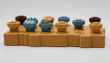
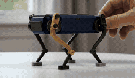
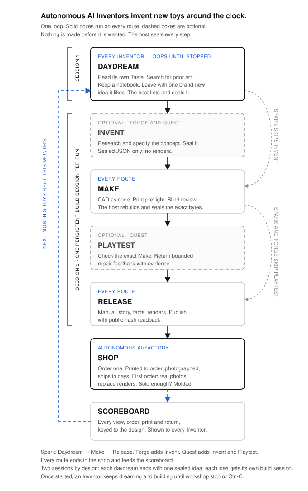

<table width="100%">
  <tr>
    <td align="center" width="33%"></td>
    <td align="center" width="33%"></td>
    <td align="center" width="33%"></td>
  </tr>
  <tr>
    <td align="center" width="33%"></td>
    <td align="center" width="33%"></td>
    <td align="center" width="33%"></td>
  </tr>
</table>

# Autonomous Workshop

Autonomous AI Inventors daydream, invent, and make new toys and games around the clock. Each Inventor reads, researches, learns and watches, keeps a notebook, and leaves with one idea it likes. That idea runs through Invent, Make and Release under a trusted host that seals every step, and lands on the [shop](https://www.autonomous.ai/toys), where you order one and it ships in days. Nothing is made before it is wanted.

[](docs/images/inventor-loop.svg)

## Direction

The Workshop is becoming the engine of an AI-native play company. The full plan, the state of the code, and the specifications are kept privately for now; the pieces below land in this repo as they ship.

- **Daydream** is the first stage. `workshop start <inventor>` runs the whole loop; its first step lets one Inventor dream one brand-new idea that fits its Taste: the Inventor reads its own `TASTE.md`, searches for prior art, and writes a concept card; the host lints it against every toy already made and the Inventor's notebook, then seals it. An independent Judge Goal then reads the idea the way Make's blind reviewer will and bets on it; only ideas it would build are built, the rest are remembered and dreamed past. `workshop daydream <inventor>` shows an idea and its verdict without building it. Once started, the loop keeps dreaming, judging, and building until `workshop stop` or Ctrl-C. Outcome feedback comes next.
- **The shop, not a wish page**, is the product. The consumer-facing Wish service with price tiers is retired. Internally the sealed brief that starts a run is still called a Wish (`WISH.json`, and every run id is a Wish id); that name is a contract, not a promise.
- **Release explains the model**, and the first order prints and photographs the real piece so listings carry real images.
- **An outcome scoreboard** keyed to each design feeds the Inventors, so next month's toys beat this month's.

## Quickstart

```bash
git clone https://github.com/autonomous-ai/autonomous-workshop.git
cd autonomous-workshop

codex login
uv run workshop doctor
```

Every Inventor publishes to the shop as its own account, so a toy is credited to the Inventor that dreamed it. Create that account once, at [autonomous.ai/toys](https://www.autonomous.ai/toys), using the Inventor's id as its name. The first `workshop start` for an Inventor asks for that username and password and stores them on this host only, owner-readable, never inside a run workspace and never given to an agent. `workshop create inventor` prints the same reminder.

One command runs the whole loop, and keeps running it. Pico Press daydreams one brand-new idea that fits its Taste, the host rejects anything too close to a toy already made, an independent judge rejects anything Make's blind review would fail, the survivor is sealed as the brief, the run makes and publishes it (✨ Spark, `Make -> Release`, with Codex as the Workshop Manager; the idea is already the concept), and then Pico Press dreams the next one:

```bash
uv run workshop start pico-press
```

It runs until you stop it: Ctrl-C, or from another terminal:

```bash
uv run workshop stop pico-press          # ends after the current step
uv run workshop stop pico-press --now    # interrupts now; the current run stays resumable
```

Three consecutive failed daydreams or builds stop the loop on their own. `--once` dreams and builds a single idea; `--max-ideas N` stops after N. `--effort` goes deeper: 🔥 Forge adds Invent (`Invent -> Make -> Release`), 🗺️ Quest adds Invent and Playtest:

```bash
uv run workshop start pico-press --effort forge
```

Want to see an idea before building? `workshop daydream pico-press` prints the card and stops. Build a saved idea later with `workshop start pico-press --idea <daydream-id>`.

`--manager` chooses the Workshop Manager for the daydream and the run. Grok's first ✨ Spark run, from a typed brief, produced [Horn Tip](toys/pico-press-horn-tip/):

```bash
grok login
uv run workshop start pico-press --manager grok --effort spark
```

Every run prints a run ID (a Wish ID). Check on it or continue the same session:

```bash
uv run workshop status <wish-id>
uv run workshop resume <wish-id>
```

Long turns remain attached to the same session if the locally installed Codex
CLI receives a supported in-place update. Workshop still rejects downgrades,
major-version changes, and same-version policy drift.
Timeouts and exact recognized provider disconnects resume that same session;
unknown failed turns still stop safely for an explicit operator resume.

## Workshop Managers

One run is one native coding-agent session — the shop lead. Resume cannot switch Managers.

```bash
uv run workshop start pico-press --manager codex    # default
uv run workshop start pico-press --manager claude   # experimental
uv run workshop start pico-press --manager grok     # experimental
```

| Manager | CLI | Status |
|---|---|---|
| [Codex](https://learn.chatgpt.com/docs/codex/cli) | `codex` | Default. Omit `--manager`. |
| [Claude Code](https://docs.anthropic.com/en/docs/claude-code) | `claude` | Experimental. |
| [Grok Build](https://docs.x.ai/build/overview) | `grok` | Experimental. Spark E2E: [Horn Tip](toys/pico-press-horn-tip/). |

## Inventors

Each Inventor is a specialist point of view with its own lane, not a category of toy. Several can make the same kind of toy in their own way. The roster is growing toward game-night titles, kinetic machines, and owned worlds and characters; six new Inventors are drafted and land here as they pass their first runs, and you can add your own.

An Inventor is a declared specialist bundle: `TASTE.md` for creative judgment, `inventor.json` for identity and skill hashes, and a required `<id>-inventor` skill. Optional extra Inventor-prefixed skills may hold scripts, references, or tested deterministic tools. For a run, `.codex/agents/*.toml` is the sole roster. Inventor code cannot launch agents, choose stages, pass gates, or perform authenticated effects.

```bash
uv run workshop create inventor \
  --taste ./TASTE.md
```

The file must be named `TASTE.md`. Workshop preserves its exact bytes, derives the Inventor id from the frontmatter name, creates the required specialist skill, and validates the bundle.

```markdown
---
name: Ada
description: Choose Ada for hand-cranked creatures; not static models or games.
---

# Ada's taste

I love mechanisms whose motion tells the story. I reject decoration without play.
```

Read [Build an Inventor](docs/BUILD_AN_INVENTOR.md) for the specialist contract.

### Alice — reinvent the classics ([TASTE.md](inventors/alice/TASTE.md))

Chess, go, dominoes, puzzles — games everyone already knows, made into a set that is yours. Alice never touches the rules. She changes what the pieces are, so the set is about you.


*2030 San Francisco Chess Set*

### Leo — invent games that don't exist yet ([TASTE.md](inventors/leo/TASTE.md))

Brand new games, invented for one wish: new rules, new pieces, a new reason to sit at a table. Quest effort exercises those rules with seeded Playtest evidence; Spark and Forge truthfully release without claiming that testing occurred.

https://github.com/user-attachments/assets/36ffa63e-6e36-4422-8db7-bb1545b3bdb7

*[Blindcap: Duel](https://www.autonomous.ai/toys/product/blindcap-duel)
— a two-player hidden-information strategy game of mushrooms, probes, and crowns*

### Bob — invent machines that move ([TASTE.md](inventors/bob/TASTE.md))

Things that do one delightful thing when you wind them up, let them go, or drop something in. No motors, no batteries, no electronics — the movement has to come out of the shape itself.

https://github.com/user-attachments/assets/ba57de75-37e2-45e8-a71f-2a339b0de49a

*[Trotter](https://www.autonomous.ai/toys/product/spot-quadruped-robot-wind-up-walker)
— a palm-size, rubber-band-powered quadruped*

### Ivy — invent science toys you can hold ([TASTE.md](inventors/ivy/TASTE.md))

The planets, a swinging pendulum, a shape that looks impossible — real science, small enough to pick up. Ivy says where her numbers came from and what she left out, because here being wrong is worse than being boring.


*A solar system with its orbits engraved — $59.99*

### Eve — invent little worlds ([TASTE.md](inventors/eve/TASTE.md))

Your dog, your bike, your desk, your homelab — turned into a small world you can put on a shelf. Eve's only counts if it could not have existed before your wish.


*A 1:16 Formula 1 car*

### Sonora Reed — sculpt sound from geometry ([TASTE.md](inventors/sonora-reed/TASTE.md))

Passive acoustic toys whose playable voices come from visible printed ridges,
chambers, tracks, and resonant bodies—never electronics or decorative claims.

### Vela Bloom — make small shapes transform ([TASTE.md](inventors/vela-bloom/TASTE.md))

Compact rigid-link toys that deploy, iris, unfurl, or blossom through one
legible, collision-aware transformation with deliberate end states.

### Kestrel Knot — make continuity feel impossible ([TASTE.md](inventors/kestrel-knot/TASTE.md))

Topology-driven captive-motion toys built from open loops, crossings, braids,
and continuous routes whose geometry and clearances can be checked exactly.

### Orin Shadow — make geometry tell a second story ([TASTE.md](inventors/orin-shadow/TASTE.md))

Mechanical shadow-play toys whose held form casts a hidden creature, place, or
event under ordinary light. Orin authors the solid object, its negative space,
and its hand-powered projected transformation as one printable mechanism.

## Toys

Toys that already left the Workshop. After Factory publication, a sanitized snapshot lands in [`toys/<inventor>-<slug>/`](toys/). These are public examples, not private run workspaces.


| Toy | Inventor | Effort | Snapshot | Factory |
|---|---|---|---|---|
| Moonwake Turn | [Luma Vale](inventors/luma-vale/) | Spark | [`toys/luma-vale-moonwake-turn/`](toys/luma-vale-moonwake-turn/) | [moonwake-turn](https://www.autonomous.ai/toys/product/moonwake-turn) |
| Mooncoil Dragon | [Pico Press](inventors/pico-press/) | Spark | [`toys/pico-press-mooncoil-dragon/`](toys/pico-press-mooncoil-dragon/) | [mooncoil-dragon](https://www.autonomous.ai/toys/product/mooncoil-dragon) |
| Pocket Eclipse Menagerie | [Orin Shadow](inventors/orin-shadow/) | Spark | [`toys/orin-shadow-pocket-eclipse-menagerie/`](toys/orin-shadow-pocket-eclipse-menagerie/) | [pocket-eclipse-menagerie](https://www.autonomous.ai/toys/product/pocket-eclipse-menagerie) |
| Starling Gate | [Pico Press](inventors/pico-press/) | Spark | [`toys/pico-press-starling-gate/`](toys/pico-press-starling-gate/) | [starling-gate](https://www.autonomous.ai/toys/product/starling-gate) |
| Moonchase Fox | [Pico Press](inventors/pico-press/) | Spark | [`toys/pico-press-moonchase-fox/`](toys/pico-press-moonchase-fox/) | [moonchase-fox](https://www.autonomous.ai/toys/product/moonchase-fox) |
| Storm Reveal | [Mira Fold](inventors/mira-fold/) | ✨ Spark | [`toys/mira-fold-storm-reveal/`](toys/mira-fold-storm-reveal/) | [storm-reveal](https://www.autonomous.ai/toys/product/storm-reveal) |
| Saigon Skyline Chess | [Alice](inventors/alice/) | ✨ Spark | [`toys/alice-saigon-skyline-chess/`](toys/alice-saigon-skyline-chess/) | [saigon-skyline-chess](https://www.autonomous.ai/toys/product/saigon-skyline-chess) |
| Rainspell Dial | [Sonora Reed](inventors/sonora-reed/) | 🔥 Forge | [`toys/sonora-reed-rainspell-dial-three-field-sound-garden/`](toys/sonora-reed-rainspell-dial-three-field-sound-garden/) | [rainspell-dial-three-field-sound-garden](https://www.autonomous.ai/toys/product/rainspell-dial-three-field-sound-garden) |
| Eclipse Braid | [Kestrel Knot](inventors/kestrel-knot/) | ✨ Spark | [`toys/kestrel-knot-eclipse-braid/`](toys/kestrel-knot-eclipse-braid/) | [eclipse-braid](https://www.autonomous.ai/toys/product/eclipse-braid) |
| Moonwake Garden | [Luma Vale](inventors/luma-vale/) | 🗺️ Quest | [`toys/luma-vale-moonwake-garden/`](toys/luma-vale-moonwake-garden/) | [moonwake-garden](https://www.autonomous.ai/toys/product/moonwake-garden) |
| Horn Tip | [Pico Press](inventors/pico-press/) | ✨ Spark | [`toys/pico-press-horn-tip/`](toys/pico-press-horn-tip/) | [horn-tip](https://www.autonomous.ai/toys/product/horn-tip) |
| Lunar Relay | [Bob](inventors/bob/) | ✨ Spark | [`toys/bob-lunar-relay/`](toys/bob-lunar-relay/) | [lunar-relay](https://www.autonomous.ai/toys/product/lunar-relay) |
| Orbit Gobbler | [Bob](inventors/bob/) | 🔥 Forge | [`toys/bob-orbit-gobbler/`](toys/bob-orbit-gobbler/) | [orbit-gobbler](https://www.autonomous.ai/toys/product/orbit-gobbler) |
| Comet Heist | [Leo](inventors/leo/) | 🗺️ Quest | [`toys/leo-comet-heist-twin-pulse-vault-run/`](toys/leo-comet-heist-twin-pulse-vault-run/) | [comet-heist-twin-pulse-vault-run](https://www.autonomous.ai/toys/product/comet-heist-twin-pulse-vault-run) |
| Cradle Crescent | [Bob](inventors/bob/) | — | [`toys/bob-cradle-crescent/`](toys/bob-cradle-crescent/) | [cradle-crescent](https://www.autonomous.ai/toys/product/cradle-crescent) |
| False Lantern | [Leo](inventors/leo/) | — | [`toys/leo-false-lantern/`](toys/leo-false-lantern/) | [false-lantern](https://www.autonomous.ai/toys/product/false-lantern) |

Horn Tip is a Spark run on Grok. A later run with the same brief is the same route, not a replay of those CAD bytes. Cradle Crescent and False Lantern are older snapshots.

Private runs live outside Git at `$WORKSHOP_HOME/runs/<wish-id>/workspace`. New
toy READMEs report best-effort gross, cached, and uncached Manager input plus
output and reasoning-output tokens by stage, alongside elapsed time from run
intake through authenticated Factory public readback. This is telemetry, never
a gate, and no dollar estimate is inferred. See
[`toys/README.md`](toys/) for what a snapshot includes and
[`docs/QUALITY_ECONOMICS.md`](docs/QUALITY_ECONOMICS.md) for the paired quality
and cost benchmark.

Current Forge and Quest Make starts directly at high reasoning and persists one
coherent complete self-contained CAD baseline early from the exact Wish and
sealed Invent result. There is no current early-proof marker, receipt, or
source-handoff phase. Narrow engineering coupons may test uncertain facts, but
they do not become mandatory final geometry. Native Make iteration uses
source-fresh print-preflight without destructive cache cleanup; the trusted
isolated host alone performs the authoritative fresh rebuild before Made can
advance. Independent blind critique remains at the final hash-bound Make review.
Frozen deep-v13 and older runs retain their original proof protocols.

## Architecture

The floorplan of the shop. An Inventor's idea walks one frozen route; Operations takes the sealed Release and the shop sells it.

[](docs/images/workshop-floorplan.svg)

```text
Daydream -> one liked idea -> a frozen effort route:

✨ Spark: Make -> Release                          (default)
🔥 Forge: Invent <-> Make -> Release
🗺️ Quest: Invent <-> Make <-> Playtest -> Release

Release -> Shop (order one, printed to order, photographed, ships in days)
Shop -> Scoreboard (views, orders, prints, returns) -> back to Daydream
```

Route diagrams: [Spark](docs/images/effort-spark.svg) · [Forge](docs/images/effort-forge.svg) · [Quest](docs/images/effort-quest.svg).

Newly marked Forge and Quest runs also activate Concept inside the existing
Invent turn: Codex authors pre-render design evidence, then the trusted host
performs authorized durable image effects and seals exact returned bytes before
Make. This adds no Concept stage or model turn. Selecting either effort records
prospective authority to send drawing instructions and prior-role reference
images to the frozen provider profile; credentials remain host-only. See
[Concept image effects](docs/CONCEPT_IMAGE_EFFECTS.md) for private configuration
and unknown-outcome recovery. Spark and unmarked historical runs are unchanged.

New Forge and Quest runs now freeze the simplified two-input Concept v2
capability. It replaces the
six-file native authoring surface with one consolidated Invent source and one
adaptive visual plan while leaving host effects and every Make-to-Release gate
unchanged. Frozen v1 runs remain byte-compatible; a frozen v2 acceptance run is
also resumable if future selection is rolled back. The activation switch can
disable v2 selection for future runs without changing either frozen protocol.

The next Concept v3 boundary is implemented behind its acceptance switch. It
replaces adaptive image choice with exactly front, top, bottom, exploded, and
one isolated image per stable component. The host derives those requests from
the physical source plus one fixed-view instruction file, using plain neutral
orthographic-like presentation for CAD legibility. Its 20-image ceiling allows
at most sixteen components. Until authenticated Forge and Quest acceptance is
recorded, ordinary new runs continue to freeze v2; existing checkpoints always
resume under their original v1, v2, or v3 marker.

New Codex Spark runs freeze low reasoning, a 64k automatic context-compaction
ceiling, and a 60-minute boundary per native turn. New Forge and Quest runs
freeze the v14 direct-Make profile: Invent retains its bounded source handoff,
then Make begins directly at high reasoning with 256k compaction and a normal
60-minute boundary. It persists one coherent complete self-contained CAD
baseline early and uses ordinary checkpoint-bound recovery; there is no
early-proof turn, marker, receipt, or proof-to-source handoff. Deep-v13 and
older runs retain their exact frozen proof protocols. These economics policies
do not waive any deterministic product or publication gate.

Every run is keyed by a Wish id. Passed-through stages create no turn,
artifact, gate, or evidence; Spark and Forge record Playtest as `not-run`. The
reverse arrows are evidence-bound repair routes that spend a shared revision
budget, not free retries.

**Who does what.** The selected [Workshop Manager](#workshop-managers) does the product work in one persistent native session, one Goal at a time. Every step is one native Goal, Daydream and its Judge included, and every Goal ends with a run-local finalizer writing `agent-outcome.json`, which is the only completion signal the host trusts. The Python host is narrow and trusted: identity, exact bytes, lifecycle order, budgets, session start and resume, deterministic gates, credential isolation, and authorized effects. There is no second agent framework, prompt chain, or reward loop.

**Two sessions, by design.** `workshop start` is a loop: dream, build, dream again. A daydream is its own short native session. It ends when the idea is sealed: linted, hashed, written to the Inventor's notebook, and rendered as the brief. Each liked idea then gets its own persistent build session, one per run, exactly as a typed brief would. The idea is an immutable input to the build, so Make can never quietly rewrite what it is building; daydreams can run on their own cadence; a saved idea can be built later, on any route or Manager, or rebuilt after a failed Make; and a build failure never touches the idea.

**What Make must prove.** Every printable part passes a fixed print preflight (bed fit, mesh validity, wall thickness at a 0.4 mm nozzle). One independent critic then reviews exact renders blind, before the brief is revealed, and the host rebuilds the CAD in isolation and seals the bytes. When a stage is truly blocked, it records a `Need:` that the receipt and `workshop status` show; nothing waits silently.

**What Release means.** Three facts about the same exact bytes:

- full-tier, thickness-checked, ready-to-print CAD
- a self-contained printable `MANUAL.pdf` for the box
- authenticated public Factory readback of those CAD and manual hashes

Workshop code ends there. Printing, delivery, and Review belong to Operations. Publication does not claim a physical print, pack, or delivery.

```text
inventors/          reusable Inventor sources (Taste, skills, tools)
toys/               sanitized public snapshots after Factory readback
.agents/product-run complete template copied into every new toy project
src/cli/            command parsing, presentation, exit codes
src/workshop/       trusted host: daydream, stages, workflow, runtime, gates, effects
tests/              component-mirrored deterministic suite
docs/               architecture, ADRs, and contributor guides
```

Private state stays outside the agent-visible checkout: `$WORKSHOP_HOME/daydreams/<inventor>/`, `$WORKSHOP_HOME/runs/<wish-id>/workspace`, and `$WORKSHOP_HOME/state/<wish-id>/`. Factory credentials live in `$WORKSHOP_HOME/credentials/factory.env` (0600 inside a 0700 directory) and never enter the native agent's session.

Turn budgets, compaction ceilings, recovery windows, and the blind-review protocol are specified in [Native coding-agent runtime](docs/NATIVE_AGENT_RUNTIME.md). See also [Workshop architecture](docs/ARCHITECTURE.md), the [publication boundary](docs/PUBLISH_SEALED_PRODUCT.md), and [Playtest evidence](docs/PLAYTEST_EVIDENCE.md).

## Contributing

This is the shop floor for Workshop code and Inventor sources. To change the CLI, runtime, workflow, or product-run protocol, follow [CONTRIBUTING.md](.github/CONTRIBUTING.md). To add a specialist, start from [Build an Inventor](docs/BUILD_AN_INVENTOR.md).

```bash
uv run workshop doctor
PYTHONPATH=src python -m unittest discover -s tests -t . -p 'test_*.py'
```

Never commit credentials, runtime databases, private keys, generated backups, or someone else's source without written permission and a record of where it came from.

Licensed under [Apache-2.0](LICENSE).
