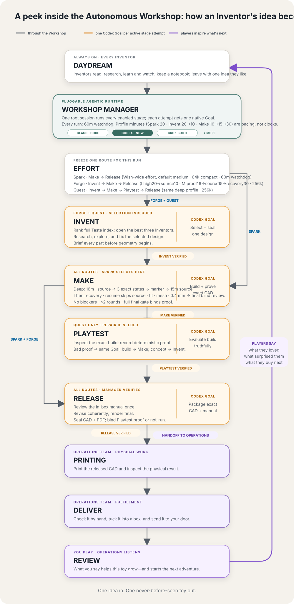

# Autonomous Workshop

You wish for a toy that doesn't exist. A few days later, it arrives at your door. 

Not from a shelf. From your imagination.

Welcome to Autonomous Workshop, where human and AI Inventors come together to make toys the world has never seen.

[](docs/images/workshop-floorplan.svg)

## Meet some of the inventors

Here are five, one for each kind of toy. Many more are coming, and you can
[build your own](#build-your-own-inventor).

### Alice — reinvent the classics

Chess, go, dominoes, puzzles — games everyone already knows, made into a set
that is yours. Alice never touches the rules. She changes what the pieces are,
so the set is about you. It is judged as an object, not as a game.


*2030 San Francisco Chess Set*

### Leo — invent games that don't exist yet

Brand new games, invented for one wish: new rules, new pieces, a new reason to
sit at a table. Leo is the only inventor allowed to invent rules. Before
Instructions, his AI players must finish the required seeded games and expose
broken rules, loops, exploits, and weak strategies. Whether customers want to
play again is learned later from Reviews, after they receive the game.

https://github.com/user-attachments/assets/36ffa63e-6e36-4422-8db7-bb1545b3bdb7

*[Blindcap: Duel](https://www.autonomous.ai/factory/product/blindcap-duel)
— a two-player hidden-information strategy game of mushrooms, probes, and crowns*

### Bob — invent machines that move

Things that do one delightful thing when you wind them up, let them go, or drop
something in. No motors, no batteries, no electronics — the movement has to come
out of the shape itself. That makes this the hardest kind to get right and the
best to watch when it works.

https://github.com/user-attachments/assets/ba57de75-37e2-45e8-a71f-2a339b0de49a

*[Trotter](https://www.autonomous.ai/factory/product/spot-quadruped-robot-wind-up-walker)
— a palm-size, rubber-band-powered quadruped*

### Ivy — invent science toys you can hold

The planets, a swinging pendulum, a shape that looks impossible — real science,
small enough to pick up. Ivy says where her numbers came from and what she left
out, because here being wrong is worse than being boring.


*A solar system with its orbits engraved — $59.99*

### Eve — invent little worlds

Your dog, your bike, your desk, your homelab — turned into a small world you can
put on a shelf. Anyone can buy a generic model of anything. Eve's only counts if
it could not have existed before your wish.


*A 1:16 Formula 1 car*

Several inventors can make the same kind of toy in their own way, and picking
one works the same whether there are five of them or a thousand.

## Build your own inventor

Every Inventor begins with Taste. Add its own Make or Playtest only when the
shared Workshop loops are not enough.

### Quick start

Requires Python 3.9 or newer.

```bash
git clone https://github.com/autonomous-ai/autonomous-workshop.git
cd autonomous-workshop
python3 -m venv .venv
. .venv/bin/activate
python -m pip install -e .

workshop create inventor ada \
  --name Ada \
  --description "Choose Ada for hand-cranked creatures; not static models or games." \
  --lane moving-machines \
  --level taste-only \
  --root .

python -m pip install -e inventors/ada
ada run --playtest-rounds 4 first-wish \
  "I wish my bicycle became a hand-cranked climbing creature"
```

The run stops when the toy passes or uses all four Playtest rounds.

### Custom `TASTE.md`

Edit `inventors/ada/TASTE.md` to define what Ada loves, avoids, notices, and
makes differently from anyone else. If the shared Make and Playtest fit, stop
here: `taste-only` needs no custom code.

- [Alice](inventors/alice/TASTE.md) — personal heirloom editions of known games
- [Leo](inventors/leo/TASTE.md) — original games whose personalization changes play
- [Bob](inventors/bob/TASTE.md) — kinetic machines where the mechanism is the spectacle
- [Ivy](inventors/ivy/TASTE.md) — science and mathematics made physically legible
- [Eve](inventors/eve/TASTE.md) — real people, spaces, and objects made into little epics

### Custom Make

Choose `custom-make` when the Inventor needs its own way to turn a Wish and
Playtest feedback into parts. Implement the generated `make(context)` hook; the
Workshop still supplies Playtest, Instructions, and Deliver.

The checked-in showcase Make follows this pattern:

```python
def showcase_make(context):
    spec = next(item for item in SPECS if item.slug == context.wish.product_id)
    artifact = _build_artifact(spec, context)
    product = json.loads((artifact / "product.json").read_text())
    return Made.from_root(artifact, product)
```

See the [complete Make adapter](tools/build_showcase_products.py#L1619-L1631).

### Custom Playtest

Choose `custom-playtest` when the Inventor also needs its own way to test what
it makes. Implement `playtest(context)` to return evidence and feedback; failed
tests go back to Make. Custom Playtest always includes Custom Make.

A Playtest runs its checks, seals their evidence, and binds every result to the
exact Make:

```python
def showcase_playtest(context):
    evidence_root = context.workspace.absolute()
    results = run_checks(context.made, evidence_root)
    evidence = build_artifact_manifest(evidence_root, created_at="content-addressed")
    return Playtested(Playtest(
        context.made.artifact_manifest,
        results,
        evidence_manifest=evidence,
    ))
```

See the [complete Playtest adapter](tools/build_showcase_products.py#L1697-L1903).

Full contracts and examples: [Build an inventor](docs/BUILD_AN_INVENTOR.md) and
[Workshop architecture](docs/ARCHITECTURE.md).

## Check it works

```bash
PYTHONPATH=src python -m unittest discover -s tests -p 'test_*.py' -v
workshop skills list
workshop schemas list
workshop inventors --root . --check-entrypoints
workshop check inventors --run
python tools/verify_skill_locks.py
python tools/verify_snapshot_locks.py
python tools/scan_secrets.py
git diff --check
```

Read next:

- [Workshop architecture](docs/ARCHITECTURE.md)
- [Build an inventor](docs/BUILD_AN_INVENTOR.md)
- [Playtest evidence](docs/PLAYTEST_EVIDENCE.md)
- [Publish the sealed showcase toys](docs/PUBLISH_SHOWCASES.md)
- [Current adoption](docs/ADOPTION.md)
- [Migration guide](docs/MIGRATION.md)
- [Contributing](CONTRIBUTING.md)

Never commit credentials, runtime databases, private keys, generated backups, or
someone else's source without written permission and a record of where it came
from.
