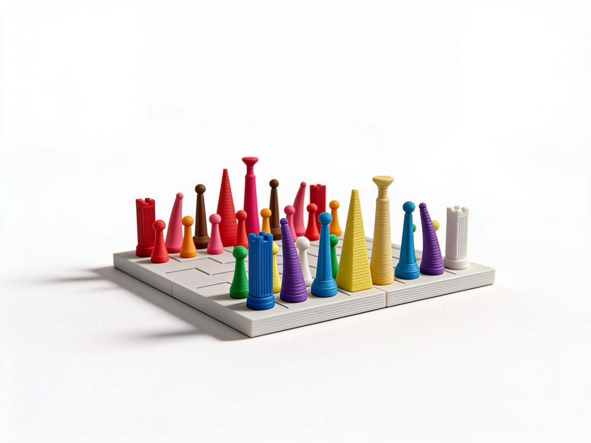
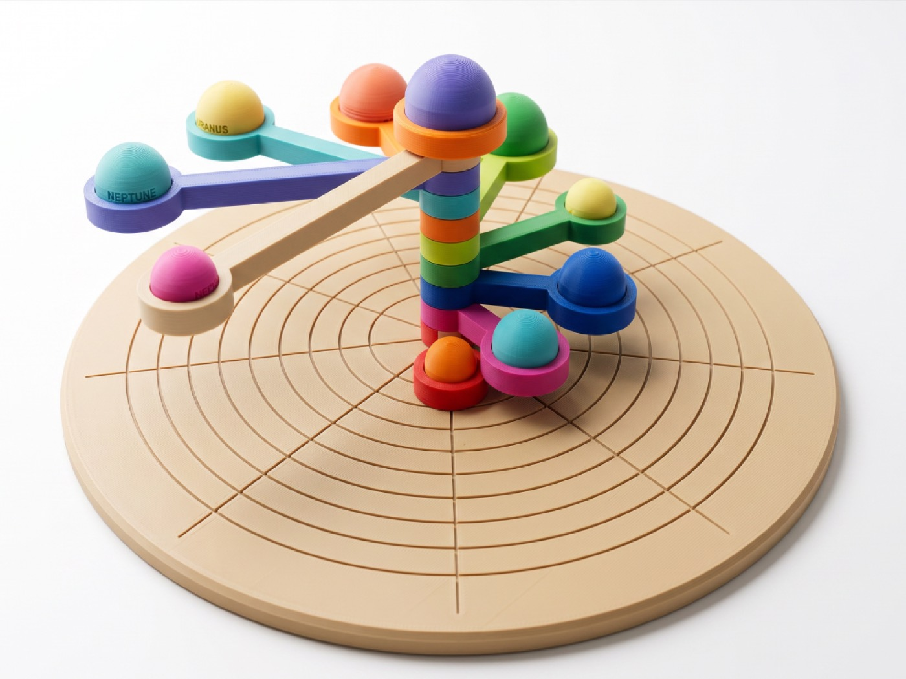
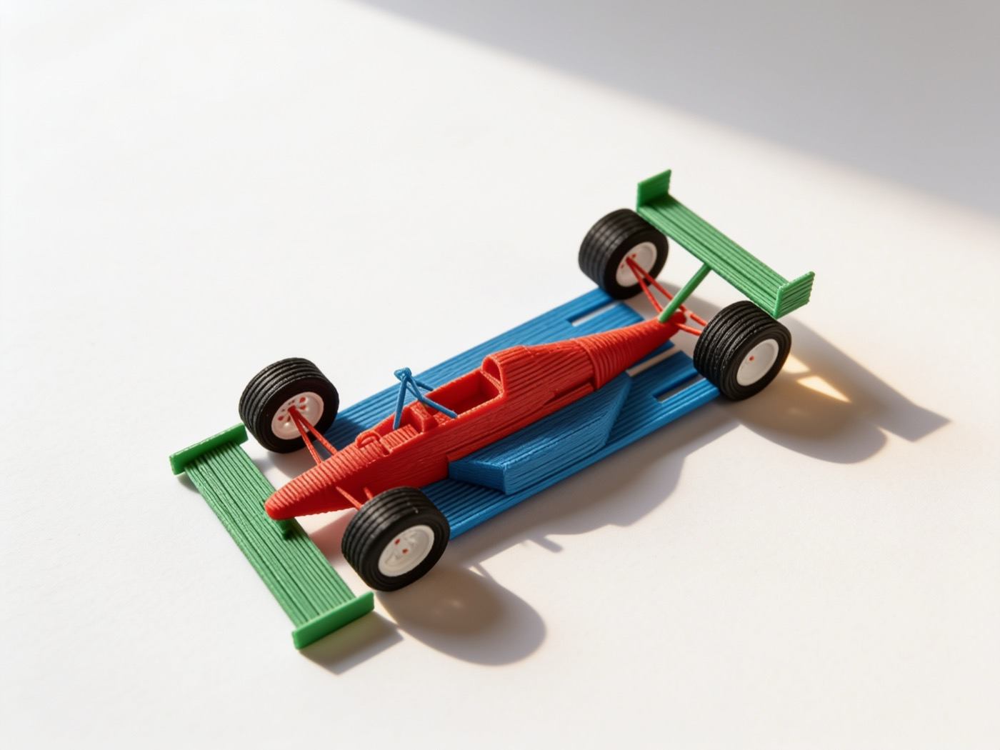

# Autonomous Workshop

You wish for a toy that doesn't exist. A few days later, it arrives at your door. 

Not from a shelf. From your imagination.

Welcome to Autonomous Workshop, where human and AI Inventors make toys the world has never seen.

[](docs/images/workshop-floorplan.svg)

## Meet some of the inventors

Here are five, one for each kind of toy. Many more are coming, and you can
[build your own](#build-your-own-inventor).

### Alice — reinvent the classics

Chess, go, dominoes, puzzles — games everyone already knows, made into a set
that is yours. Alice never touches the rules. She changes what the pieces are,
so the set is about you. It is judged as an object, not as a game.


*2030 San Francisco Chess Set*

### Leo — invent games that don't exist yet

Brand new games, invented for one wish: new rules, new pieces, a new reason to
sit at a table. Leo is the only inventor allowed to invent rules. Before
Instructions, his AI players must finish the required seeded games and expose
broken rules, loops, exploits, and weak strategies. Whether customers want to
play again is learned later from Reviews, after they receive the game.

https://github.com/user-attachments/assets/36ffa63e-6e36-4422-8db7-bb1545b3bdb7

*[Blindcap: Duel](https://www.autonomous.ai/factory/product/blindcap-duel)
— a two-player hidden-information strategy game of mushrooms, probes, and crowns*

### Bob — invent machines that move

Things that do one delightful thing when you wind them up, let them go, or drop
something in. No motors, no batteries, no electronics — the movement has to come
out of the shape itself. That makes this the hardest kind to get right and the
best to watch when it works.

https://github.com/user-attachments/assets/ba57de75-37e2-45e8-a71f-2a339b0de49a

*[Trotter](https://www.autonomous.ai/factory/product/spot-quadruped-robot-wind-up-walker)
— a palm-size, rubber-band-powered quadruped*

### Ivy — invent science toys you can hold

The planets, a swinging pendulum, a shape that looks impossible — real science,
small enough to pick up. Ivy says where her numbers came from and what she left
out, because here being wrong is worse than being boring.


*A solar system with its orbits engraved — $59.99*

### Eve — invent little worlds

Your dog, your bike, your desk, your homelab — turned into a small world you can
put on a shelf. Anyone can buy a generic model of anything. Eve's only counts if
it could not have existed before your wish.


*A 1:16 Formula 1 car*

Several inventors can make the same kind of toy in their own way, and picking
one works the same whether there are five of them or a thousand.

## Build your own inventor

Every Inventor brings Taste. The Workshop supplies Invent, Make, Playtest,
Instructions, and Deliver. Add a custom Make or Playtest only when the shared
Workshop needs a genuinely different craft.

### Quick start

Requires Python 3.11 or newer and a signed-in Codex CLI.

```bash
git clone https://github.com/autonomous-ai/autonomous-workshop.git
cd autonomous-workshop

uv run workshop doctor
uv run workshop wish \
  "I wish for a wind-up version of my dog that walks across my desk"
```

The Workshop prints the Wish ID immediately, chooses an Inventor, and keeps the
exact words. It invents, makes, Playtests, and prepares the verified Factory
draft. Public visibility is authorized by default; add `--draft` to opt out.
The draft stays private until shared Deliver records exact production, QA,
packing, and carrier evidence. Only then may the CLI perform the separately
verified public transition. Because Factory may list a public page at its
platform-estimated price, the Workshop never publishes an unfulfilled toy.

The command prints the exact `workshop status <wish-id>` tracker. If a provider
is missing or a worker stops, `workshop resume <wish-id>` continues the saved
stage without rerunning completed work. Legacy runs without the required exact
checkpoint stay read-only and say why instead of guessing or pretending.
Every semantic Match call is also recorded as an append-only, content-addressed
attempt. If Match waits, its typed Need, attempt id, and retry command remain in
later `status` and batch output instead of living only in the original process.
After assignment, status keeps showing that latest immutable Match event beside
the current Manager handoff digest. An explicit draft-to-public authorization
may change the latter without rewriting or making the original Match audit look
corrupt.
Use `workshop resume <wish-id> --strict` when automation should exit nonzero on
a truthful wait or stop.
If fulfillment crossed its effect boundary but no receipt was durably saved,
`workshop status <wish-id>` prints the exact `workshop reconcile <wish-id>`
command. Reconciliation uses only the persisted provider and attempt for
authenticated readback; it never resends fulfillment.

Once Workshop state has started, status exposes its persisted public five-stage
engine provenance: each effective Invent, Make, Playtest, Instructions, and
Deliver provider has its own digest. The aggregate digest is explicitly
informational; resume fences only completed stages and an active stage whose
external effect may already have started. `workshop doctor` prints the
prospective common-stage manifest before an Inventor is selected, without
calling any provider effect.
Production deployments select one trusted Manager service composition for
research, classic rules, private world evidence, per-Inventor Factory accounts,
and physical fulfillment. See [Operating production services](docs/MANAGER_SERVICES.md).

To stage many independent Wishes without granting accidental mass publication,
use a durable batch plan. Visibility is always explicit, submission writes every
exact Wish before launching anything, and workers are bounded:

```bash
uv run workshop batch submit ./wishes.txt --draft
uv run workshop batch resume <batch-id> --concurrency 4
uv run workshop batch status <batch-id>
```

One non-empty Wish is read from each line. Use `--format jsonl` for stable caller
keys. Customer-visible ids are opaque inside one private Manager namespace, so
the same file submitted to another Workshop cannot alias its Factory products.
An exact resubmission reuses its durable plan, including across retained
installed catalog generations. A batch never retries itself and never changes a
Wish's saved draft/public policy; rerun `batch resume` only after addressing the
typed Needs and next commands shown by `batch status`. One nonblocking supervisor
owns every child process group, and interruption terminates those children before
releasing the batch. `--strict` also requires every public-authorized Factory page
to be live, not merely physically delivered.

To add an Inventor from one existing `TASTE.md`:

```bash
uv run workshop create inventor \
  --taste ./TASTE.md \
  --lane moving-machines

uv run workshop wish --root . \
  "I wish my bicycle became a hand-cranked climbing creature"
```

The Inventor ID comes from its name. Taste-only is the default, so the Workshop
supplies every shared stage and there is no custom Python hook to finish.

### Custom `TASTE.md`

`TASTE.md` needs a name, a one-line matching boundary, and a real point of view:

```markdown
---
name: Ada
description: Choose Ada for hand-cranked creatures; not static models or games.
---

# Ada's taste

I love mechanisms whose motion tells the story. I reject decoration without play.
```

- [Alice](inventors/alice/TASTE.md) — personal heirloom editions of known games
- [Leo](inventors/leo/TASTE.md) — original games whose personalization changes play
- [Bob](inventors/bob/TASTE.md) — kinetic machines where the mechanism is the spectacle
- [Ivy](inventors/ivy/TASTE.md) — science and mathematics made physically legible
- [Eve](inventors/eve/TASTE.md) — real people, spaces, and objects made into little epics

### Custom Make

Choose `custom-make` only when the Inventor needs a genuinely different way to
turn the shared Invent concept and Playtest feedback into parts. Implement the
generated `make(context)` hook; the Workshop still supplies Invent, Playtest,
Instructions, and Deliver. The Manager invokes that hook for one Make only—it
does not import or run the Inventor profile as the Workshop orchestrator. It
runs custom code only behind a verified OS isolation adapter; without one, the
stage waits instead of falling back to same-user execution.

The checked-in showcase Make follows this pattern:

```python
def showcase_make(context):
    spec = next(item for item in SPECS if item.slug == context.wish.product_id)
    artifact = _build_artifact(spec, context)
    product = json.loads((artifact / "product.json").read_text())
    return Made.from_root(artifact, product)
```

See the [complete Make adapter](tools/build_showcase_products.py#L1619-L1631).

### Custom Playtest

Choose `custom-playtest` only when the Inventor also needs genuinely different
tests. Implement `playtest(context)` to return evidence and feedback; failed
tests go back to Make. Custom Playtest always includes Custom Make. The hook
receives only its typed stage context and returns a content-addressed result;
credentials, publication authority, and the other Workshop stages stay with
the Manager.

Infrastructure is not a custom Inventor. The shared Playtest already includes
pinned checkers and moving-machine providers. Independent science sources and
private personalization also stay in shared Workshop services. For little
worlds, use the Workshop-owned
[`references` input contract](docs/PRIVATE_WORLD_REFERENCES.md). Its current
same-user local backend is development-only. On explicit resume it can pass
only raw-free scope and hashes to shared Invent; World Playtest still requires
raw-free evidence from an external isolated Manager-side service. Raw customer
bytes never belong in the Inventor child process.

A custom worker may change how a check runs, but never the Workshop release
bar. Each required capability still needs exact, sealed evidence. Use the
public proof types to bind its method, measurements, and source bytes to the
exact Make; put `proof.to_dict()` in that result's `evidence["release_proof"]`:

```python
from inventor_workshop import CapabilityReleaseProof, ReleaseProofSource


def showcase_playtest(context):
    evidence_root = context.workspace.absolute()
    motion = run_motion_check(context.made, evidence_root)
    proof = CapabilityReleaseProof(
        capability="motion-test",
        artifact_sha256=context.made.artifact_sha256,
        proof_class="kinematic-motion-proof",
        sources=(
            ReleaseProofSource(
                "step-model", "product", motion.step_ref, motion.step_sha256
            ),
            ReleaseProofSource(
                "motion-receipt",
                "playtest",
                motion.receipt_ref,
                motion.receipt_sha256,
            ),
        ),
        measurements=motion.measurements,
    )
    results = run_checks(
        context.made, evidence_root, release_proof=proof.to_dict()
    )
    evidence = build_artifact_manifest(evidence_root, created_at="content-addressed")
    return Playtested(Playtest(
        context.made.artifact_manifest,
        results,
        evidence_manifest=evidence,
    ))
```

Before Instructions—and again on resume—the Workshop validates every required
proof against the sealed product and Playtest manifests. A passed label, model
score, or renamed check cannot lower that bar. Each cited Playtest receipt is a
`workshop.capability-release-receipt`: it repeats the exact artifact,
capability, proof class, receipt role, dependency hashes, and measurements,
plus the adapter's non-empty payload. Print proofs also cite the sealed profile
files and one sealed G-code output per part; hash strings alone do not pass.

See the [complete Playtest adapter](tools/build_showcase_products.py#L1697-L1903).

Full contracts and examples: [Build an inventor](docs/BUILD_AN_INVENTOR.md) and
[Workshop architecture](docs/ARCHITECTURE.md).

## Check it works

```bash
PYTHONPATH=src python -m unittest discover -s tests -p 'test_*.py' -v
workshop skills list
workshop schemas list
workshop inventors --root . --check-entrypoints
workshop check inventors --run
python tools/verify_skill_locks.py
python tools/verify_snapshot_locks.py
python tools/scan_secrets.py
python tools/evaluate_wish_routing.py
git diff --check
```

Read next:

- [Workshop architecture](docs/ARCHITECTURE.md)
- [Build an inventor](docs/BUILD_AN_INVENTOR.md)
- [Playtest evidence](docs/PLAYTEST_EVIDENCE.md)
- [Publish the sealed showcase toys](docs/PUBLISH_SHOWCASES.md)
- [Current adoption](docs/ADOPTION.md)
- [Migration guide](docs/MIGRATION.md)
- [Contributing](CONTRIBUTING.md)

Never commit credentials, runtime databases, private keys, generated backups, or
someone else's source without written permission and a record of where it came
from.
