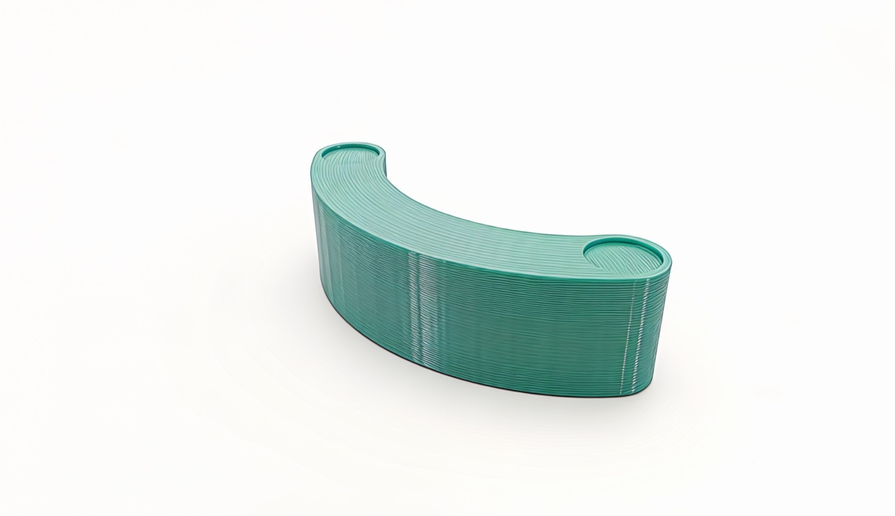
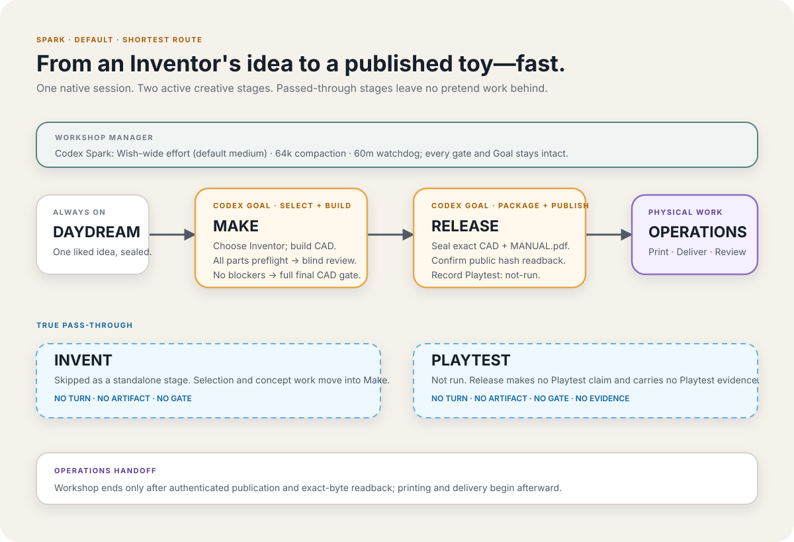
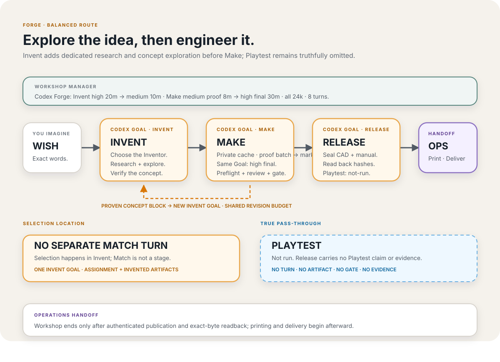
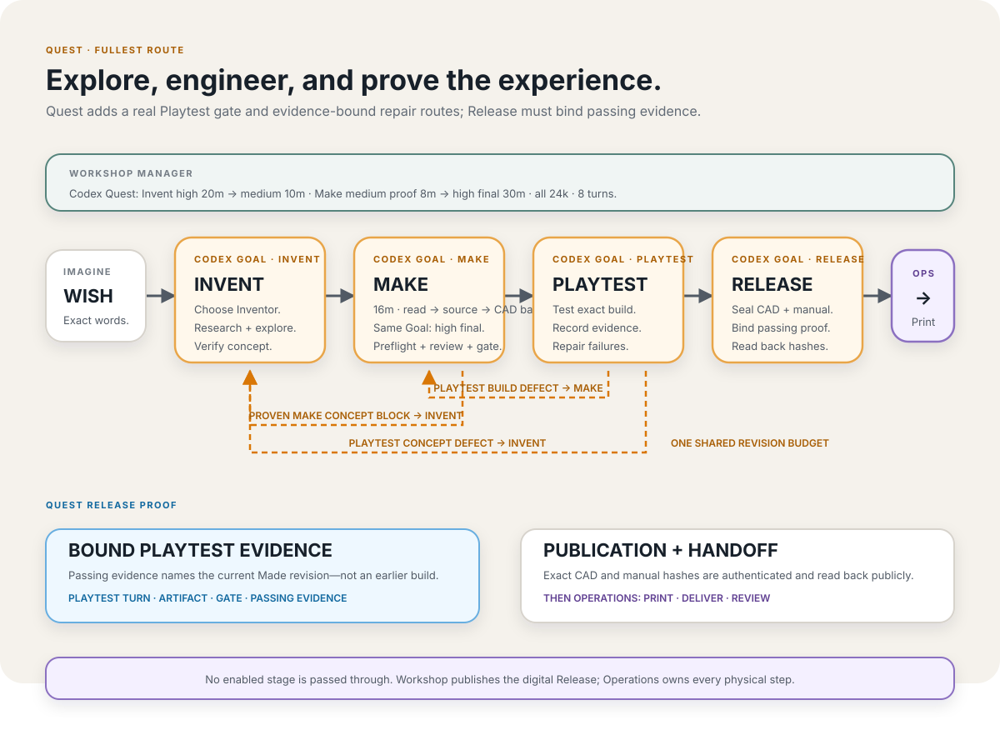

# Autonomous Workshop

You wish for a toy that doesn't exist. AI inventors in the Autonomous Workshop make it. A magical box turns up at your door in a few days. Use the [Workshop CLI](#quickstart) or [make a Wish on the web](https://www.autonomous.ai/wish).

## Quickstart

```bash
git clone https://github.com/autonomous-ai/autonomous-workshop.git
cd autonomous-workshop

codex login
uv run workshop doctor
```

A default Wish uses Codex as the Workshop Manager and ✨ Spark as the effort (`Wish -> Make -> Release`):

```bash
uv run workshop wish \
  "I wish for a tiny one-piece crescent desk rocker that tips with a fingertip"
```

`--effort` chooses how deep the shop goes: ✨ Spark, 🔥 Forge, or 🗺️ Quest. Forge adds Invent. Quest adds Invent and Playtest:

```bash
uv run workshop wish \
  --effort forge \
  "I wish for a wind-up version of my dog that walks across my desk"
```

`--manager` chooses the Workshop Manager. This ✨ Spark Wish on Grok produced [Horn Tip](toys/pico-press-horn-tip/):

```bash
grok login
uv run workshop wish --manager grok --effort spark \
  "I wish for a tiny one-piece crescent desk rocker that tips with a fingertip"
```

The command prints a Wish ID. Check on it or continue the same session:

```bash
uv run workshop status <wish-id>
uv run workshop resume <wish-id>
```

## Workshop Managers

One Wish is one native coding-agent session — the shop lead. Resume cannot switch Managers.

```bash
uv run workshop wish --manager codex --effort spark "I wish for …"   # default
uv run workshop wish --manager claude --effort spark "I wish for …"  # experimental
uv run workshop wish --manager grok --effort spark "I wish for …"    # experimental
```

| Manager | CLI | Status |
|---|---|---|
| [Codex](https://learn.chatgpt.com/docs/codex/cli) | `codex` | Default. Omit `--manager`. |
| [Claude Code](https://docs.anthropic.com/en/docs/claude-code) | `claude` | Experimental. |
| [Grok Build](https://docs.x.ai/build/overview) | `grok` | Experimental. Spark E2E: [Horn Tip](toys/pico-press-horn-tip/). |

## Inventors

Each Inventor is a specialist point of view, not a category of Wish. Several can make the same kind of toy in their own way. Many more are coming, and you can add your own.

An Inventor is a declared specialist bundle: `TASTE.md` for creative judgment, `inventor.json` for identity and skill hashes, and a required `<id>-inventor` skill. Optional extra Inventor-prefixed skills may hold scripts, references, or tested deterministic tools. For a run, `.codex/agents/*.toml` is the sole roster. Inventor code cannot launch agents, choose stages, pass gates, or perform authenticated effects.

```bash
uv run workshop create inventor \
  --taste ./TASTE.md
```

The file must be named `TASTE.md`. Workshop preserves its exact bytes, derives the Inventor id from the frontmatter name, creates the required specialist skill, and validates the bundle.

```markdown
---
name: Ada
description: Choose Ada for hand-cranked creatures; not static models or games.
---

# Ada's taste

I love mechanisms whose motion tells the story. I reject decoration without play.
```

Read [Build an Inventor](docs/BUILD_AN_INVENTOR.md) for the specialist contract.

### Alice — reinvent the classics ([TASTE.md](inventors/alice/TASTE.md))

Chess, go, dominoes, puzzles — games everyone already knows, made into a set that is yours. Alice never touches the rules. She changes what the pieces are, so the set is about you.


*2030 San Francisco Chess Set*

### Leo — invent games that don't exist yet ([TASTE.md](inventors/leo/TASTE.md))

Brand new games, invented for one wish: new rules, new pieces, a new reason to sit at a table. Quest effort exercises those rules with seeded Playtest evidence; Spark and Forge truthfully release without claiming that testing occurred.

https://github.com/user-attachments/assets/36ffa63e-6e36-4422-8db7-bb1545b3bdb7

*[Blindcap: Duel](https://www.autonomous.ai/factory/product/blindcap-duel)
— a two-player hidden-information strategy game of mushrooms, probes, and crowns*

### Bob — invent machines that move ([TASTE.md](inventors/bob/TASTE.md))

Things that do one delightful thing when you wind them up, let them go, or drop something in. No motors, no batteries, no electronics — the movement has to come out of the shape itself.

https://github.com/user-attachments/assets/ba57de75-37e2-45e8-a71f-2a339b0de49a

*[Trotter](https://www.autonomous.ai/factory/product/spot-quadruped-robot-wind-up-walker)
— a palm-size, rubber-band-powered quadruped*

### Ivy — invent science toys you can hold ([TASTE.md](inventors/ivy/TASTE.md))

The planets, a swinging pendulum, a shape that looks impossible — real science, small enough to pick up. Ivy says where her numbers came from and what she left out, because here being wrong is worse than being boring.


*A solar system with its orbits engraved — $59.99*

### Eve — invent little worlds ([TASTE.md](inventors/eve/TASTE.md))

Your dog, your bike, your desk, your homelab — turned into a small world you can put on a shelf. Eve's only counts if it could not have existed before your wish.


*A 1:16 Formula 1 car*

## Toys

Toys that already left the Workshop. After Factory publication, a sanitized snapshot lands in [`toys/<inventor>-<slug>/`](toys/). These are public examples, not private run workspaces.



| Toy | Inventor | Effort | Snapshot | Factory |
|---|---|---|---|---|
| Horn Tip | [Pico Press](inventors/pico-press/) | ✨ Spark | [`toys/pico-press-horn-tip/`](toys/pico-press-horn-tip/) | [horn-tip](https://www.autonomous.ai/factory/product/horn-tip) |
| Lunar Relay | [Bob](inventors/bob/) | ✨ Spark | [`toys/bob-lunar-relay/`](toys/bob-lunar-relay/) | [lunar-relay](https://www.autonomous.ai/factory/product/lunar-relay) |
| Orbit Gobbler | [Bob](inventors/bob/) | 🔥 Forge | [`toys/bob-orbit-gobbler/`](toys/bob-orbit-gobbler/) | [orbit-gobbler](https://www.autonomous.ai/factory/product/orbit-gobbler) |
| Comet Heist | [Leo](inventors/leo/) | 🗺️ Quest | [`toys/leo-comet-heist-twin-pulse-vault-run/`](toys/leo-comet-heist-twin-pulse-vault-run/) | [comet-heist-twin-pulse-vault-run](https://www.autonomous.ai/factory/product/comet-heist-twin-pulse-vault-run) |
| Cradle Crescent | [Bob](inventors/bob/) | — | [`toys/bob-cradle-crescent/`](toys/bob-cradle-crescent/) | [cradle-crescent](https://www.autonomous.ai/factory/product/cradle-crescent) |
| False Lantern | [Leo](inventors/leo/) | — | [`toys/leo-false-lantern/`](toys/leo-false-lantern/) | [false-lantern](https://www.autonomous.ai/factory/product/false-lantern) |

Horn Tip is a Spark run on Grok. A later Wish with the same prompt is the same route, not a replay of those CAD bytes. Cradle Crescent and False Lantern are older snapshots.

Private runs live outside Git at `$WORKSHOP_HOME/runs/<wish-id>/workspace`. See [`toys/README.md`](toys/) for what a snapshot includes.

## Architecture

The floorplan of the shop. One Wish walks a frozen effort, then Operations takes the sealed Release.

[](docs/images/workshop-floorplan.svg)

```text
✨ Spark: Wish -> Make -> Release                 (default)
🔥 Forge: Wish -> Invent -> Make -> Release
🗺️ Quest: Wish -> Invent -> Make -> Playtest -> Release

Release -- handoff to Operations --> Printing -> Deliver -> Review
```

Passed-through stages create no turn, artifact, gate, or fabricated evidence. Spark and Forge record Playtest as `not-run`. Quest requires passing Playtest bound to the current Made revision.

[](docs/images/effort-spark.svg)

[](docs/images/effort-forge.svg)

[](docs/images/effort-quest.svg)

Workshop code ends at Release. Printing, delivery, and Review belong to Operations. Release is three facts about the same exact bytes:

- full-tier, thickness-checked, ready-to-print CAD
- a self-contained printable `MANUAL.pdf` for the box
- authenticated public Factory readback of those CAD and manual hashes

The selected [Workshop Manager](#workshop-managers) does the product work. The Python host is narrow: identity, exact bytes, lifecycle order, budgets, session start/resume, deterministic gates, credential isolation, and authorized effects. It does not contain a second agent framework, prompt chain, or reward loop. One native Goal is active at a time.

Factory credentials live in `$WORKSHOP_HOME/credentials/factory.env` (0600 inside a 0700 directory) and never enter the native agent subprocess. Publication does not claim a physical print, pack, or delivery.

```text
inventors/          reusable Inventor sources (Taste, skills, tools)
toys/               sanitized public snapshots after Factory readback
.agents/product-run complete template copied into every new toy project
src/cli/            command parsing, presentation, exit codes
src/workshop/       trusted host: stages, workflow, runtime, gates, effects
tests/              component-mirrored deterministic suite
docs/               architecture, ADRs, and contributor guides
```

The private project and host state stay outside the agent-visible checkout: `$WORKSHOP_HOME/runs/<wish-id>/workspace` and `$WORKSHOP_HOME/state/<wish-id>/`.

See [Native coding-agent runtime](docs/NATIVE_AGENT_RUNTIME.md), [Workshop architecture](docs/ARCHITECTURE.md), [publication boundary](docs/PUBLISH_SEALED_PRODUCT.md), and [Playtest evidence](docs/PLAYTEST_EVIDENCE.md).

## Contributing

This is the shop floor for Workshop code and Inventor sources. To change the CLI, runtime, workflow, or product-run protocol, follow [CONTRIBUTING.md](.github/CONTRIBUTING.md). To add a specialist, start from [Build an Inventor](docs/BUILD_AN_INVENTOR.md).

```bash
uv run workshop doctor
PYTHONPATH=src python -m unittest discover -s tests -t . -p 'test_*.py'
```

Never commit credentials, runtime databases, private keys, generated backups, or someone else's source without written permission and a record of where it came from.

Licensed under [Apache-2.0](LICENSE).
