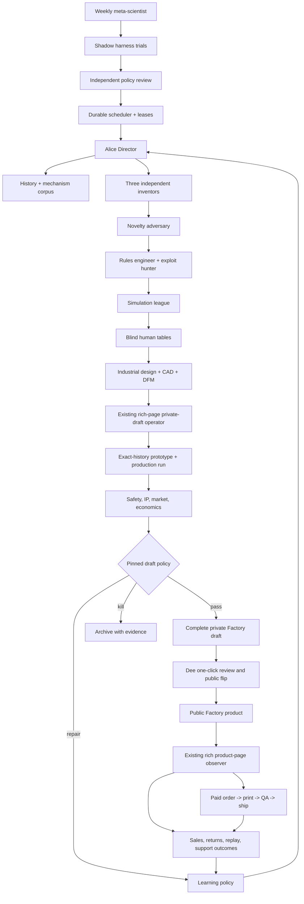

# Alice architecture

## Objective

Alice continuously increases the probability of shipping an original
3D-printable board game that people understand, replay, recommend, and can
actually buy. In the intended live system, a paid order triggers
print-on-demand production and shipping. The portfolio target is one
publishable game per week, with quality gates allowed to slow that cadence.
Throughput is a diagnostic, never the reward.

## The system

The diagram is the target closed loop, not the activation state of this
checkout. Today the fixture is dry-run-only, public Vibe publish is blocked on
the missing atomic backend contract, and no operational order/print/QA/ship
adapters are included.



The scheduler, store, state machine, and effect policy are deterministic code.
Agents propose and evaluate artifacts inside those boundaries. A model cannot
declare a task complete, confer “human” evidence, or change a publication gate.

## Durable runtime

An always-on service is a sequence of recoverable sessions:

- SQLite WAL holds candidates, idempotent tasks, leases, attempts,
  evaluations, experiences, and publication receipts.
- Every consequential action also enters a hash-chained append-only event log.
- A worker claims a time-limited lease in one transaction. A dead worker's
  lease expires and the task returns to the queue.
- External calls carry deterministic operation keys. Where the remote service
  does not yet enforce idempotency, Alice records intent before the call,
  performs the write once, and moves an uncertain result to reconciliation
  instead of retrying it blindly.
- A fresh process can reconstruct work from the database and artifacts; no
  important fact exists only in a model context window.
- Agents receive the smallest cited context required for one job. An archivist
  compacts knowledge, but never edits history.
- The text2game CAD adapter verifies clean text2game and text2cad checkouts at
  exact pinned commits and pins every external executable/profile by path and
  bytes. It copies only an explicit reviewed text2game runtime allowlist and
  the selected text2cad gate/CAD-skill subtree into a private operation
  directory; publishers and credential-like backups are excluded. It stages
  Alice's exact accepted rules, components, and mechanisms, and runs the pinned
  deterministic `consistency.py` before any model process starts.
- Text2game phases 1, 2, and 3 run separately across durable `sending` fences.
  Its model lane is forced to Codex with `workspace-write` scoped to that
  operation copy; Claude fallback, shared vault exchange, messaging, and both
  legacy publishers are disabled. The shared source checkout and its `out/`
  directory are never a runtime workspace.
- The service derives its outer tick deadline from the enabled inner adapters.
  A text2game CAD tick is budgeted for all three configured phase deadlines,
  orderly shutdowns, and validation/export overhead; an operator override may
  lengthen that bound but cannot undercut it.

## Organization

Alice is an orchestrator-worker system with bounded, adversarial specialization:

| Group | Roles | Why separate |
|---|---|---|
| Direction | Alice Director, archivist | Portfolio routing and durable context |
| Knowledge | game historian, mechanism cartographer | Historical breadth and opportunity map |
| Creation | three independent divergent inventors, rules engineer | Avoid early consensus and theme-only variation |
| Falsification | novelty adversary, exploit hunter, safety/IP | Their job is to kill weak claims, not help the pitch |
| Play | optimizer, social, explorer, playtest director, human researcher | Different player incentives expose different failures |
| Make | industrial designer, CAD builder, DFM verifier | Digital plausibility must become a printable object |
| Sell | merchant, publisher | Economics and effects are distinct from invention |
| Improve | meta-scientist | Harness experiments run in shadow mode |

Multi-agent work is used only for independent search, proposals, personas, and
adversarial review. Sequential state changes stay in one deterministic
coordinator. This controls cost and prevents coordination chatter from becoming
the product.

## Interacting loops

### 1. Book laboratory — daily

Maintains a legally acquired reading queue spanning history, culture, mechanism
taxonomy, mathematics, psychology, and design practice. The seed shelf includes
*Everybody Wins*, *Around the World in Eighty Games*, *Board Games in 100
Moves*, *GameTek*, *A Theory of Fun for Game Design*, *Characteristics of
Games*, and *Building Blocks of Tabletop Game Design*.

For every source the librarian records edition and page/location citations,
claims, author evidence, scope, counterexamples, and disagreements—never a
pirated full-text copy. The synthesizer turns one surviving idea into a
preregistered design or playtest hypothesis; the theory adversary tries to break
it. A book is marked “applied” only after held-out evidence tests the hypothesis.
Reading a summary is not completion.

### 2. History loop — daily

Ingests cited metadata and ludemes across cultures and eras, updates a mechanic
graph, records uncertainty and provenance, and identifies underexplored player
experiences. It learns concepts, not copyrighted rulebook expression. Sources
start with Ludii/Digital Ludeme Project and BoardGameGeek metadata and expand
through licensed or public-domain corpora.

### 3. Invention loop — daily when fewer than three candidates are active

The Director selects one evidence-backed opportunity. Three inventors work from
the same constraint but separate contexts and must propose mechanically distinct
systems. The novelty adversary searches for the closest substitutes before any
candidate consumes playtest or CAD budget.

### 4. Rules and digital playtest loop — continuous

The rules engineer writes executable setup, legal action, turn, terminal,
scoring, and tie contracts. Deterministic checks establish reachability and
termination. A seeded league then runs optimizing, social, exploratory, and
adversarial policies. Metrics include first-player advantage, win-rate spread,
decision entropy, effective branching, stalemates, duration variance,
kingmaking, runaway leaders, and repeated-state exploits. Every failure stores
a replayable trace.

### 5. Blind human loop — gated by real people

Alice creates a print-and-play kit and preregistered observation sheet. At least
three independent groups learn from the artifact without designer coaching and
play at least two games. The primary signal is spontaneous replay choice, not a
leading satisfaction question. Confusion, hints, abandonment, duration, rules
disputes, emotional arc, and requested replay are preserved per table. Alice
may schedule and ingest this work; she may not simulate it.

### 6. Physical loop — after human evidence

The industrial designer improves legibility and delight, then the connected
text2game adapter runs its three pinned phases in an isolated operation copy and
exports the accepted result to the verified Vibe workspace. DFM checks layout,
fit, calibrated clearances, motion/interference where relevant, mesh integrity,
component count, assembly, slice success, packaging, and the evidence still
open for a physical operator. Alice then calls the
existing `vibe-ideas` `board-game/tools/publish.py <slug>` operator—not a new
page generator—to create a private rich-page draft from that exact production
workspace. The adapter rereads the draft as its owner and hashes every accepted
CAD artifact back from the immutable `project_url`. Only then does the physical
adapter print and review that exact design/history. A render is not a print.
Production validation requires a receipt tied to the same artifact hashes,
project hash, design id, history id, and project URL.

### 7. Market and publishing loop

The merchant checks the exact offer and economics; safety/IP reviews the exact
production packet. The policy engine makes the eligibility decision. The
publisher hashes rules, assets, CAD, BOM, evidence, price, and disclosures into
one immutable packet. In the current product boundary, `draft` Alice creates and
verifies the complete private Factory page, then stops. Dee reviews that exact
draft and uses the existing one-click public control. Alice never regenerates
the product after the print gate.

Automatic public release is a later, separate `live` capability. After the
missing backend contract is deployed and Dee explicitly enables it, `live`
Alice may invoke the supported Vibe public flip used by manually vibed products,
reusing the exact private draft design/history that was hash-checked, printed,
and reviewed. One atomic write must compare that exact history/project and
complete rich page, apply the reviewed SKU, price, and USD currency, and echo
the packet and policy hashes. The deployed downstream observer may enrich the
public Factory page further. Alice does not recreate either the draft page
builder or that downstream merchandising system.

Alice persists the operation before each remote write, never retries an
ambiguous create/publish response, and reconciles by reading the design back.
For the later automatic path, Alice polls the anonymous Factory design record
until the page contract is complete and the exact price is visible. Only then
does the candidate reach `page_ready`; a final receipt-bound transition marks it
`published`. Until that path is explicitly activated, every game has Dee's
one-click public approval.

### 8. Future print-on-demand order loop — live only

No operational fulfillment adapters are included today. In the intended live
loop, paid orders are reconciled to the exact published packet hash and create
one durably keyed print job per order. The runtime verifies the exact SKU,
candidate, design, history, project, order quantity, artifact hashes, print
profile, canonical material specification, per-set BOM quantities, and packing
recipe. That complete manufacturing slice travels in the intent and must be
echoed by the print, independent QA, and shipment receipts. Replayed order polls
cannot create a second task or cross the external-effect sender fence. Detailed
machine, lot, cost, return, support, review, and repeat-purchase outcomes enter
separately through the outcomes adapter. Agents can plan and route work; a human
or qualified factory process remains accountable for physical safety and final
shipment QA.

### 9. Learning loop — after every verified outcome

A contextual bandit chooses one explicit repair action for a diagnosed failure.
Only held-out human, manufacturing, market, or post-publish outcomes update it.
Simulation and model graders route work but do not train the release policy as
ground truth. A fixed exploration fraction preserves controls and catches drift.

### 10. Meta-loop — weekly

The meta-scientist studies new harness, evaluation, game, and manufacturing
methods, then proposes one change with a preregistered held-out eval. The change
runs in shadow mode against a frozen regression suite and current control. A
separate reviewer can activate the new policy hash. Alice cannot merge or
deploy a change that relaxes her own reward or evidence gates.

## Candidate lifecycle

```text
proposed -> researched -> rules_valid -> digitally_playtested -> human_ready
-> human_validated -> physical_ready -> production_validated -> publish_ready
-> page_ready -> published
```

At each stage the policy may send a candidate to `rework`, `blocked`, or
`killed`. Killed candidates remain valuable negative examples. No state can be
inferred from a prose claim; it requires typed evidence and a transition event.

## Isolation and authority

- Alice never forwards or copies publishing or payment credentials into model
  workspaces. Deployment must also use a credential-clean service host; the
  model sandbox is not a substitute for host-level secret isolation.
- Tool runners hold credentials outside the model sandbox and expose narrow
  JSON contracts.
- Alice's ordinary Codex app-server tasks use the pinned read-only sandbox.
  Text2game is the narrow exception: its internal Codex subprocess receives
  `workspace-write` for a source-pinned per-operation copy so it can produce
  CAD without writing the shared checkout, while fallback to text2game's
  host-capable Claude lane is forced off.
- Same-model generator/evaluator context is never used as release evidence.
- Human records require source identity, consent/provenance metadata, time, and
  a unique trial id.
- Production and publication receipts are bound to input hashes.
- Policy files and held-out evals are read-only to the runtime identity.
- Secrets, personal playtest data, and unpublished partner terms do not enter
  prompts or the public catalog.

## Resource policy

At most three candidates are active. Cheap falsification precedes expensive
work. The system kills a candidate after a critical safety/IP issue, repeated
unfixable dominant strategy, or three repair rounds without held-out gain.
Expensive multi-agent panels run only where independent contexts materially
increase coverage. The weekly target is therefore a quality constraint: Alice
can publish zero games in a weak week and must say why.
