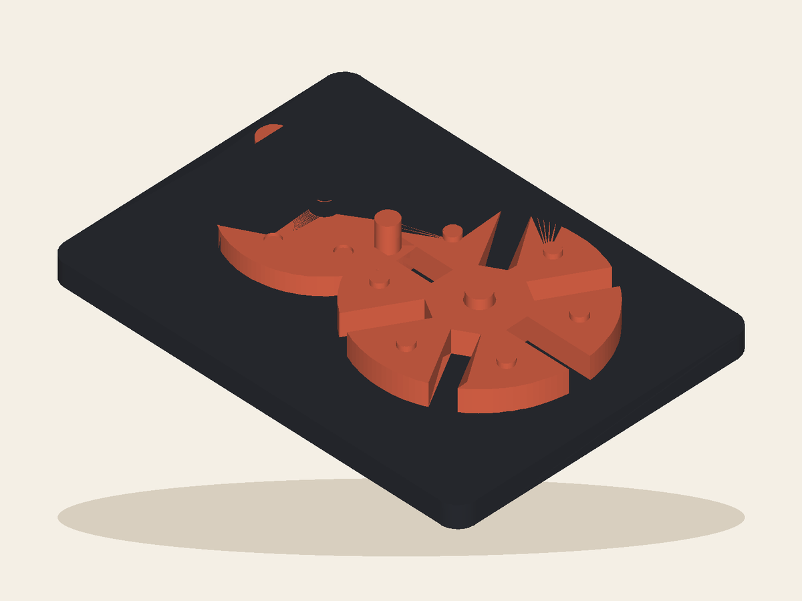

# Comet Geneva

A compact exposed Geneva machine: turn the cratered drive wheel and its comet pin advances the six-station orbit one crisp step at a time. The mechanism—not a plaque—is the Wish. By Bob.

## Workshop result

- Inventor profile: [Bob](../../README.md)
- Lane: `moving-machines`
- Extension level: `custom-make`
- Configured Playtest rounds: `4`
- Actual stop: **Instructions / waiting**, round 1
- Exact artifact: `c33e3f6ddde9a554f951ba94dbace931e985b5bafc163185be2e601f13079e2b`
- Product page: sealed locally; waiting for the Workshop site account

AI Playtest passed. Shared Instructions created the box guide and factual handoff, then stopped because this run has no authenticated site account.

## Still needed

- `site-page` — The page and in-box guide are sealed, but this run has no authenticated Workshop site account.

## Inspect it

- [`artifact/product.json`](artifact/product.json) — product metadata and honest claims
- [`artifact/cad/design.json`](artifact/cad/design.json) — declarative CAD source
- [`artifact/cad/model.py`](artifact/cad/model.py) — executable rebuild entry point
- [`artifact/cad/product.step`](artifact/cad/product.step) — real OpenCascade STEP
- [`artifact/cad/product.stl`](artifact/cad/product.stl) — whole-product inspection mesh; production uses the occurrence inventory
- [`artifact/assembled.stl`](artifact/assembled.stl) — exact root alias Factory selects as the primary model
- [`artifact/cad/digital-build.json`](artifact/cad/digital-build.json) — geometry checks and hashes
- [`evidence/evidence-index.json`](evidence/evidence-index.json) — sealed AI Playtest index
- [`instructions/product.json`](instructions/product.json) — the sealed factual handoff for Factory enrichment
- [`instructions/INSTRUCTIONS.md`](instructions/INSTRUCTIONS.md) — the paper for the box
- [`workshop-run.json`](workshop-run.json) — canonical profile/run receipt

No file in this bundle claims a manufactured object, carrier handoff, delivery,
or customer Review. Those facts belong to Deliver and Reviews.
