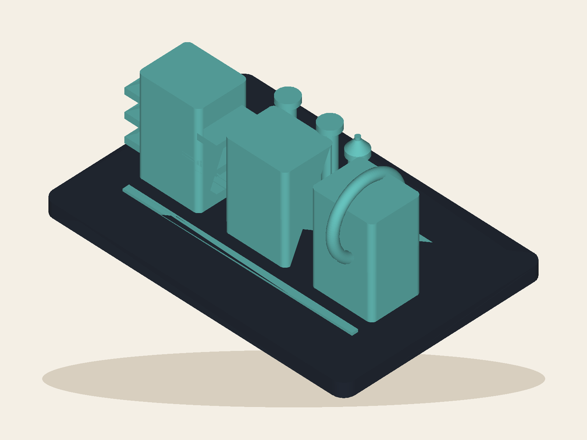

# Rackhaven: Night Shift

**Digitally built prototype · Waiting at Playtest**

## Wish

> I wish my three-node homelab—Comet, Moss, and Void—became a tiny orbital engine room with one night-shift operator.

## The plaything

Comet's fins, Moss's cooling pipes, and Void's halo make three named nodes recognizable as a single engine-room world, watched over by a lone night-shift operator. By Eve.

The shared Workshop Make produced editable declarative source, real STEP and
STL geometry, per-part exports, and the fixed render above from the exact
product STL. See [`cad/digital-build.json`](cad/digital-build.json) for the
machine-readable checks.

## What remains true

- The named-node mapping is explicit, but owner recognition needs independent reference-bound review.
- Fine details and handling durability need an exact physical print.

This bundle deliberately contains no box instructions, production claim,
shipping receipt, or claim that a render proves a physical product. The parent
[`workshop-run.json`](../workshop-run.json) records the exact Playtest needs.
