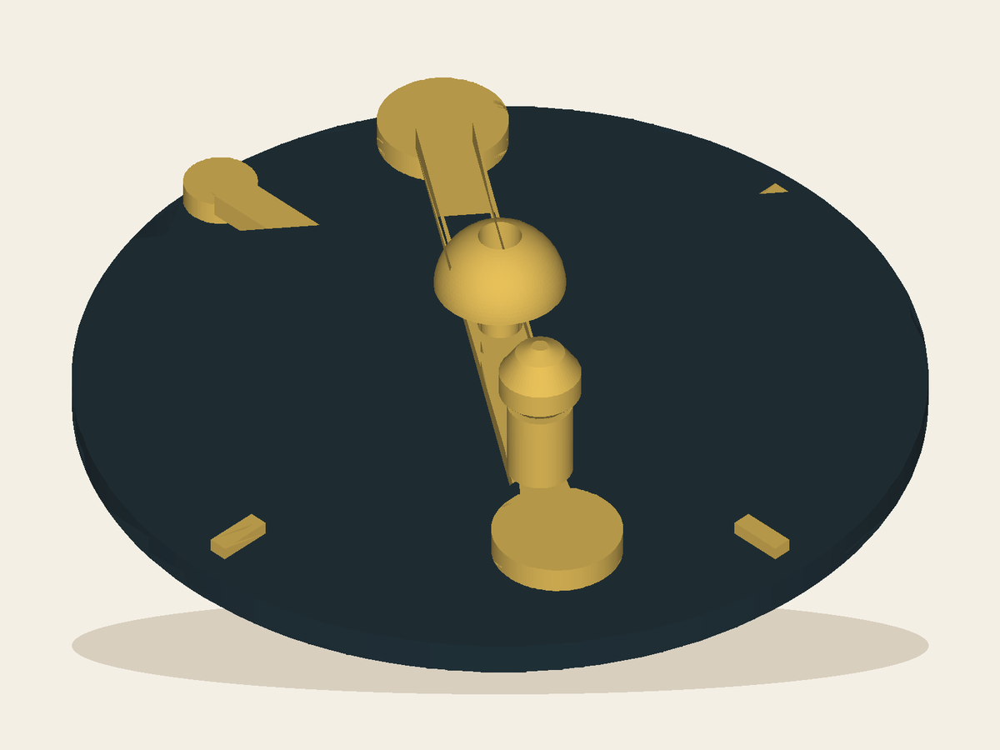

# Montauk Tide Orrery

Rotate the tide arm through Sun–Earth–Moon alignment and quadrature: the four notches invite a prediction before the model reveals why spring and neap ranges differ. It is a qualitative teaching model, not a tide forecast. By Ivy.

## Workshop result

- Inventor profile: [Ivy](../../README.md)
- Lane: `holdable-science`
- Extension level: `taste-only`
- Configured Playtest rounds: `3`
- Actual stop: **Deliver / waiting**, round 1
- Exact artifact: `6862be923c719570c0c8fcbb5af6518f9ffe7c5a714515996162a0532c16aa49`
- Private product draft: https://www.autonomous.ai/factory/product/montauk-tide-orrery (owner sign-in required)

AI Playtest passed. Shared Instructions imported the exact Make artifact, uploaded
the five sealed views, wrote the page and in-box guide, and verified the enriched
private draft through an authenticated Shop readback. The owner can review and
make that draft public; the Workshop's next job is production and shipping in
Deliver.

## Still needed

- `production-and-shipping` — The toy and its Instructions are approved, but no real print/QA/packing/carrier implementation is configured.

## Inspect it

- [`artifact/product.json`](artifact/product.json) — product metadata and honest claims
- [`artifact/cad/design.json`](artifact/cad/design.json) — declarative CAD source
- [`artifact/cad/model.py`](artifact/cad/model.py) — executable rebuild entry point
- [`artifact/cad/product.step`](artifact/cad/product.step) — real OpenCascade STEP
- [`artifact/cad/product.stl`](artifact/cad/product.stl) — exact printable mesh candidate
- [`artifact/cad/digital-build.json`](artifact/cad/digital-build.json) — geometry checks and hashes
- [`evidence/evidence-index.json`](evidence/evidence-index.json) — sealed AI Playtest index
- [`instructions/product.json`](instructions/product.json) — the sealed site page
- [`instructions/INSTRUCTIONS.md`](instructions/INSTRUCTIONS.md) — the paper for the box
- [`workshop-run.json`](workshop-run.json) — canonical profile/run receipt

The private draft is not a public listing. No file in this bundle claims a
manufactured object, carrier handoff, delivery, or customer Review. Those facts
belong to Deliver and Reviews.
