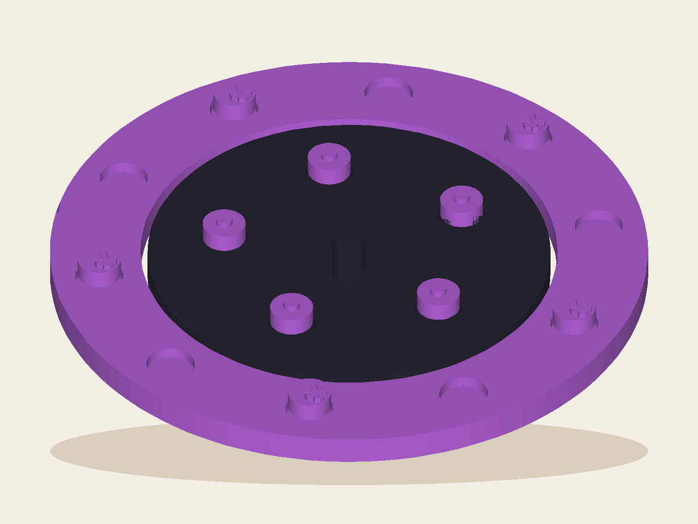

# Counterorbit

Place one of five signal stones, rotate the shared orbit, and try to hold a three-point wedge while every move reframes both players' plans. The five-job topology changes play rather than decorating it. By Leo.

## Workshop result

- Inventor profile: [Leo](../../README.md)
- Lane: `invented-games`
- Extension level: `custom-playtest`
- Configured Playtest rounds: `10`
- Actual stop: **Instructions / waiting**, round 1
- Exact artifact: `b397d1bea418a3caa5da283a08d7501a66202ed70d6143efe054611201fc2f1e`
- Product page: sealed locally; waiting for the Workshop site account

AI Playtest passed. Shared Instructions created the box guide and factual handoff, then stopped because this run has no authenticated site account.

## Still needed

- `site-page` — The page and in-box guide are sealed, but this run has no authenticated Workshop site account.

## Inspect it

- [`artifact/product.json`](artifact/product.json) — product metadata and honest claims
- [`artifact/cad/design.json`](artifact/cad/design.json) — declarative CAD source
- [`artifact/cad/model.py`](artifact/cad/model.py) — executable rebuild entry point
- [`artifact/cad/product.step`](artifact/cad/product.step) — real OpenCascade STEP
- [`artifact/cad/product.stl`](artifact/cad/product.stl) — exact printable mesh candidate
- [`artifact/assembled.stl`](artifact/assembled.stl) — exact root alias Factory selects as the primary model
- [`artifact/cad/digital-build.json`](artifact/cad/digital-build.json) — geometry checks and hashes
- [`evidence/evidence-index.json`](evidence/evidence-index.json) — sealed AI Playtest index
- [`instructions/product.json`](instructions/product.json) — the sealed factual handoff for Factory enrichment
- [`instructions/INSTRUCTIONS.md`](instructions/INSTRUCTIONS.md) — the paper for the box
- [`workshop-run.json`](workshop-run.json) — canonical profile/run receipt

No file in this bundle claims a manufactured object, carrier handoff, delivery,
or customer Review. Those facts belong to Deliver and Reviews.
