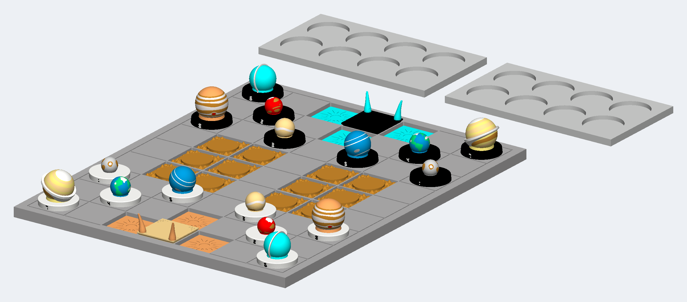

# Antisol Mirror



Jungle Chess played with the solar system. Every piece is a planet, and a planet's size on the board is the fifth root of its real measured diameter, so rank is something you can see rather than learn: Mercury is the smallest world in play and Jupiter the largest, and the traditional rules are followed exactly as written. The two armies are the same sixteen worlds facing each other, told apart because each pair is a mirror of itself -- six of the eight by the lean of the globe at the planet's own true axial tilt, and Mercury and Venus, whose tilts are too small to show one, by the map instead. A star stands at each end with two flames bursting off the board edge, and they are the only raised flames on the board: the three trap cells around each star are flat tiles with a sunken sixteen-rayed star cut into them, and a world caught on one drops three millimetres out of the light and its rank counts for nothing.

**Not published.** This run was sealed locally with `--no-publish`: no Factory listing, no public product page, and no external effect of any kind was created.

| Frozen on this run | Value |
|---|---|
| Agent | Claude Code (`--agent claude`) |
| Workflow | Spark (`--workflow spark`) |
| Model | claude-opus-5 (`--model claude-opus-5`) |
| Effort | High (`--effort high`) |
| Inventor | [Ad Astra](../../inventors/ad-astra/) |
| Factory | not published (`--no-publish`) |

## Workflow

Spark: `Wish -> Make -> Release`. The accepted Inventor assignment is preserved under `match/`. Release is host-owned publication of Make output, with no native Release turn or new manual.

| Stage | Attempts | Outcome |
|---|---|---|
| Wish | host | frozen |
| Match | 1 | accepted (Ad Astra) |
| Invent | skipped | Spark pass-through |
| Make | 1 | accepted |
| Playtest | not run | Spark omission |
| Release | host | accepted |
| Publication | host | unreleased |

Counts come from each stage's public `ATTEMPTS.json`. Skipped stages created no turn, artifact, or gate. Private host rejections and native session resumes are not public.

## How this toy was created

### 1. Wish — freeze the request

**Input:** the creator's request. **This toy's input:** Jungle Chess played with the solar system. Every piece is a planet, and a planet's size on the board is the fifth root of its real measured diameter, so rank is something you can see rather than learn: Mercury is the smallest world in play and Jupiter the largest, and the traditional rules are followed exactly as written. The two armies are the same sixteen worlds facing each other, told apart because each pair is a mirror of itself -- six of the eight by the lean of the globe at the planet's own true axial tilt, and Mercury and Venus, whose tilts are too small to show one, by the map instead. A star stands at each end with two flames bursting off the board edge, and they are the only raised flames on the board: the three trap cells around each star are flat tiles with a sunken sixteen-rayed star cut into them, and a world caught on one drops three millimetres out of the light and its rank counts for nothing.

**Output:** an immutable, hash-bound Wish plus its frozen effort route. The exact wording is withheld; this is the sanitized public summary in [the Wish binding](wish/wish.json).

### 2. Invent — choose an Inventor and define the concept

**Input:** the frozen Wish, eligible Inventor roster with each bound Taste/skill bundle, and the product blueprint. **Output:** **Ad Astra** was selected and produced **Antisol Mirror** — Jungle Chess played with the solar system. Every piece is a planet, and a planet's size on the board is the fifth root of its real measured diameter, so rank is something you can see rather than learn: Mercury is the smallest world in play and Jupiter the largest, and the traditional rules are followed exactly as written. The two armies are the same sixteen worlds facing each other, told apart because each pair is a mirror of itself -- six of the eight by the lean of the globe at the planet's own true axial tilt, and Mercury and Venus, whose tilts are too small to show one, by the map instead. A star stands at each end with two flames bursting off the board edge, and they are the only raised flames on the board: the three trap cells around each star are flat tiles with a sunken sixteen-rayed star cut into them, and a world caught on one drops three millimetres out of the light and its rank counts for nothing. **Concept parts:** Board panel southwest, Board panel southeast, Board panel northwest, Board panel northeast, Asteroid belt tile, Sol star, Sol prominences, Anti-Sol star, Anti-Sol prominences, Sol corona cell, Anti-Sol corona cell, Orbit tray, Orbit tray, Sol disc, Sol rank numeral, Anti-Sol disc, Anti-Sol rank numeral, Mercury globe, Mercury smooth plains, Mercury Caloris rim, Mercury Caloris floor, Mars globe, Mars albedo, Mars north cap, Venus globe, Venus highlands, Earth globe, Earth land, Earth dryland, Earth ice, Neptune globe, Neptune spot, Neptune bands, Uranus globe, Uranus ring, Saturn globe, Saturn light bands, Saturn dark band, Saturn north cap, Saturn ring, Jupiter globe, Jupiter belts, Jupiter spot, Jupiter zones, Jupiter spot collar, Venus lowland plains. The complete compact concept is in [make/invented.json](make/invented.json). Spark has no separate Invent Goal; the accepted Inventor assignment and compact Make concept are preserved separately.

### 3. Make — turn the concept into exact product bytes

**Input:** the accepted concept, selected Inventor identity/Taste, blueprint, and any bounded revision evidence. **Output:** Jungle Chess played with the solar system. Every piece is a planet, and a planet's size on the board is the fifth root of its real measured diameter, so rank is something you can see rather than learn: Mercury is the smallest world in play and Jupiter the largest, and the traditional rules are followed exactly as written. The two armies are the same sixteen worlds facing each other, told apart because each pair is a mirror of itself -- six of the eight by the lean of the globe at the planet's own true axial tilt, and Mercury and Venus, whose tilts are too small to show one, by the map instead. A star stands at each end with two flames bursting off the board edge, and they are the only raised flames on the board: the three trap cells around each star are flat tiles with a sunken sixteen-rayed star cut into them, and a world caught on one drops three millimetres out of the light and its rank counts for nothing. The sealed snapshot contains 26 STEP and 98 product render PNGs, together with [CAD source](make/source/), [models](make/models/), and [deterministic verification](make/verification/). [The Made contract](make/made.json) binds those exact bytes.

### 4. Playtest — challenge the made product

**Input:** the sealed Made product, blueprint-required checks, and exact evidence. **Output:** not run on this effort route; Release preserves the explicit [omission record](release/PLAYTEST-NOT-RUN.json).

### 5. Release — make the customer package

**Input:** the sealed product and the passed Playtest evidence or truthful not-run record. **Output:** the existing Make files and hash-bound publication metadata, with no new manual, PDF, review, or native Release turn; [the existing README](release/README.md) was reused from Make; see [the Release contract](release/release.json).

### 6. Publication — not performed

**Input:** the exact sealed Release package. **Output:** none. This run was sealed locally with `--no-publish`, so no Factory effect was created, no listing exists, and [the publication record](publication/PUBLICATION.json) says `unreleased`.

## Run cost

| Measure | Value |
|---|---|
| Native Manager input tokens | unavailable (the Manager did not report input usage) |
| Native Manager cached input tokens | unavailable (the Manager did not report cache detail) |
| Native Manager uncached input tokens | unavailable (the Manager did not report cache detail) |
| Native Manager cache-write input tokens | unavailable (the Manager did not report cache detail) |
| Native Manager output tokens | unavailable (the Manager did not report output usage) |
| Native Manager reasoning output tokens | unavailable (the Manager did not report reasoning detail) |
| Wish to verified publication | 5h 29m 51s (2026-09-20T11:47:48Z to 2026-09-20T17:17:39+00:00) |

Input and output tokens are best-effort separate counts reported by the native Manager; they are not added together. Cached plus uncached input equals the input covered by the economic breakdown, while cache writes and reasoning are reported as subsets rather than added again. No dollar cost is inferred. Elapsed time ends only after authenticated Factory public readback.

## Reproduce

From a checkout of this repository, verify the host and run the same agent and workflow. This command uses the public product summary; a later run follows the same route but does not replay these exact CAD bytes.

```bash
uv run workshop doctor
uv run workshop wish --agent claude --model claude-opus-5 --effort high --workflow spark 'Jungle Chess played with the solar system. Every piece is a planet, and a planet'"'"'s size on the board is the fifth root of its real measured diameter, so rank is something you can see rather than learn: Mercury is the smallest world in play and Jupiter the largest, and the traditional rules are followed exactly as written. The two armies are the same sixteen worlds facing each other, told apart because each pair is a mirror of itself -- six of the eight by the lean of the globe at the planet'"'"'s own true axial tilt, and Mercury and Venus, whose tilts are too small to show one, by the map instead. A star stands at each end with two flames bursting off the board edge, and they are the only raised flames on the board: the three trap cells around each star are flat tiles with a sunken sixteen-rayed star cut into them, and a world caught on one drops three millimetres out of the light and its rank counts for nothing.'
```

If a native turn stops before Release, continue the same Wish with `uv run workshop resume <wish-id>`.

## Snapshot contents

- `wish/` — sanitized Wish binding (exact text only with explicit consent).
- `match/` — accepted Match assignment.
- Invent was skipped by this effort route; its sealed compact concept is under `make/`.
- `make/` — the exact sealed Release facts, exact CAD source, models, product renders, verification, and sealed prior attempts.
- `release/README.md` — the existing Make README, reused without rewriting.
- `release/` — accepted Release contract and exact package bytes.
- `publication/PUBLICATION.json` — local `unreleased` record; no readback identities, because nothing was published.
- `TOKENS.json` — separate Manager-reported gross/cached/uncached input and output/reasoning tokens by stage; no combined total or dollar estimate.
- `TIMING.json` — Wish intake to locally sealed Release elapsed time.
- `MANIFEST.json` — hashes every workflow file except itself and this README.
- `SANITIZATION.json` — source/public hashes for host-local path prefixes replaced by stable placeholders.
- Playtest was not run; Release records that omission explicitly.

This archive contains no agent session, prompt, transcript, chain of thought, host state, credentials, or raw effect receipt. Publication is not proof of physical manufacture, fit, durability, or delivery.
