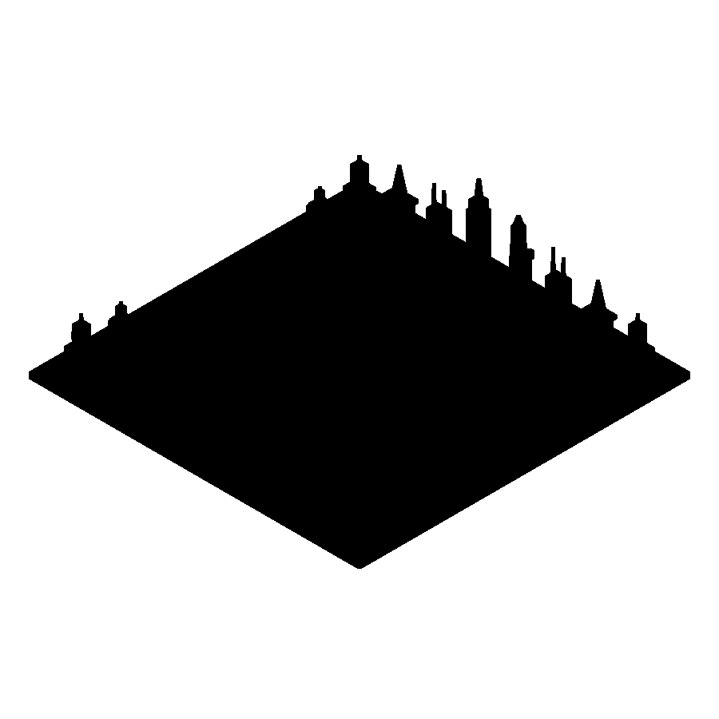

# Saigon Skyline Chess



A geometry-readable orthodox chess set that turns six Ho Chi Minh City landmarks into a complete 32-piece skyline, with round River and square Grid plinths distinguishing the two sides without relying on color.

[View the verified public product page](https://www.autonomous.ai/factory/product/saigon-skyline-chess)

| Frozen on this run | Value |
|---|---|
| Manager | Codex (`--manager codex`) |
| Effort | Spark (`--effort spark`) |
| Inventor | [Alice](../../inventors/alice/) |
| Factory | https://www.autonomous.ai/factory/product/saigon-skyline-chess |

## Workflow

Spark: `Wish -> Make -> Release`. Inventor selection is folded into Make.

| Stage | Attempts | Outcome |
|---|---|---|
| Wish | host | frozen |
| Match | 1 | accepted (Alice) |
| Invent | skipped | Spark pass-through |
| Make | 1 | accepted |
| Playtest | not run | Spark omission |
| Release | 1 | accepted |
| Publication | host | public |

Counts come from each stage's public `ATTEMPTS.json`. Skipped stages created no turn, artifact, or gate. Private host rejections and native session resumes are not public.

## Reproduce

From a checkout of this repository, verify the host and run the same Manager
and effort route. The exact original Wish remains private, so this command uses
the public product summary. A later run follows the same route but does not
replay these exact CAD bytes.

```bash
uv run workshop doctor
uv run workshop wish --manager codex --effort spark --github \
  'A geometry-readable orthodox chess set that turns six Ho Chi Minh City landmarks into a complete 32-piece skyline, with round River and square Grid plinths distinguishing the two sides without relying on color.'
```

If a native turn stops before Release, continue the same Wish with
`uv run workshop resume <wish-id>`.

## Snapshot contents

- `wish/` — sanitized Wish binding (exact text only with explicit consent).
- `match/` — accepted Match assignment.
- Invent was skipped by this effort route; its sealed compact concept is under `make/`.
- `make/` — the exact sealed Release facts, exact CAD source, models, product renders, verification, and sealed prior attempts.
- `release/MANUAL.pdf` — the exact sealed printable in-box manual.
- `release/` — accepted Release contract and exact package bytes.
- `publication/PUBLICATION.json` — sanitized public readback identities.
- `MANIFEST.json` — hashes every workflow file except itself and this README.
- `SANITIZATION.json` — source/public hashes for host-local path prefixes replaced by stable placeholders.
- Playtest was not run; Release records that omission explicitly.

This archive contains no agent session, prompt, transcript, chain of thought, host state, credentials, or raw effect receipt. Publication is not proof of physical manufacture, fit, durability, or delivery.
