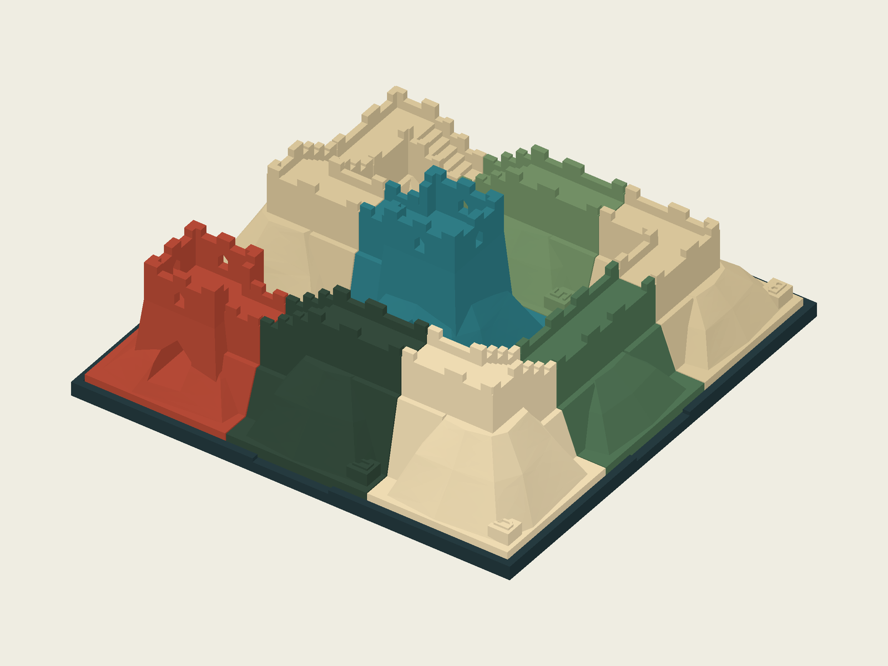

# RIDGELINE — Great Wall Path Puzzle



Build an unbroken route from G1 to G2 using nine mountain-wall modules.
Directions and route heights must match across the entire numbered 3×3 board.
This edition includes the engraved grid, cell numbers, north tab and eight
part colors, with detailed face colors retained.

[Public product](https://www.autonomous.ai/toys/product/ridgeline-great-wall-path-puzzle)
· [Arden Span](../../inventors/arden-span/)
· [Assembly STEP](release/package/assembled.step)
· [Individual parts](release/package/parts/)
· [Rules and source instructions](release/package/README.md)
· [Existing illustrated guide](release/package/manual.pdf)

## Play

Place the cradle on a flat surface, orient its N tab, and follow a challenge's
fixed placements. Complete the board using each of A, B, C, D, S, T, U, G1 and
G2 exactly once. Rotate pieces in the board plane while keeping them upright.
Win when one continuous G1-to-G2 route visits all nine pieces with matching
direction and height at every seam, without an open end or separate loop.
The guided starter leaves A and S to place; the existing guide contains fourteen
route puzzles. See the included rules for the exact setups and solutions.

## Published edition and provenance

This is the operator-published numbered-cradle revision of RIDGELINE. Its 43
package files match the recorded CDN readback from 2026-09-11, including assembly
SHA-256 `f471fbe9f3d5fcafab2caac7e498ee8568fa6f72694d9603ba1743946b08e323`.
The public design and history identifiers, dates and per-file hashes are in
[publication/PUBLICATION.json](publication/PUBLICATION.json).

The final grid/color revision was imported and updated by the operator. This
archive does not assert a native Workshop Release gate for that revision and
does not substitute its operator evidence for a host-accepted Made/Release
contract. The later GitHub preparation added this existing package to source
control; it did not republish or modify the web product. A fresh unauthenticated
API/CDN request on 2026-09-14 returned HTTP 403, so the publication observation
retains its original date.

## Source and reproduction

All product files live together in `release/package/`. Use Python with
build123d 0.11.1 and its compatible OCP dependency. From that directory:

```bash
python board/revise_board.py
```

This rebuilds the numbered, colored cradle and assembly from the hash-checked
preceding STEP edition in `board/previous-edition.zip`. The original parametric
part construction is in `ridgeline_lib.py`, `cadfits.py`, `states.py` and
`ridgeline.step.py`; it is preserved alongside the grid revision in
`cradle_grid.py`. For the current published edition use the revision command
above. Export timestamps can change regenerated STEP file hashes.

`puzzle/` contains the inventory, fourteen challenge definitions, solution set
and an independent exhaustive verifier. `colors/` preserves the color scripts,
palettes and their exact historical STEP inputs. These three small ZIP inputs
are reconstruction dependencies, not private run archives.

`manual.pdf` is the optional guide already shipped with this edition.
`board/build_manual.py` can rebuild it with reportlab and pypdf; it is not a
new Workshop lifecycle requirement. No manual was generated for this commit.

`MANIFEST.json` hashes every snapshot file except itself and this root README.
`SANITIZATION.json` describes the public allowlist. Credentials, original Wish,
agent sessions and raw host receipts are not included.

## Evidence limits

The included grid audit checks cradle validity, the nine engraved numbers,
four grid lines, remaining floor thickness, unchanged module geometry/colors,
and lack of module/cradle volume intersections. The solver checks finite route
constraints. Physical printing, fit, handling, durability and human enjoyment
have not been tested; publication does not establish those properties.
