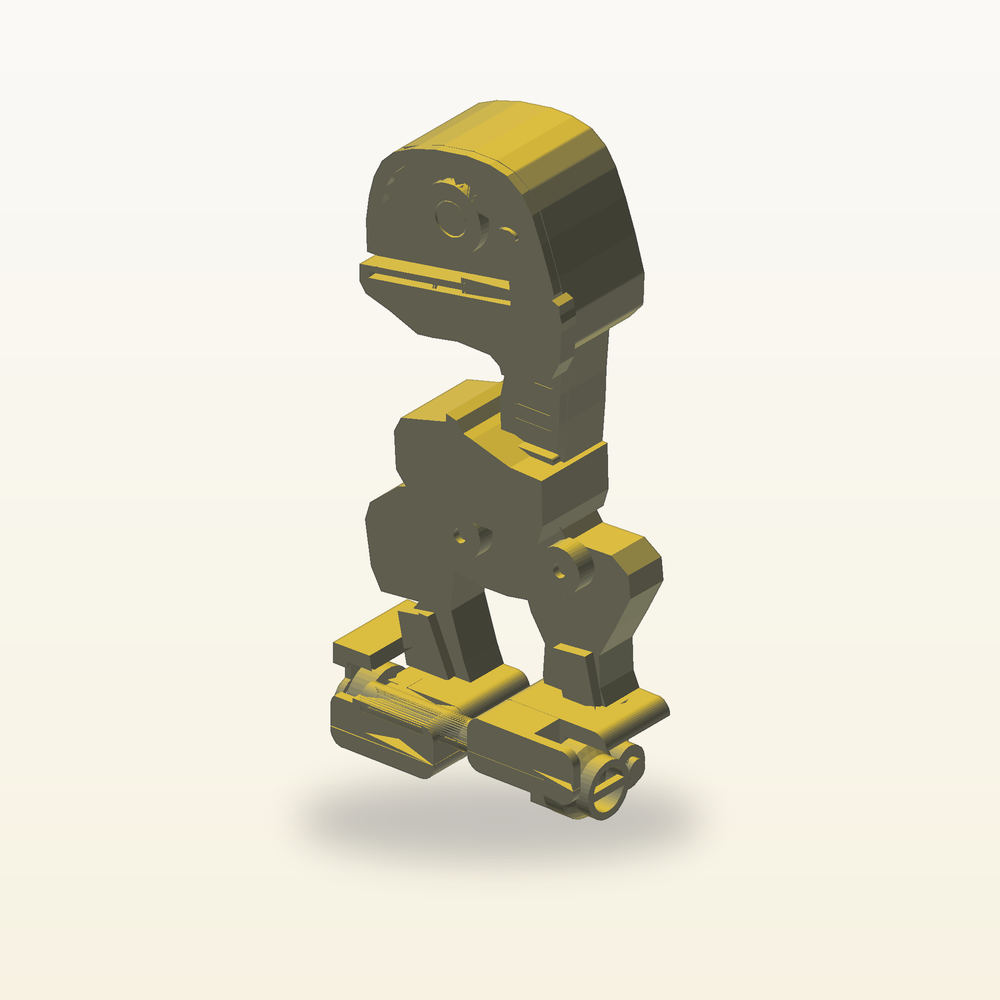

# Microduck



A grey robot duck with a yellow bill, purple details and a side winding knob. A replaceable silicone cord stores the twist that drives its small wheels.

[View the verified public product page](https://www.autonomous.ai/toys/product/microduck)

| Frozen on this run | Value |
|---|---|
| Agent | Codex (`--agent codex`) |
| Workflow | Spark (`--workflow spark`) |
| Model | gpt-6-astra (`--model gpt-6-astra`) |
| Effort | Medium (`--effort medium`) |
| Inventor | [Ferro Line](../../inventors/ferro-line/) |
| Factory | https://www.autonomous.ai/toys/product/microduck |

## Workflow

Spark: `Wish -> Make -> Release`. Inventor selection is folded into Make.

| Stage | Attempts | Outcome |
|---|---|---|
| Wish | host | frozen |
| Match | 1 | accepted (Ferro Line) |
| Invent | skipped | Spark pass-through |
| Make | 1 | accepted |
| Playtest | not run | Spark omission |
| Release | 1 | accepted |
| Publication | host | public |

Counts come from each stage's public `ATTEMPTS.json`. Skipped stages created no turn, artifact, or gate. Private host rejections and native session resumes are not public.

## How this toy was created

### 1. Wish — freeze the request

**Input:** the creator's request. **This toy's input:** A grey robot duck with a yellow bill, purple details and a side winding knob. A replaceable silicone cord stores the twist that drives its small wheels.

**Output:** an immutable, hash-bound Wish plus its frozen effort route. The exact wording is withheld; this is the sanitized public summary in [the Wish binding](wish/wish.json).

### 2. Invent — choose an Inventor and define the concept

**Input:** the frozen Wish, eligible Inventor roster with each bound Taste/skill bundle, and the product blueprint. **Output:** **Ferro Line** was selected and produced **Microduck: upright wind-up robot** — A 180 mm grey, yellow and purple mechanical duck whose exposed side knob twists a replaceable silicone cord inside the front axle. Releasing the knob drives both front wheels while two rear rollers support the rigid upright legs. Twenty printable parts retain the supplied image character. **Concept parts:** Grey robot frame, Yellow duck bill, Dark head rim, Purple eye ring, Dark eye centre, Small dark sensor, Segmented dark neck skin, Left grey shin skin, Left yellow boot, Left purple sole, Right grey shin skin, Right yellow boot, Right purple sole, Wind knob, hollow axle and right drive wheel, Left keyed drive wheel, Fixed cord anchor, Left rear roller, Left rear roller pin, Right rear roller, Right rear roller pin. The complete compact concept is in [make/invented.json](make/invented.json). Spark has no separate Invent Goal; selection and this compact concept were folded into Make.

### 3. Make — turn the concept into exact product bytes

**Input:** the accepted concept, selected Inventor identity/Taste, blueprint, and any bounded revision evidence. **Output:** A grey robot duck with a yellow bill, purple details and a side winding knob. Twist the knob to store energy in a replaceable silicone cord, then release it for a short roll on its small wheels. The sealed snapshot contains 21 STEP, 22 STL, 1 GLB and 8 product render PNGs, together with [CAD source](make/source/), [models](make/models/), and [deterministic verification](make/verification/). [The Made contract](make/made.json) binds those exact bytes.

### 4. Playtest — challenge the made product

**Input:** the sealed Made product, blueprint-required checks, and exact evidence. **Output:** not run on this effort route; Release preserves the explicit [omission record](release/PLAYTEST-NOT-RUN.json).

### 5. Release — make the customer package

**Input:** the sealed product and the passed Playtest evidence or truthful not-run record. **Output:** the hash-bound Release package, product facts, and printable [customer manual](release/MANUAL.pdf); see [the Release contract](release/release.json).

### 6. Publication — perform and verify the external effect

**Input:** the exact sealed Release package plus host-held Factory authorization; credentials never enter the native session. **Output:** [the public Factory product](https://www.autonomous.ai/toys/product/microduck) and a sanitized, hash-verified [publication readback](publication/PUBLICATION.json).

## Run cost

| Measure | Value |
|---|---|
| Native Manager input tokens | 11,161,139 (partial; 4/6 turns measured) |
| Native Manager cached input tokens | 10,636,928 (partial; 4/6 turns measured) |
| Native Manager uncached input tokens | 524,211 (partial; 4/6 turns measured) |
| Native Manager cache-write input tokens | 0 (partial; 4/6 turns measured) |
| Native Manager output tokens | 48,149 (partial; 4/6 turns measured) |
| Native Manager reasoning output tokens | 7,407 (partial; 4/6 turns measured) |
| Wish to verified publication | 3h 23m 46s (2026-09-07T09:58:52Z to 2026-09-07T13:22:38.320937+00:00) |

| Stage | Input tokens | Cached input | Uncached input | Output tokens | Turns | Coverage |
|---|---:|---:|---:|---:|---:|---|
| Match | 0 | 0 | 0 | 0 | 0 | folded; economics folded |
| Invent | 0 | 0 | 0 | 0 | 0 | skipped; economics skipped |
| Make | 9,790,137 | 9,382,016 | 408,121 | 37,368 | 5 | partial; economics partial |
| Playtest | 0 | 0 | 0 | 0 | 0 | not-run; economics not-run |
| Release | 1,371,002 | 1,254,912 | 116,090 | 10,781 | 1 | measured; economics measured |

Input and output tokens are best-effort separate counts reported by the native Manager; they are not added together. Cached plus uncached input equals the input covered by the economic breakdown, while cache writes and reasoning are reported as subsets rather than added again. No dollar cost is inferred. Elapsed time ends only after authenticated Factory public readback.

## Reproduce

From a checkout of this repository, verify the host and run the same agent and workflow. This command uses the public product summary; a later run follows the same route but does not replay these exact CAD bytes.

```bash
uv run workshop doctor
uv run workshop wish --agent codex --model gpt-6-astra --effort medium --workflow spark 'A grey robot duck with a yellow bill, purple details and a side winding knob. A replaceable silicone cord stores the twist that drives its small wheels.'
```

If a native turn stops before Release, continue the same Wish with `uv run workshop resume <wish-id>`.

## Snapshot contents

- `wish/` — sanitized Wish binding (exact text only with explicit consent).
- `match/` — accepted Match assignment.
- Invent was skipped by this effort route; its sealed compact concept is under `make/`.
- `make/` — the exact sealed Release facts, exact CAD source, models, product renders, verification, and sealed prior attempts.
- `release/MANUAL.pdf` — the exact sealed printable in-box manual.
- `release/` — accepted Release contract and exact package bytes.
- `publication/PUBLICATION.json` — sanitized public readback identities.
- `TOKENS.json` — separate Manager-reported gross/cached/uncached input and output/reasoning tokens by stage; no combined total or dollar estimate.
- `TIMING.json` — Wish intake to authenticated public-readback elapsed time.
- `MANIFEST.json` — hashes every workflow file except itself and this README.
- `SANITIZATION.json` — source/public hashes for host-local path prefixes replaced by stable placeholders.
- Playtest was not run; Release records that omission explicitly.

This archive contains no agent session, prompt, transcript, chain of thought, host state, credentials, or raw effect receipt. Publication is not proof of physical manufacture, fit, durability, or delivery.
