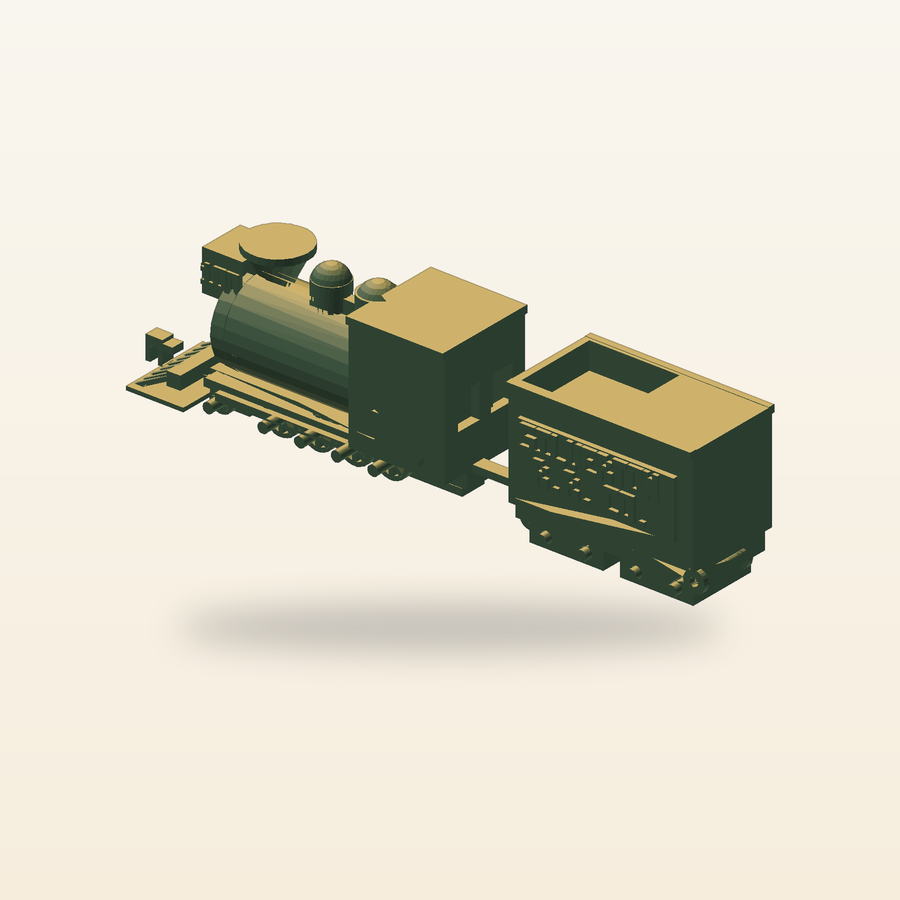

# Ouray No. 100



A 1:87 buildable desk model of Silverton Railroad No. 100, with a four-driver 2-8-0 profile, separate rolling wheelsets, a two-truck tender, and a hook-and-bar coupling.

[View the verified public product page](https://www.autonomous.ai/toys/product/ouray-no-100)

| Frozen on this run | Value |
|---|---|
| Manager | Codex (`--manager codex`) |
| Effort | Forge (`--effort forge`) |
| Inventor | [Ferro Line](../../inventors/ferro-line/) |
| Factory | https://www.autonomous.ai/toys/product/ouray-no-100 |

## Workflow

Forge: `Wish -> Invent -> Make -> Release`. Inventor selection is folded into Invent.

| Stage | Attempts | Outcome |
|---|---|---|
| Wish | host | frozen |
| Match | 1 | accepted (Ferro Line) |
| Invent | 1 | accepted |
| Make | 1 | accepted |
| Playtest | not run | Forge omission |
| Release | 1 | accepted |
| Publication | host | public |

Counts come from each stage's public `ATTEMPTS.json`. Skipped stages created no turn, artifact, or gate. Private host rejections and native session resumes are not public.

## How this toy was created

### 1. Wish — freeze the request

**Input:** the creator's request. **This toy's input:** A 1:87 buildable desk model of Silverton Railroad No. 100, with a four-driver 2-8-0 profile, separate rolling wheelsets, a two-truck tender, and a hook-and-bar coupling.

**Output:** an immutable, hash-bound Wish plus its frozen effort route. The exact wording is withheld; this is the sanitized public summary in [the Wish binding](wish/wish.json).

### 2. Invent — choose an Inventor and define the concept

**Input:** the frozen Wish, eligible Inventor roster with each bound Taste/skill bundle, and the product blueprint. **Output:** **Ferro Line** was selected and produced **Ferro Line 1:87 No. 100 “Ouray” — 1887 Silverton Railroad composite 2-8-0** — A 1:87, all-FDM, support-aware desk-running reconstruction concept for Silverton Railroad No. 100 “Ouray,” the railroad's 1887 composite rebuild from Baldwin-built D&RG components: four coupled 10.51 mm driver wheelsets under a low Class 60 frame, a compact boiler and Victorian cab crowned by a diamond stack, a box headlamp and pilot, and a separately rolling tender on two swiveling four-wheel trucks with process-resolved SILVERTON R.R. CO. lettering. The exact 1888 Fort Lewis photograph establishes identity and wheel arrangement; sister Class 60/C-16 records provisionally bound dimensions. A provenance-verified period GA remains a mandatory first Make gate, so no exact-drawing fidelity is claimed at Invent. No motor, light, metal axle, purchased bearing, or commercial-kit geometry enters the design. **Concept parts:** Locomotive frame and fixed suspension relief, Locomotive journal keeper, Leading driving wheelset, Second driving wheelset, Third driving wheelset, Trailing driving wheelset, Two-wheel pilot truck, Pilot wheelset, Pilot truck axle keeper, Pilot truck pivot pin, Boiler, firebox, smokebox, and running boards, Steam and sand dome cluster, Flared diamond spark-arresting stack, Victorian cab shell, Kerosene box headlamp marked 100, Pilot beam, cowcatcher, steps, and front fleet hook, Tender underframe, Silverton Railroad tender tank and coal bunker, Front four-wheel tender truck, Rear four-wheel tender truck, Front tender truck axle keeper, Rear tender truck axle keeper, Front tender truck pivot pin, Rear tender truck pivot pin, Tender wheelset one, Tender wheelset two, Tender wheelset three, Tender wheelset four, Tender-front fleet coupling bar, Tender-rear fleet coupling bar. The complete compact concept is in [invent/invented.json](invent/invented.json). Invent was a separate native Goal.

### 3. Make — turn the concept into exact product bytes

**Input:** the accepted concept, selected Inventor identity/Taste, blueprint, and any bounded revision evidence. **Output:** A source-built 1:87 model of Silverton Railroad No. 100, with a four-axle 2-8-0 stance, serviceable rolling wheelsets, process-resolved historic markings, and a hook-and-bar tender coupling. The sealed snapshot contains 34 STEP, 38 STL, 1 GLB and 5 product render PNGs, together with [CAD source](make/source/), [models](make/models/), and [deterministic verification](make/verification/). [The Made contract](make/made.json) binds those exact bytes.

### 4. Playtest — challenge the made product

**Input:** the sealed Made product, blueprint-required checks, and exact evidence. **Output:** not run on this effort route; Release preserves the explicit [omission record](release/PLAYTEST-NOT-RUN.json).

### 5. Release — make the customer package

**Input:** the sealed product and the passed Playtest evidence or truthful not-run record. **Output:** the hash-bound Release package, product facts, and printable [customer manual](release/MANUAL.pdf); see [the Release contract](release/release.json).

### 6. Publication — perform and verify the external effect

**Input:** the exact sealed Release package plus host-held Factory authorization; credentials never enter the native session. **Output:** [the public Factory product](https://www.autonomous.ai/toys/product/ouray-no-100) and a sanitized, hash-verified [publication readback](publication/PUBLICATION.json).

## Run cost

| Measure | Value |
|---|---|
| Native Manager input tokens | 43,183,074 (partial; 6/9 turns measured) |
| Native Manager cached input tokens | 42,023,808 (partial; 6/9 turns measured) |
| Native Manager uncached input tokens | 1,159,266 (partial; 6/9 turns measured) |
| Native Manager cache-write input tokens | 0 (partial; 6/9 turns measured) |
| Native Manager output tokens | 164,065 (partial; 6/9 turns measured) |
| Native Manager reasoning output tokens | 57,556 (partial; 6/9 turns measured) |
| Wish to verified publication | 4h 53m 2s (2026-09-05T08:08:24Z to 2026-09-05T13:01:26.546728+00:00) |

| Stage | Input tokens | Cached input | Uncached input | Output tokens | Turns | Coverage |
|---|---:|---:|---:|---:|---:|---|
| Match | 0 | 0 | 0 | 0 | 0 | folded; economics folded |
| Invent | 11,407,388 | 11,078,144 | 329,244 | 71,934 | 1 | measured; economics measured |
| Make | 24,236,468 | 23,768,576 | 467,892 | 60,459 | 6 | partial; economics partial |
| Playtest | 0 | 0 | 0 | 0 | 0 | not-run; economics not-run |
| Release | 7,539,218 | 7,177,088 | 362,130 | 31,672 | 1 | measured; economics measured |

Input and output tokens are best-effort separate counts reported by the native Manager; they are not added together. Cached plus uncached input equals the input covered by the economic breakdown, while cache writes and reasoning are reported as subsets rather than added again. No dollar cost is inferred. Elapsed time ends only after authenticated Factory public readback.

## Reproduce

From a checkout of this repository, verify the host and run the same Manager and effort route. This command uses the public product summary; a later run follows the same route but does not replay these exact CAD bytes.

```bash
uv run workshop doctor
uv run workshop wish --manager codex --effort forge 'A 1:87 buildable desk model of Silverton Railroad No. 100, with a four-driver 2-8-0 profile, separate rolling wheelsets, a two-truck tender, and a hook-and-bar coupling.'
```

If a native turn stops before Release, continue the same Wish with `uv run workshop resume <wish-id>`.

## Snapshot contents

- `wish/` — sanitized Wish binding (exact text only with explicit consent).
- `match/` — accepted Match assignment.
- `invent/` — accepted Invent contract/source and sealed superseded attempts.
- `make/` — the exact sealed Release facts, exact CAD source, models, product renders, verification, and sealed prior attempts.
- `release/MANUAL.pdf` — the exact sealed printable in-box manual.
- `release/` — accepted Release contract and exact package bytes.
- `publication/PUBLICATION.json` — sanitized public readback identities.
- `TOKENS.json` — separate Manager-reported gross/cached/uncached input and output/reasoning tokens by stage; no combined total or dollar estimate.
- `TIMING.json` — Wish intake to authenticated public-readback elapsed time.
- `MANIFEST.json` — hashes every workflow file except itself and this README.
- `SANITIZATION.json` — source/public hashes for host-local path prefixes replaced by stable placeholders.
- Playtest was not run; Release records that omission explicitly.

This archive contains no agent session, prompt, transcript, chain of thought, host state, credentials, or raw effect receipt. Publication is not proof of physical manufacture, fit, durability, or delivery.
