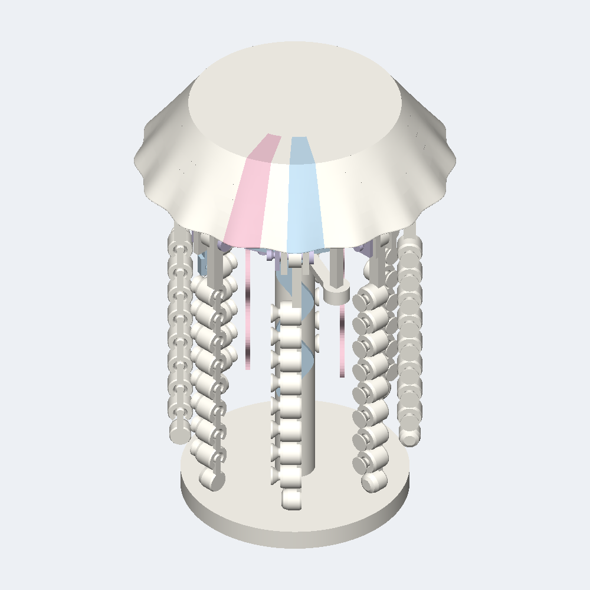

# Pearl Pulse



A palm-sized pearl jellyfish with soft pink and blue accents, eight beaded tentacles and four flowing ribbons. Its wind-up mechanism and pressable bell are designed to create a gentle swimming pulse.

[View the verified public product page](https://www.autonomous.ai/toys/product/pearl-pulse)

| Frozen on this run | Value |
|---|---|
| Agent | Codex (`--agent codex`) |
| Workflow | Spark (`--workflow spark`) |
| Model | gpt-6-astra (`--model gpt-6-astra`) |
| Effort | High (`--effort high`) |
| Inventor | [Ferro Line](../../inventors/ferro-line/) |
| Factory | https://www.autonomous.ai/toys/product/pearl-pulse |

## Workflow

Spark: `Wish -> Make -> Release`. The accepted Inventor assignment is preserved under `match/`. Release is host-owned publication of Make output, with no native Release turn or new manual.

| Stage | Attempts | Outcome |
|---|---|---|
| Wish | host | frozen |
| Match | 1 | accepted (Ferro Line) |
| Invent | skipped | Spark pass-through |
| Make | 1 | accepted |
| Playtest | not run | Spark omission |
| Release | host | accepted |
| Publication | host | public |

Counts come from each stage's public `ATTEMPTS.json`. Skipped stages created no turn, artifact, or gate. Private host rejections and native session resumes are not public.

## How this toy was created

### 1. Wish — freeze the request

**Input:** the creator's request. **This toy's input:** A palm-sized pearl jellyfish with soft pink and blue accents, eight beaded tentacles and four flowing ribbons. Its wind-up mechanism and pressable bell are designed to create a gentle swimming pulse.

**Output:** an immutable, hash-bound Wish plus its frozen effort route. The exact wording is withheld; this is the sanitized public summary in [the Wish binding](wish/wish.json).

### 2. Invent — choose an Inventor and define the concept

**Input:** the frozen Wish, eligible Inventor roster with each bound Taste/skill bundle, and the product blueprint. **Output:** **Ferro Line** was selected and produced **Pearl Pulse** — A pearl jellyfish desk companion with a pressable bell, eight articulated bead tentacles and four ribbon arms. Its wind-up rubber drive is designed to repeat a slow swimming pulse. **Concept parts:** Integrated foot and stand (quantity 1), Removable motor anchor (quantity 1), Keyed lower carrier (quantity 1), Fixed pivot frame and stator (quantity 1), Face cam and winding key (quantity 1), Grease rotor cup (quantity 1), Retained motor shaft (quantity 1), Split drive cross-key (quantity 1), Drive thrust washer (quantity 1), Moving inner ring and posts (quantity 1), Relieved ring keeper (quantity 1), Clipped keeper pin (quantity 3), Common flat C-clip (quantity 11), Removable elastic attachment (quantity 2), Blush oral ribbon (quantity 2), Mist oral ribbon (quantity 2), Clipped tangent pivot pin (quantity 8), Rocker and first chain eye (quantity 8), Repeating captive bead (quantity 56), Terminal pearl bead (quantity 8), Pearl bell material region (quantity 1), Blush bell material region (quantity 1), Mist bell material region (quantity 1). The complete compact concept is in [make/invented.json](make/invented.json). Spark has no separate Invent Goal; the accepted Inventor assignment and compact Make concept are preserved separately.

### 3. Make — turn the concept into exact product bytes

**Input:** the accepted concept, selected Inventor identity/Taste, blueprint, and any bounded revision evidence. **Output:** A palm-sized pearl jellyfish with soft pink and blue accents, eight beaded tentacles and four flowing ribbons. Its wind-up mechanism and pressable bell are designed to create a gentle swimming pulse. The sealed snapshot contains 23 STEP and 3 product render PNGs, together with [CAD source](make/source/), [models](make/models/), and [deterministic verification](make/verification/). [The Made contract](make/made.json) binds those exact bytes.

### 4. Playtest — challenge the made product

**Input:** the sealed Made product, blueprint-required checks, and exact evidence. **Output:** not run on this effort route; Release preserves the explicit [omission record](release/PLAYTEST-NOT-RUN.json).

### 5. Release — make the customer package

**Input:** the sealed product and the passed Playtest evidence or truthful not-run record. **Output:** the existing Make files and hash-bound publication metadata, with no new manual, PDF, review, or native Release turn; [the existing README](release/README.md) was reused from Make; see [the Release contract](release/release.json).

### 6. Publication — perform and verify the external effect

**Input:** the exact sealed Release package plus host-held Factory authorization; credentials never enter the native session. **Output:** [the public Factory product](https://www.autonomous.ai/toys/product/pearl-pulse) and a sanitized, hash-verified [publication readback](publication/PUBLICATION.json).

## Run cost

| Measure | Value |
|---|---|
| Native Manager input tokens | 57,230,877 (measured; 1/1 turns measured) |
| Native Manager cached input tokens | 55,992,064 (measured; 1/1 turns measured) |
| Native Manager uncached input tokens | 1,238,813 (measured; 1/1 turns measured) |
| Native Manager cache-write input tokens | 0 (measured; 1/1 turns measured) |
| Native Manager output tokens | 154,591 (measured; 1/1 turns measured) |
| Native Manager reasoning output tokens | 64,912 (measured; 1/1 turns measured) |
| Wish to verified publication | 4h 50m 57s (2026-09-15T23:07:15Z to 2026-09-16T03:58:12.840578+00:00) |

| Stage | Input tokens | Cached input | Uncached input | Output tokens | Turns | Coverage |
|---|---:|---:|---:|---:|---:|---|
| Match | 0 | 0 | 0 | 0 | 0 | folded; economics folded |
| Invent | 0 | 0 | 0 | 0 | 0 | skipped; economics skipped |
| Make | 57,230,877 | 55,992,064 | 1,238,813 | 154,591 | 1 | measured; economics measured |
| Playtest | 0 | 0 | 0 | 0 | 0 | not-run; economics not-run |
| Release | 0 | 0 | 0 | 0 | 0 | pending; economics pending |

Input and output tokens are best-effort separate counts reported by the native Manager; they are not added together. Cached plus uncached input equals the input covered by the economic breakdown, while cache writes and reasoning are reported as subsets rather than added again. No dollar cost is inferred. Elapsed time ends only after authenticated Factory public readback.

## Reproduce

From a checkout of this repository, verify the host and run the same agent and workflow. This command uses the public product summary; a later run follows the same route but does not replay these exact CAD bytes.

```bash
uv run workshop doctor
uv run workshop wish --agent codex --model gpt-6-astra --effort high --workflow spark 'A palm-sized pearl jellyfish with soft pink and blue accents, eight beaded tentacles and four flowing ribbons. Its wind-up mechanism and pressable bell are designed to create a gentle swimming pulse.'
```

If a native turn stops before Release, continue the same Wish with `uv run workshop resume <wish-id>`.

## Snapshot contents

- `wish/` — sanitized Wish binding (exact text only with explicit consent).
- `match/` — accepted Match assignment.
- Invent was skipped by this effort route; its sealed compact concept is under `make/`.
- `make/` — the exact sealed Release facts, exact CAD source, models, product renders, verification, and sealed prior attempts.
- `release/README.md` — the existing Make README, reused without rewriting.
- `release/` — accepted Release contract and exact package bytes.
- `publication/PUBLICATION.json` — sanitized public readback identities.
- `TOKENS.json` — separate Manager-reported gross/cached/uncached input and output/reasoning tokens by stage; no combined total or dollar estimate.
- `TIMING.json` — Wish intake to authenticated public-readback elapsed time.
- `MANIFEST.json` — hashes every workflow file except itself and this README.
- `SANITIZATION.json` — source/public hashes for host-local path prefixes replaced by stable placeholders.
- Playtest was not run; Release records that omission explicitly.

This archive contains no agent session, prompt, transcript, chain of thought, host state, credentials, or raw effect receipt. Publication is not proof of physical manufacture, fit, durability, or delivery.
