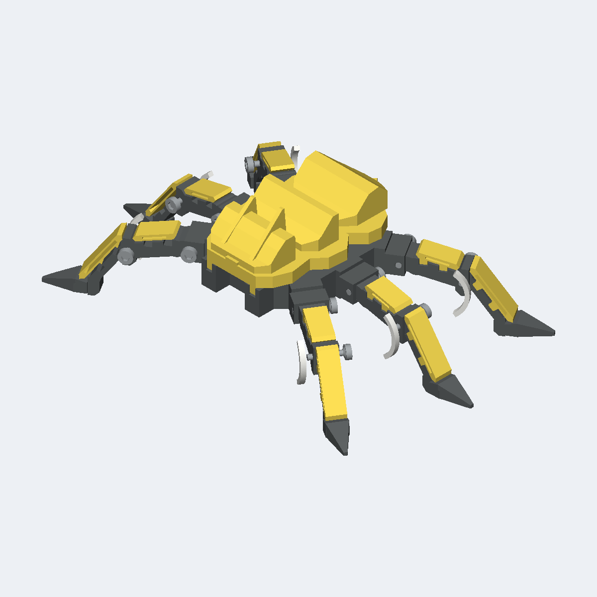

# Rivetback H-6 V4

**Archive status:** Make output sealed; Factory publication is not verified by this archive.

Unarmed, rigid-pose successor with 15 unique component roles and 61 placed occurrences. The existing final verification report records PASS on 2026-09-16. The earlier desktop V4 source, STEP files, renders and saved report are preserved separately under revisions/desktop-v4/cad/; its legacy weapon generators are not part of the final assembly.

## Design files

- [Editable assembly entry](cad/rivetback.step.py)
- `cad/part_*.step.py`: individual component generators.
- `cad/part_*.step`: existing generated component geometry.
- `cad/parts/`, `cad/features/`, `cad/assemblies/`: shared model source.
- [Original CAD documentation](cad/README.md)

## Existing verification records

- [verification-pipeline.md](cad/measure/verification-pipeline.md)

## Reuse and provenance

The source uses build123d and Workshop's cadgen/CAD helpers. Use a compatible
Workshop CAD toolchain when rebuilding the explicit `*.step.py` entries.
STEP exports can be opened independently in a STEP-compatible CAD viewer.

This is a generated design archive committed at the owner's request. It does
not represent a completed Factory publication or a new validation run. Digital
reports do not establish a successful physical print, fit, durability or safety.
Only design source, existing STEP geometry, renders and selected engineering
records are included. Local path prefixes in text are replaced with stable
placeholders; `PROVENANCE.json` records original and archived hashes.
`MANIFEST.json` hashes every archived file except itself.
