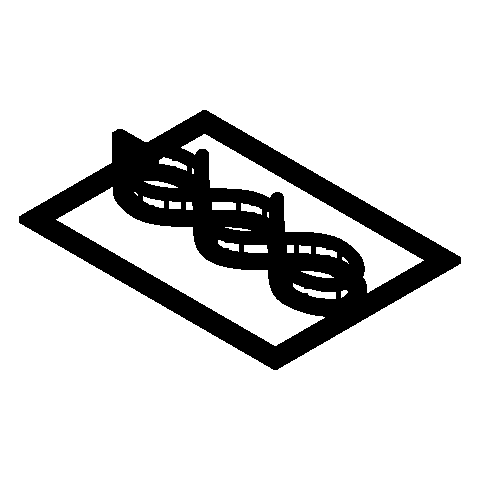

# Eclipse Braid

A one-handed print-in-place desk toy whose captive moon runner follows one fully visible braided figure-eight route through two separated bridges and returns home by continued thumb motion.

[View the verified public product page](https://www.autonomous.ai/factory/product/eclipse-braid)

## Workflow

Spark: `Wish -> Make -> Release`. Inventor selection is folded into Make.

| Stage | Attempts | Outcome |
|---|---|---|
| Wish | host | frozen |
| Match | 1 | accepted (Kestrel Knot) |
| Invent | skipped | Spark pass-through |
| Make | 1 | accepted |
| Playtest | not run | Spark omission |
| Release | 1 | accepted |
| Publication | host | public |

Counts come from each stage's public `ATTEMPTS.json`. Skipped stages created no turn, artifact, or gate. Private host rejections and native session resumes are not public.

## How this toy was created

1. **Wish.** Input: a one-handed print-in-place toy whose captive moon follows a visible braided figure-eight and returns home. Output: the immutable [sanitized Wish binding](wish/wish.json); its exact wording is withheld.
2. **Invent.** Input: that Wish, the eligible Inventor roster, Taste, and blueprint. Output: Kestrel Knot was selected and defined *Eclipse Braid*: an open hand frame, branch-free braided rail, and captive squared-crescent runner that visibly reverses orientation at the far lobe. Spark folded this compact concept into Make; see [the concept](make/invented.json).
3. **Make.** Input: the accepted concept and Kestrel Knot's bound craft context. Output: the sealed print-in-place model, with 1 STL and 4 legacy-layout Make evidence PNGs, exact [CAD source](make/source/), [models](make/models/), and [verification](make/verification/), all bound by [made.json](make/made.json).
4. **Playtest.** Input: the sealed Made product. Output: not run on the Spark route, recorded explicitly in [PLAYTEST-NOT-RUN.json](release/PLAYTEST-NOT-RUN.json).
5. **Release.** Input: the sealed product plus the truthful Playtest omission. Output: the hash-bound package and printable [customer manual](release/MANUAL.pdf), bound by [release.json](release/release.json).
6. **Publication.** Input: the exact Release package plus host-held Factory authorization. Output: the verified [Factory product](https://www.autonomous.ai/factory/product/eclipse-braid) and sanitized [publication readback](publication/PUBLICATION.json).

## Run cost

| Measure | Value |
|---|---|
| Native Manager input tokens | unavailable — this run predates split token telemetry |
| Native Manager output tokens | unavailable — this run predates split token telemetry |
| Wish to verified publication | unavailable — the archived snapshot has no trustworthy Wish-start timestamp |

No dollar cost is inferred.

## Snapshot contents

- `wish/` — sanitized Wish binding (exact text only with explicit consent).
- `match/` — accepted Match assignment.
- Invent was skipped by this effort route; its sealed compact concept is under `make/`.
- `make/` — the exact sealed Release facts, exact CAD source, models, product renders, verification, and sealed prior attempts.
- `release/MANUAL.pdf` — the exact sealed printable in-box manual.
- `release/` — accepted Release contract and exact package bytes.
- `publication/PUBLICATION.json` — sanitized public readback identities.
- `MANIFEST.json` — hashes every workflow file except itself and this README.
- `SANITIZATION.json` — source/public hashes for host-local path prefixes replaced by stable placeholders.
- Playtest was not run; Release records that omission explicitly.

This archive contains no agent session, prompt, transcript, chain of thought, host state, credentials, or raw effect receipt. Publication is not proof of physical manufacture, fit, durability, or delivery.
