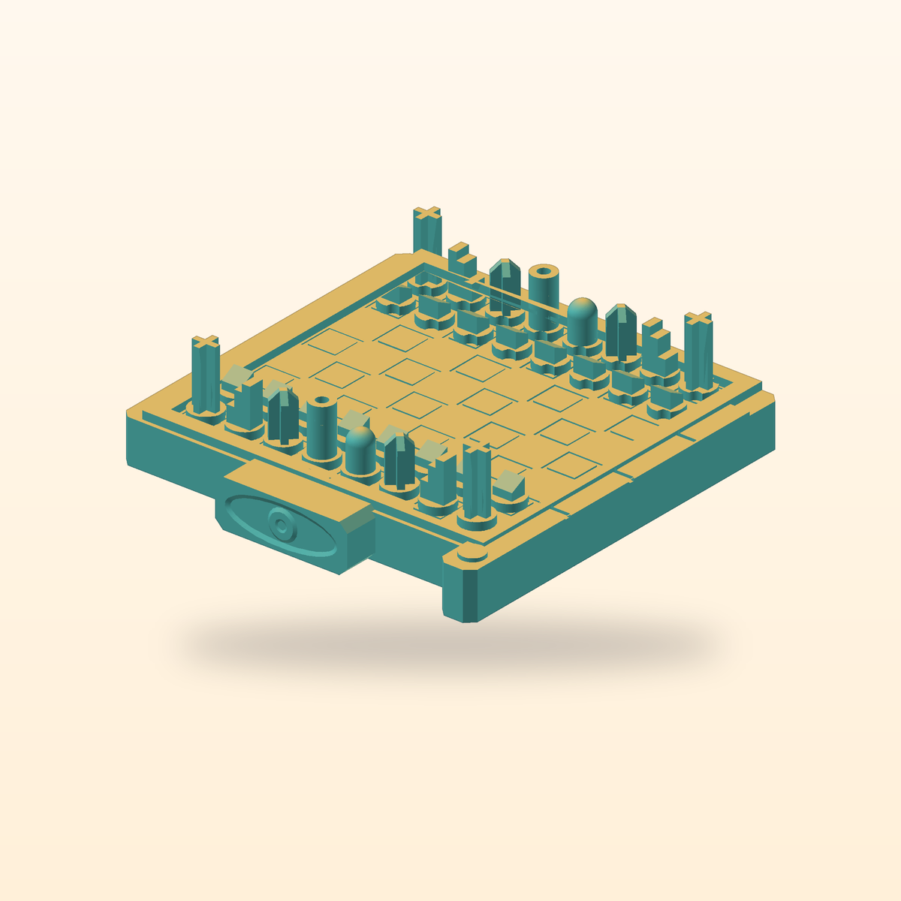

# Limbward



A camera-shaped chess set with sculptural astronomical masks. Move a towering cross-vane rook across the field and bring the distant stellar king into check.

[View the verified public product page](https://www.autonomous.ai/toys/product/limbward)

| Frozen on this run | Value |
|---|---|
| Agent | Codex (`--agent codex`) |
| Workflow | Spark (`--workflow spark`) |
| Model | gpt-6-astra (`--model gpt-6-astra`) |
| Effort | Medium (`--effort medium`) |
| Inventor | [Mara Masque](../../inventors/mara-masque/) |
| Factory | https://www.autonomous.ai/toys/product/limbward |

## Workflow

Spark: `Wish -> Make -> Release`. The accepted Inventor assignment is preserved under `match/`. Release is host-owned publication of Make output, with no native Release turn or new manual.

| Stage | Attempts | Outcome |
|---|---|---|
| Wish | host | frozen |
| Match | 1 | accepted (Mara Masque) |
| Invent | skipped | Spark pass-through |
| Make | 1 | accepted |
| Playtest | not run | Spark omission |
| Release | host | accepted |
| Publication | host | public |

Counts come from each stage's public `ATTEMPTS.json`. Skipped stages created no turn, artifact, or gate. Private host rejections and native session resumes are not public.

## How this toy was created

### 1. Wish — freeze the request

**Input:** the creator's request. **This toy's input:** A camera-shaped chess set with sculptural astronomical masks. Move a towering cross-vane rook across the field and bring the distant stellar king into check.

**Output:** an immutable, hash-bound Wish plus its frozen effort route. The exact wording is withheld; this is the sanitized public summary in [the Wish binding](wish/wish.json).

### 2. Invent — choose an Inventor and define the concept

**Input:** the frozen Wish, eligible Inventor roster with each bound Taste/skill bundle, and the product blueprint. **Output:** **Mara Masque** was selected and produced **Limbward** — Chess — coronagraph theme: rival optical masks cross a focal-plane board to leave the opposing star no safe line of sight. **Concept parts:** Camera focal-plane board, White Stellar dome, White Annular mask, White Cross-vane mask, White Diagonal vane mask, White Off-axis baffle, White Knife-edge wedge, Black Stellar dome, Black Annular mask, Black Cross-vane mask, Black Diagonal vane mask, Black Off-axis baffle, Black Knife-edge wedge. The complete compact concept is in [make/invented.json](make/invented.json). Spark has no separate Invent Goal; the accepted Inventor assignment and compact Make concept are preserved separately.

### 3. Make — turn the concept into exact product bytes

**Input:** the accepted concept, selected Inventor identity/Taste, blueprint, and any bounded revision evidence. **Output:** A camera-shaped chess set with sculptural astronomical masks. Move a towering cross-vane rook across the field and bring the distant stellar king into check. The sealed snapshot contains 18 STEP and 2 product render PNGs, together with [CAD source](make/source/), [models](make/models/), and [deterministic verification](make/verification/). [The Made contract](make/made.json) binds those exact bytes.

### 4. Playtest — challenge the made product

**Input:** the sealed Made product, blueprint-required checks, and exact evidence. **Output:** not run on this effort route; Release preserves the explicit [omission record](release/PLAYTEST-NOT-RUN.json).

### 5. Release — make the customer package

**Input:** the sealed product and the passed Playtest evidence or truthful not-run record. **Output:** the existing Make files and hash-bound publication metadata, with no new manual, PDF, review, or native Release turn; [the existing README](release/README.md) was reused from Make; see [the Release contract](release/release.json).

### 6. Publication — perform and verify the external effect

**Input:** the exact sealed Release package plus host-held Factory authorization; credentials never enter the native session. **Output:** [the public Factory product](https://www.autonomous.ai/toys/product/limbward) and a sanitized, hash-verified [publication readback](publication/PUBLICATION.json).

## Run cost

| Measure | Value |
|---|---|
| Native Manager input tokens | 12,842,344 (measured; 1/1 turns measured) |
| Native Manager cached input tokens | 12,512,640 (measured; 1/1 turns measured) |
| Native Manager uncached input tokens | 329,704 (measured; 1/1 turns measured) |
| Native Manager cache-write input tokens | 0 (measured; 1/1 turns measured) |
| Native Manager output tokens | 36,710 (measured; 1/1 turns measured) |
| Native Manager reasoning output tokens | 9,074 (measured; 1/1 turns measured) |
| Wish to verified publication | 48m 50s (2026-09-11T17:16:49Z to 2026-09-11T18:05:39.965315+00:00) |

| Stage | Input tokens | Cached input | Uncached input | Output tokens | Turns | Coverage |
|---|---:|---:|---:|---:|---:|---|
| Match | 0 | 0 | 0 | 0 | 0 | folded; economics folded |
| Invent | 0 | 0 | 0 | 0 | 0 | skipped; economics skipped |
| Make | 12,842,344 | 12,512,640 | 329,704 | 36,710 | 1 | measured; economics measured |
| Playtest | 0 | 0 | 0 | 0 | 0 | not-run; economics not-run |
| Release | 0 | 0 | 0 | 0 | 0 | pending; economics pending |

Input and output tokens are best-effort separate counts reported by the native Manager; they are not added together. Cached plus uncached input equals the input covered by the economic breakdown, while cache writes and reasoning are reported as subsets rather than added again. No dollar cost is inferred. Elapsed time ends only after authenticated Factory public readback.

## Reproduce

From a checkout of this repository, verify the host and run the same agent and workflow. This command uses the public product summary; a later run follows the same route but does not replay these exact CAD bytes.

```bash
uv run workshop doctor
uv run workshop wish --agent codex --model gpt-6-astra --effort medium --workflow spark 'A camera-shaped chess set with sculptural astronomical masks. Move a towering cross-vane rook across the field and bring the distant stellar king into check.'
```

If a native turn stops before Release, continue the same Wish with `uv run workshop resume <wish-id>`.

## Snapshot contents

- `wish/` — sanitized Wish binding (exact text only with explicit consent).
- `match/` — accepted Match assignment.
- Invent was skipped by this effort route; its sealed compact concept is under `make/`.
- `make/` — the exact sealed Release facts, exact CAD source, models, product renders, verification, and sealed prior attempts.
- `release/README.md` — the existing Make README, reused without rewriting.
- `release/` — accepted Release contract and exact package bytes.
- `publication/PUBLICATION.json` — sanitized public readback identities.
- `TOKENS.json` — separate Manager-reported gross/cached/uncached input and output/reasoning tokens by stage; no combined total or dollar estimate.
- `TIMING.json` — Wish intake to authenticated public-readback elapsed time.
- `MANIFEST.json` — hashes every workflow file except itself and this README.
- `SANITIZATION.json` — source/public hashes for host-local path prefixes replaced by stable placeholders.
- Playtest was not run; Release records that omission explicitly.

This archive contains no agent session, prompt, transcript, chain of thought, host state, credentials, or raw effect receipt. Publication is not proof of physical manufacture, fit, durability, or delivery.
