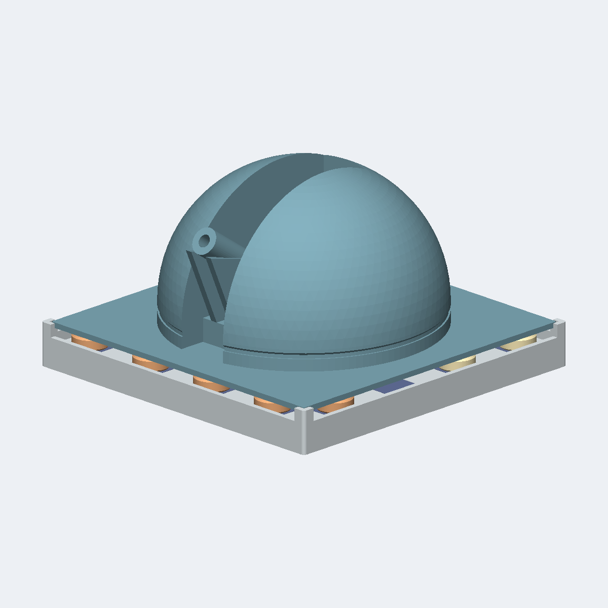

# Periastra Meridian



Lift a domed observatory roof, open to the sky along one shutter slit with a telescope standing centred in it, and reveal English draughts between the Sun and the Moon on a chequerboard whose dark squares are inlaid tiles in a second colour. Every counter carries its mark raised out of a sunk field on both faces alike, so there is no wrong way up, and a king is crowned the way an ordinary draughts set crowns one - by stacking a second counter of the same colour.

**Not published.** This run was sealed locally with `--no-publish`: no Factory listing, no public product page, and no external effect of any kind was created.

| Frozen on this run | Value |
|---|---|
| Agent | Claude Code (`--agent claude`) |
| Workflow | Spark (`--workflow spark`) |
| Model | claude-opus-5 (`--model claude-opus-5`) |
| Effort | High (`--effort high`) |
| Inventor | [Mara Masque](../../inventors/mara-masque/) |
| Factory | not published (`--no-publish`) |

## Workflow

Spark: `Wish -> Make -> Release`. The accepted Inventor assignment is preserved under `match/`. Release is host-owned publication of Make output, with no native Release turn or new manual.

| Stage | Attempts | Outcome |
|---|---|---|
| Wish | host | frozen |
| Match | 1 | accepted (Mara Masque) |
| Invent | skipped | Spark pass-through |
| Make | 1 | accepted |
| Playtest | not run | Spark omission |
| Release | host | accepted |
| Publication | host | unreleased |

Counts come from each stage's public `ATTEMPTS.json`. Skipped stages created no turn, artifact, or gate. Private host rejections and native session resumes are not public.

## How this toy was created

### 1. Wish — freeze the request

**Input:** the creator's request. **This toy's input:** Lift a domed observatory roof, open to the sky along one shutter slit with a telescope standing centred in it, and reveal English draughts between the Sun and the Moon on a chequerboard whose dark squares are inlaid tiles in a second colour. Every counter carries its mark raised out of a sunk field on both faces alike, so there is no wrong way up, and a king is crowned the way an ordinary draughts set crowns one - by stacking a second counter of the same colour.

**Output:** an immutable, hash-bound Wish plus its frozen effort route. The exact wording is withheld; this is the sanitized public summary in [the Wish binding](wish/wish.json).

### 2. Invent — choose an Inventor and define the concept

**Input:** the frozen Wish, eligible Inventor roster with each bound Taste/skill bundle, and the product blueprint. **Output:** **Mara Masque** was selected and produced **Periastra Meridian** — English draughts - an observatory theme: the Sun side and the Moon side meet across an inlaid chequerboard, and the dome that watches them is the lid of the box. **Concept parts:** Observatory board base, Observatory dome roof, Board inlay 01, Board inlay 02, Board inlay 03, Board inlay 04, Board inlay 05, Board inlay 06, Board inlay 07, Board inlay 08, Board inlay 09, Board inlay 10, Board inlay 11, Board inlay 12, Board inlay 13, Board inlay 14, Board inlay 15, Board inlay 16, Board inlay 17, Board inlay 18, Board inlay 19, Board inlay 20, Board inlay 21, Board inlay 22, Board inlay 23, Board inlay 24, Board inlay 25, Board inlay 26, Board inlay 27, Board inlay 28, Board inlay 29, Board inlay 30, Board inlay 31, Board inlay 32, Sun counter 01, Sun counter 02, Sun counter 03, Sun counter 04, Sun counter 05, Sun counter 06, Sun counter 07, Sun counter 08, Sun counter 09, Sun counter 10, Sun counter 11, Sun counter 12, Moon counter 01, Moon counter 02, Moon counter 03, Moon counter 04, Moon counter 05, Moon counter 06, Moon counter 07, Moon counter 08, Moon counter 09, Moon counter 10, Moon counter 11, Moon counter 12. The complete compact concept is in [make/invented.json](make/invented.json). Spark has no separate Invent Goal; the accepted Inventor assignment and compact Make concept are preserved separately.

### 3. Make — turn the concept into exact product bytes

**Input:** the accepted concept, selected Inventor identity/Taste, blueprint, and any bounded revision evidence. **Output:** Lift a domed observatory roof, open to the sky along one shutter slit with a telescope standing centred in it, and reveal English draughts between the Sun and the Moon on a chequerboard whose dark squares are inlaid tiles in a second colour. Every counter carries its mark raised out of a sunk field on both faces alike, so there is no wrong way up, and a king is crowned the way an ordinary draughts set crowns one - by stacking a second counter of the same colour. The sealed snapshot contains 7 STEP and 32 product render PNGs, together with [CAD source](make/source/), [models](make/models/), and [deterministic verification](make/verification/). [The Made contract](make/made.json) binds those exact bytes.

### 4. Playtest — challenge the made product

**Input:** the sealed Made product, blueprint-required checks, and exact evidence. **Output:** not run on this effort route; Release preserves the explicit [omission record](release/PLAYTEST-NOT-RUN.json).

### 5. Release — make the customer package

**Input:** the sealed product and the passed Playtest evidence or truthful not-run record. **Output:** the existing Make files and hash-bound publication metadata, with no new manual, PDF, review, or native Release turn; [the existing README](release/README.md) was reused from Make; see [the Release contract](release/release.json).

### 6. Publication — not performed

**Input:** the exact sealed Release package. **Output:** none. This run was sealed locally with `--no-publish`, so no Factory effect was created, no listing exists, and [the publication record](publication/PUBLICATION.json) says `unreleased`.

## Run cost

| Measure | Value |
|---|---|
| Native Manager input tokens | unavailable (the Manager did not report input usage) |
| Native Manager cached input tokens | unavailable (the Manager did not report cache detail) |
| Native Manager uncached input tokens | unavailable (the Manager did not report cache detail) |
| Native Manager cache-write input tokens | unavailable (the Manager did not report cache detail) |
| Native Manager output tokens | unavailable (the Manager did not report output usage) |
| Native Manager reasoning output tokens | unavailable (the Manager did not report reasoning detail) |
| Wish to verified publication | 53m 22s (2026-09-18T07:47:14Z to 2026-09-18T08:40:36+00:00) |

Input and output tokens are best-effort separate counts reported by the native Manager; they are not added together. Cached plus uncached input equals the input covered by the economic breakdown, while cache writes and reasoning are reported as subsets rather than added again. No dollar cost is inferred. Elapsed time ends only after authenticated Factory public readback.

## Reproduce

From a checkout of this repository, verify the host and run the same agent and workflow. This command uses the public product summary; a later run follows the same route but does not replay these exact CAD bytes.

```bash
uv run workshop doctor
uv run workshop wish --agent claude --model claude-opus-5 --effort high --workflow spark 'Lift a domed observatory roof, open to the sky along one shutter slit with a telescope standing centred in it, and reveal English draughts between the Sun and the Moon on a chequerboard whose dark squares are inlaid tiles in a second colour. Every counter carries its mark raised out of a sunk field on both faces alike, so there is no wrong way up, and a king is crowned the way an ordinary draughts set crowns one - by stacking a second counter of the same colour.'
```

If a native turn stops before Release, continue the same Wish with `uv run workshop resume <wish-id>`.

## Snapshot contents

- `wish/` — sanitized Wish binding (exact text only with explicit consent).
- `match/` — accepted Match assignment.
- Invent was skipped by this effort route; its sealed compact concept is under `make/`.
- `make/` — the exact sealed Release facts, exact CAD source, models, product renders, verification, and sealed prior attempts.
- `release/README.md` — the existing Make README, reused without rewriting.
- `release/` — accepted Release contract and exact package bytes.
- `publication/PUBLICATION.json` — local `unreleased` record; no readback identities, because nothing was published.
- `TOKENS.json` — separate Manager-reported gross/cached/uncached input and output/reasoning tokens by stage; no combined total or dollar estimate.
- `TIMING.json` — Wish intake to locally sealed Release elapsed time.
- `MANIFEST.json` — hashes every workflow file except itself and this README.
- `SANITIZATION.json` — source/public hashes for host-local path prefixes replaced by stable placeholders.
- Playtest was not run; Release records that omission explicitly.

This archive contains no agent session, prompt, transcript, chain of thought, host state, credentials, or raw effect receipt. Publication is not proof of physical manufacture, fit, durability, or delivery.
