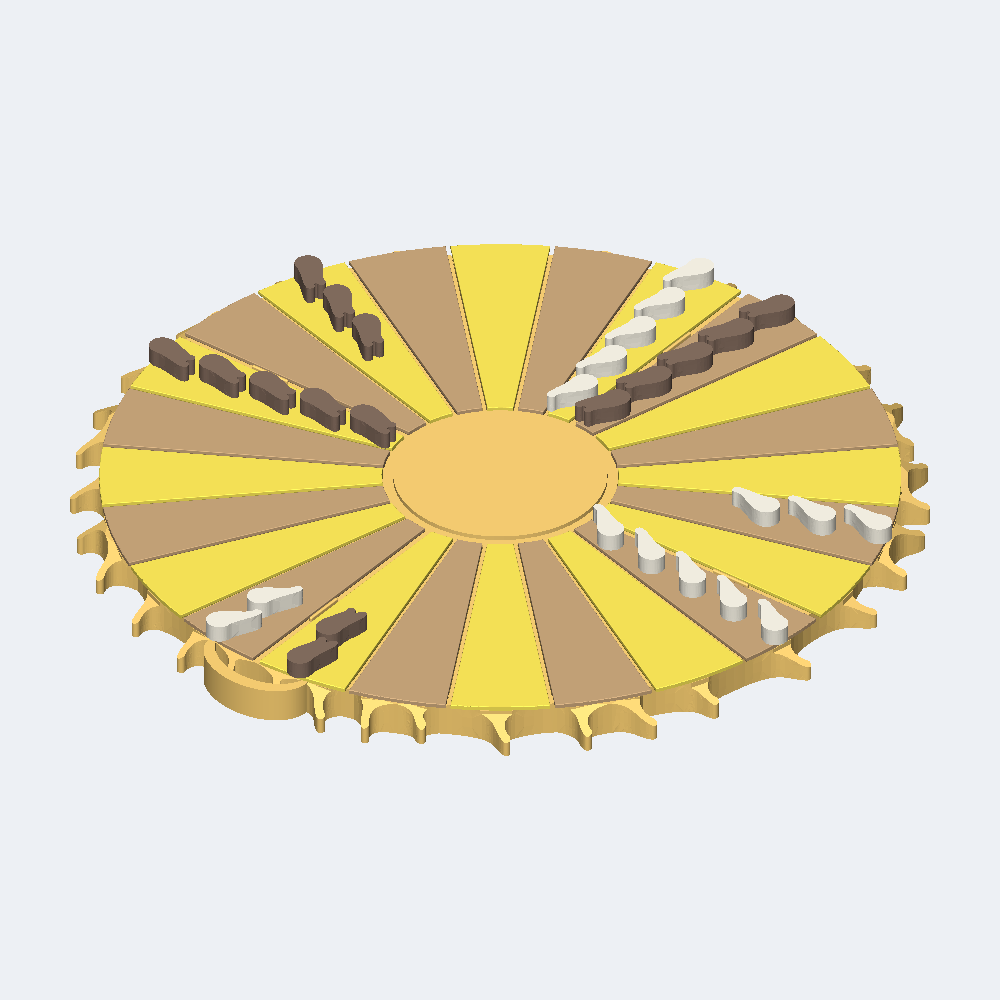

# Rainward Bladefire



The box holds the Sun board, its 24 lane tiles and 30 counters only: no dice and no dice cups are included. Each player supplies one ordinary six-sided die cup, and the pair shares two ordinary 1-6 dice of any standard make - two cubic dice, faces 1 through 6, standard opposite pairs 1-6, 2-5 and 3-4, of a size that throws freely on a table. A Sun-shaped backgammon set: 24 lanes alternate between two filament tones around a 190 mm disc that stands 9 mm tall, the fan of tiles closes on one clean circle, and outside that circle 38 slender flames curl the same way round the rim, each shedding its width where it leaves the board and laying its top back from the deck down to a low tip.

**Not published.** This run was sealed locally with `--no-publish`: no Factory listing, no public product page, and no external effect of any kind was created.

| Frozen on this run | Value |
|---|---|
| Agent | Claude Code (`--agent claude`) |
| Workflow | Spark (`--workflow spark`) |
| Model | claude-opus-5 (`--model claude-opus-5`) |
| Effort | High (`--effort high`) |
| Inventor | [Mara Masque](../../inventors/mara-masque/) |
| Factory | not published (`--no-publish`) |

## Workflow

Spark: `Wish -> Make -> Release`. The accepted Inventor assignment is preserved under `match/`. Release is host-owned publication of Make output, with no native Release turn or new manual.

| Stage | Attempts | Outcome |
|---|---|---|
| Wish | host | frozen |
| Match | 1 | accepted (Mara Masque) |
| Invent | skipped | Spark pass-through |
| Make | 1 | accepted |
| Playtest | not run | Spark omission |
| Release | host | accepted |
| Publication | host | unreleased |

Counts come from each stage's public `ATTEMPTS.json`. Skipped stages created no turn, artifact, or gate. Private host rejections and native session resumes are not public.

## How this toy was created

### 1. Wish — freeze the request

**Input:** the creator's request. **This toy's input:** The box holds the Sun board, its 24 lane tiles and 30 counters only: no dice and no dice cups are included. Each player supplies one ordinary six-sided die cup, and the pair shares two ordinary 1-6 dice of any standard make - two cubic dice, faces 1 through 6, standard opposite pairs 1-6, 2-5 and 3-4, of a size that throws freely on a table. A Sun-shaped backgammon set: 24 lanes alternate between two filament tones around a 190 mm disc that stands 9 mm tall, the fan of tiles closes on one clean circle, and outside that circle 38 slender flames curl the same way round the rim, each shedding its width where it leaves the board and laying its top back from the deck down to a low tip.

**Output:** an immutable, hash-bound Wish plus its frozen effort route. The exact wording is withheld; this is the sanitized public summary in [the Wish binding](wish/wish.json).

### 2. Invent — choose an Inventor and define the concept

**Input:** the frozen Wish, eligible Inventor roster with each bound Taste/skill bundle, and the product blueprint. **Output:** **Mara Masque** was selected and produced **Rainward Bladefire** — Backgammon - coronal-rain theme: rival streams of condensed plasma travel magnetic lanes, scatter lone drops, and rain back into a Sun whose fan of lane tiles closes on one clean circle and whose rim is a crown of curled flame laid back off that circle. **Concept parts:** Sun body, Lane tile, point 1, Lane tile, point 2, Lane tile, point 3, Lane tile, point 4, Lane tile, point 5, Lane tile, point 6, Lane tile, point 7, Lane tile, point 8, Lane tile, point 9, Lane tile, point 10, Lane tile, point 11, Lane tile, point 12, Lane tile, point 13, Lane tile, point 14, Lane tile, point 15, Lane tile, point 16, Lane tile, point 17, Lane tile, point 18, Lane tile, point 19, Lane tile, point 20, Lane tile, point 21, Lane tile, point 22, Lane tile, point 23, Lane tile, point 24, Single-tail counter 1, Single-tail counter 2, Single-tail counter 3, Single-tail counter 4, Single-tail counter 5, Single-tail counter 6, Single-tail counter 7, Single-tail counter 8, Single-tail counter 9, Single-tail counter 10, Single-tail counter 11, Single-tail counter 12, Single-tail counter 13, Single-tail counter 14, Single-tail counter 15, Split-tail counter 1, Split-tail counter 2, Split-tail counter 3, Split-tail counter 4, Split-tail counter 5, Split-tail counter 6, Split-tail counter 7, Split-tail counter 8, Split-tail counter 9, Split-tail counter 10, Split-tail counter 11, Split-tail counter 12, Split-tail counter 13, Split-tail counter 14, Split-tail counter 15. The complete compact concept is in [make/invented.json](make/invented.json). Spark has no separate Invent Goal; the accepted Inventor assignment and compact Make concept are preserved separately.

### 3. Make — turn the concept into exact product bytes

**Input:** the accepted concept, selected Inventor identity/Taste, blueprint, and any bounded revision evidence. **Output:** The box holds the Sun board, its 24 lane tiles and 30 counters only: no dice and no dice cups are included. Each player supplies one ordinary six-sided die cup, and the pair shares two ordinary 1-6 dice of any standard make - two cubic dice, faces 1 through 6, standard opposite pairs 1-6, 2-5 and 3-4, of a size that throws freely on a table. A Sun-shaped backgammon set: 24 lanes alternate between two filament tones around a 190 mm disc that stands 9 mm tall, the fan of tiles closes on one clean circle, and outside that circle 38 slender flames curl the same way round the rim, each shedding its width where it leaves the board and laying its top back from the deck down to a low tip. The sealed snapshot contains 57 STEP and 11 product render PNGs, together with [CAD source](make/source/), [models](make/models/), and [deterministic verification](make/verification/). [The Made contract](make/made.json) binds those exact bytes.

### 4. Playtest — challenge the made product

**Input:** the sealed Made product, blueprint-required checks, and exact evidence. **Output:** not run on this effort route; Release preserves the explicit [omission record](release/PLAYTEST-NOT-RUN.json).

### 5. Release — make the customer package

**Input:** the sealed product and the passed Playtest evidence or truthful not-run record. **Output:** the existing Make files and hash-bound publication metadata, with no new manual, PDF, review, or native Release turn; [the existing README](release/README.md) was reused from Make; see [the Release contract](release/release.json).

### 6. Publication — not performed

**Input:** the exact sealed Release package. **Output:** none. This run was sealed locally with `--no-publish`, so no Factory effect was created, no listing exists, and [the publication record](publication/PUBLICATION.json) says `unreleased`.

## Run cost

| Measure | Value |
|---|---|
| Native Manager input tokens | unavailable (the Manager did not report input usage) |
| Native Manager cached input tokens | unavailable (the Manager did not report cache detail) |
| Native Manager uncached input tokens | unavailable (the Manager did not report cache detail) |
| Native Manager cache-write input tokens | unavailable (the Manager did not report cache detail) |
| Native Manager output tokens | unavailable (the Manager did not report output usage) |
| Native Manager reasoning output tokens | unavailable (the Manager did not report reasoning detail) |
| Wish to verified publication | 2h 33m 9s (2026-09-18T01:48:28Z to 2026-09-18T04:21:37+00:00) |

Input and output tokens are best-effort separate counts reported by the native Manager; they are not added together. Cached plus uncached input equals the input covered by the economic breakdown, while cache writes and reasoning are reported as subsets rather than added again. No dollar cost is inferred. Elapsed time ends only after authenticated Factory public readback.

## Reproduce

From a checkout of this repository, verify the host and run the same agent and workflow. This command uses the public product summary; a later run follows the same route but does not replay these exact CAD bytes.

```bash
uv run workshop doctor
uv run workshop wish --agent claude --model claude-opus-5 --effort high --workflow spark 'The box holds the Sun board, its 24 lane tiles and 30 counters only: no dice and no dice cups are included. Each player supplies one ordinary six-sided die cup, and the pair shares two ordinary 1-6 dice of any standard make - two cubic dice, faces 1 through 6, standard opposite pairs 1-6, 2-5 and 3-4, of a size that throws freely on a table. A Sun-shaped backgammon set: 24 lanes alternate between two filament tones around a 190 mm disc that stands 9 mm tall, the fan of tiles closes on one clean circle, and outside that circle 38 slender flames curl the same way round the rim, each shedding its width where it leaves the board and laying its top back from the deck down to a low tip.'
```

If a native turn stops before Release, continue the same Wish with `uv run workshop resume <wish-id>`.

## Snapshot contents

- `wish/` — sanitized Wish binding (exact text only with explicit consent).
- `match/` — accepted Match assignment.
- Invent was skipped by this effort route; its sealed compact concept is under `make/`.
- `make/` — the exact sealed Release facts, exact CAD source, models, product renders, verification, and sealed prior attempts.
- `release/README.md` — the existing Make README, reused without rewriting.
- `release/` — accepted Release contract and exact package bytes.
- `publication/PUBLICATION.json` — local `unreleased` record; no readback identities, because nothing was published.
- `TOKENS.json` — separate Manager-reported gross/cached/uncached input and output/reasoning tokens by stage; no combined total or dollar estimate.
- `TIMING.json` — Wish intake to locally sealed Release elapsed time.
- `MANIFEST.json` — hashes every workflow file except itself and this README.
- `SANITIZATION.json` — source/public hashes for host-local path prefixes replaced by stable placeholders.
- Playtest was not run; Release records that omission explicitly.

This archive contains no agent session, prompt, transcript, chain of thought, host state, credentials, or raw effect receipt. Publication is not proof of physical manufacture, fit, durability, or delivery.
