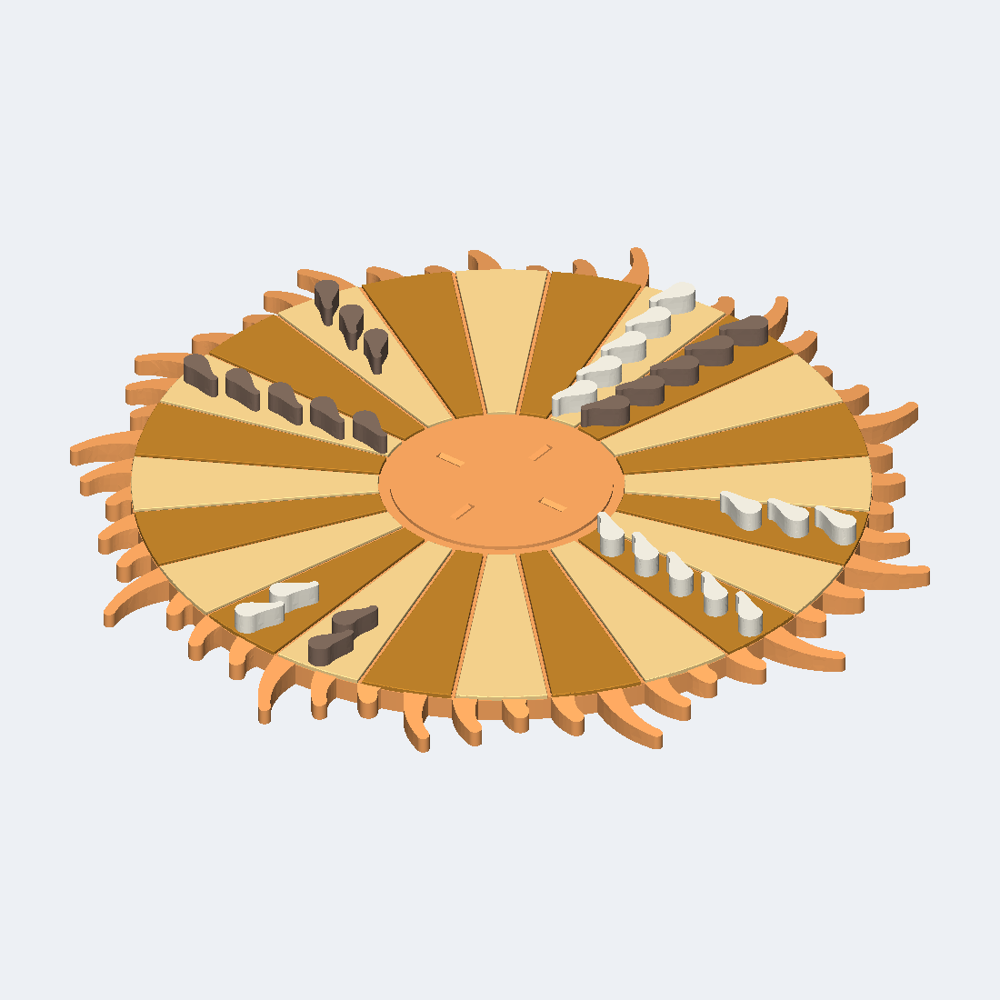

# Rainward Emberfan



You supply two ordinary six-sided dice and a cup each; everything else is in the box. A printed backgammon set built as a small Sun: twenty-four radial lanes in two tones of orange fan out from a raised centre bar, and the rim is a crown of forty-eight separate curled flames standing off the disc's own circular edge, no two the same length. Thirty teardrop drops, fifteen cream and fifteen dark brown, travel the lanes under the ordinary 1911 rules, which come with it in full.

**Not published.** This run was sealed locally with `--no-publish`: no Factory listing, no public product page, and no external effect of any kind was created.

| Frozen on this run | Value |
|---|---|
| Agent | Claude Code (`--agent claude`) |
| Workflow | Spark (`--workflow spark`) |
| Model | claude-opus-5 (`--model claude-opus-5`) |
| Effort | High (`--effort high`) |
| Inventor | [Mara Masque](../../inventors/mara-masque/) |
| Factory | not published (`--no-publish`) |

## Workflow

Spark: `Wish -> Make -> Release`. The accepted Inventor assignment is preserved under `match/`. Release is host-owned publication of Make output, with no native Release turn or new manual.

| Stage | Attempts | Outcome |
|---|---|---|
| Wish | host | frozen |
| Match | 1 | accepted (Mara Masque) |
| Invent | skipped | Spark pass-through |
| Make | 1 | accepted |
| Playtest | not run | Spark omission |
| Release | host | accepted |
| Publication | host | unreleased |

Counts come from each stage's public `ATTEMPTS.json`. Skipped stages created no turn, artifact, or gate. Private host rejections and native session resumes are not public.

## How this toy was created

### 1. Wish — freeze the request

**Input:** the creator's request. **This toy's input:** You supply two ordinary six-sided dice and a cup each; everything else is in the box. A printed backgammon set built as a small Sun: twenty-four radial lanes in two tones of orange fan out from a raised centre bar, and the rim is a crown of forty-eight separate curled flames standing off the disc's own circular edge, no two the same length. Thirty teardrop drops, fifteen cream and fifteen dark brown, travel the lanes under the ordinary 1911 rules, which come with it in full.

**Output:** an immutable, hash-bound Wish plus its frozen effort route. The exact wording is withheld; this is the sanitized public summary in [the Wish binding](wish/wish.json).

### 2. Invent — choose an Inventor and define the concept

**Input:** the frozen Wish, eligible Inventor roster with each bound Taste/skill bundle, and the product blueprint. **Output:** **Mara Masque** was selected and produced **Rainward Emberfan** — Backgammon on a Sun. Two streams of condensed plasma travel 24 radial lanes, scatter lone drops onto the exposed flare at the centre, and rain back out of play. The rim is a crown of 48 separate licks of flame standing off the disc's own circular edge. **Concept parts:** Sun board, Lane tile 1, Lane tile 2, Lane tile 3, Lane tile 4, Lane tile 5, Lane tile 6, Lane tile 7, Lane tile 8, Lane tile 9, Lane tile 10, Lane tile 11, Lane tile 12, Lane tile 13, Lane tile 14, Lane tile 15, Lane tile 16, Lane tile 17, Lane tile 18, Lane tile 19, Lane tile 20, Lane tile 21, Lane tile 22, Lane tile 23, Lane tile 24, Drop A1, Drop A2, Drop A3, Drop A4, Drop A5, Drop A6, Drop A7, Drop A8, Drop A9, Drop A10, Drop A11, Drop A12, Drop A13, Drop A14, Drop A15, Drop B1, Drop B2, Drop B3, Drop B4, Drop B5, Drop B6, Drop B7, Drop B8, Drop B9, Drop B10, Drop B11, Drop B12, Drop B13, Drop B14, Drop B15. The complete compact concept is in [make/invented.json](make/invented.json). Spark has no separate Invent Goal; the accepted Inventor assignment and compact Make concept are preserved separately.

### 3. Make — turn the concept into exact product bytes

**Input:** the accepted concept, selected Inventor identity/Taste, blueprint, and any bounded revision evidence. **Output:** You supply two ordinary six-sided dice and a cup each; everything else is in the box. A printed backgammon set built as a small Sun: twenty-four radial lanes in two tones of orange fan out from a raised centre bar, and the rim is a crown of forty-eight separate curled flames standing off the disc's own circular edge, no two the same length. Thirty teardrop drops, fifteen cream and fifteen dark brown, travel the lanes under the ordinary 1911 rules, which come with it in full. The sealed snapshot contains 57 STEP and 14 product render PNGs, together with [CAD source](make/source/), [models](make/models/), and [deterministic verification](make/verification/). [The Made contract](make/made.json) binds those exact bytes.

### 4. Playtest — challenge the made product

**Input:** the sealed Made product, blueprint-required checks, and exact evidence. **Output:** not run on this effort route; Release preserves the explicit [omission record](release/PLAYTEST-NOT-RUN.json).

### 5. Release — make the customer package

**Input:** the sealed product and the passed Playtest evidence or truthful not-run record. **Output:** the existing Make files and hash-bound publication metadata, with no new manual, PDF, review, or native Release turn; [the existing README](release/README.md) was reused from Make; see [the Release contract](release/release.json).

### 6. Publication — not performed

**Input:** the exact sealed Release package. **Output:** none. This run was sealed locally with `--no-publish`, so no Factory effect was created, no listing exists, and [the publication record](publication/PUBLICATION.json) says `unreleased`.

## Run cost

| Measure | Value |
|---|---|
| Native Manager input tokens | unavailable (the Manager did not report input usage) |
| Native Manager cached input tokens | unavailable (the Manager did not report cache detail) |
| Native Manager uncached input tokens | unavailable (the Manager did not report cache detail) |
| Native Manager cache-write input tokens | unavailable (the Manager did not report cache detail) |
| Native Manager output tokens | unavailable (the Manager did not report output usage) |
| Native Manager reasoning output tokens | unavailable (the Manager did not report reasoning detail) |
| Wish to verified publication | 1h 52m 4s (2026-09-18T16:04:54Z to 2026-09-18T17:56:58+00:00) |

Input and output tokens are best-effort separate counts reported by the native Manager; they are not added together. Cached plus uncached input equals the input covered by the economic breakdown, while cache writes and reasoning are reported as subsets rather than added again. No dollar cost is inferred. Elapsed time ends only after authenticated Factory public readback.

## Reproduce

From a checkout of this repository, verify the host and run the same agent and workflow. This command uses the public product summary; a later run follows the same route but does not replay these exact CAD bytes.

```bash
uv run workshop doctor
uv run workshop wish --agent claude --model claude-opus-5 --effort high --workflow spark 'You supply two ordinary six-sided dice and a cup each; everything else is in the box. A printed backgammon set built as a small Sun: twenty-four radial lanes in two tones of orange fan out from a raised centre bar, and the rim is a crown of forty-eight separate curled flames standing off the disc'"'"'s own circular edge, no two the same length. Thirty teardrop drops, fifteen cream and fifteen dark brown, travel the lanes under the ordinary 1911 rules, which come with it in full.'
```

If a native turn stops before Release, continue the same Wish with `uv run workshop resume <wish-id>`.

## Snapshot contents

- `wish/` — sanitized Wish binding (exact text only with explicit consent).
- `match/` — accepted Match assignment.
- Invent was skipped by this effort route; its sealed compact concept is under `make/`.
- `make/` — the exact sealed Release facts, exact CAD source, models, product renders, verification, and sealed prior attempts.
- `release/README.md` — the existing Make README, reused without rewriting.
- `release/` — accepted Release contract and exact package bytes.
- `publication/PUBLICATION.json` — local `unreleased` record; no readback identities, because nothing was published.
- `TOKENS.json` — separate Manager-reported gross/cached/uncached input and output/reasoning tokens by stage; no combined total or dollar estimate.
- `TIMING.json` — Wish intake to locally sealed Release elapsed time.
- `MANIFEST.json` — hashes every workflow file except itself and this README.
- `SANITIZATION.json` — source/public hashes for host-local path prefixes replaced by stable placeholders.
- Playtest was not run; Release records that omission explicitly.

This archive contains no agent session, prompt, transcript, chain of thought, host state, credentials, or raw effect receipt. Publication is not proof of physical manufacture, fit, durability, or delivery.
