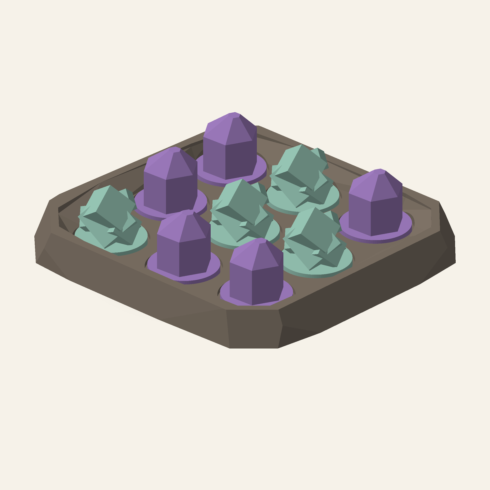

# Shatterline



A geode tic-tac-toe set cut as a low-polygon fractured boulder. Blunt tooth crystals face squat pyrite cube clusters; drop one into an empty pocket and be first to make a straight line of three.

[View the verified public product page](https://www.autonomous.ai/toys/product/shatterline)

| Frozen on this run | Value |
|---|---|
| Agent | Claude Code (`--agent claude`) |
| Workflow | Spark (`--workflow spark`) |
| Model | claude-opus-5 (`--model claude-opus-5`) |
| Effort | High (`--effort high`) |
| Inventor | [Mara Masque](../../inventors/mara-masque/) |
| Factory | https://www.autonomous.ai/toys/product/shatterline |

## Workflow

Spark: `Wish -> Make -> Release`. The accepted Inventor assignment is preserved under `match/`. Release is host-owned publication of Make output, with no native Release turn or new manual.

| Stage | Attempts | Outcome |
|---|---|---|
| Wish | host | frozen |
| Match | 1 | accepted (Mara Masque) |
| Invent | skipped | Spark pass-through |
| Make | 1 | accepted |
| Playtest | not run | Spark omission |
| Release | host | accepted |
| Publication | host | public |

Counts come from each stage's public `ATTEMPTS.json`. Skipped stages created no turn, artifact, or gate. Private host rejections and native session resumes are not public.

## How this toy was created

### 1. Wish — freeze the request

**Input:** the creator's request. **This toy's input:** A geode tic-tac-toe set cut as a low-polygon fractured boulder. Blunt tooth crystals face squat pyrite cube clusters; drop one into an empty pocket and be first to make a straight line of three.

**Output:** an immutable, hash-bound Wish plus its frozen effort route. The exact wording is withheld; this is the sanitized public summary in [the Wish binding](wish/wish.json).

### 2. Invent — choose an Inventor and define the concept

**Input:** the frozen Wish, eligible Inventor roster with each bound Taste/skill bundle, and the product blueprint. **Output:** **Mara Masque** was selected and produced **Shatterline** — Tic-tac-toe as rival mineral growth: blunt tooth crystals and pyrite cube clusters fill a fractured geode, competing to form its first straight line. **Concept parts:** Fractured boulder rind, tooth 1, tooth 2, tooth 3, tooth 4, tooth 5, cube cluster 1, cube cluster 2, cube cluster 3, cube cluster 4. The complete compact concept is in [make/invented.json](make/invented.json). Spark has no separate Invent Goal; the accepted Inventor assignment and compact Make concept are preserved separately.

### 3. Make — turn the concept into exact product bytes

**Input:** the accepted concept, selected Inventor identity/Taste, blueprint, and any bounded revision evidence. **Output:** A geode tic-tac-toe set cut as a low-polygon fractured boulder. Blunt tooth crystals face squat pyrite cube clusters; drop one into an empty pocket and be first to make a straight line of three. The sealed snapshot contains 12 STEP and 4 product render PNGs, together with [CAD source](make/source/), [models](make/models/), and [deterministic verification](make/verification/). [The Made contract](make/made.json) binds those exact bytes.

### 4. Playtest — challenge the made product

**Input:** the sealed Made product, blueprint-required checks, and exact evidence. **Output:** not run on this effort route; Release preserves the explicit [omission record](release/PLAYTEST-NOT-RUN.json).

### 5. Release — make the customer package

**Input:** the sealed product and the passed Playtest evidence or truthful not-run record. **Output:** the existing Make files and hash-bound publication metadata, with no new manual, PDF, review, or native Release turn; [the existing README](release/README.md) was reused from Make; see [the Release contract](release/release.json).

### 6. Publication — perform and verify the external effect

**Input:** the exact sealed Release package plus host-held Factory authorization; credentials never enter the native session. **Output:** [the public Factory product](https://www.autonomous.ai/toys/product/shatterline) and a sanitized, hash-verified [publication readback](publication/PUBLICATION.json).

## Run cost

| Measure | Value |
|---|---|
| Native Manager input tokens | unavailable (the Manager did not report input usage) |
| Native Manager cached input tokens | unavailable (the Manager did not report cache detail) |
| Native Manager uncached input tokens | unavailable (the Manager did not report cache detail) |
| Native Manager cache-write input tokens | unavailable (the Manager did not report cache detail) |
| Native Manager output tokens | unavailable (the Manager did not report output usage) |
| Native Manager reasoning output tokens | unavailable (the Manager did not report reasoning detail) |
| Wish to verified publication | 10h 6m 43s (2026-09-17T17:23:05Z to 2026-09-18T03:29:48.515858+00:00) |

Input and output tokens are best-effort separate counts reported by the native Manager; they are not added together. Cached plus uncached input equals the input covered by the economic breakdown, while cache writes and reasoning are reported as subsets rather than added again. No dollar cost is inferred. Elapsed time ends only after authenticated Factory public readback.

## Reproduce

From a checkout of this repository, verify the host and run the same agent and workflow. This command uses the public product summary; a later run follows the same route but does not replay these exact CAD bytes.

```bash
uv run workshop doctor
uv run workshop wish --agent claude --model claude-opus-5 --effort high --workflow spark 'A geode tic-tac-toe set cut as a low-polygon fractured boulder. Blunt tooth crystals face squat pyrite cube clusters; drop one into an empty pocket and be first to make a straight line of three.'
```

If a native turn stops before Release, continue the same Wish with `uv run workshop resume <wish-id>`.

## Snapshot contents

- `wish/` — sanitized Wish binding (exact text only with explicit consent).
- `match/` — accepted Match assignment.
- Invent was skipped by this effort route; its sealed compact concept is under `make/`.
- `make/` — the exact sealed Release facts, exact CAD source, models, product renders, verification, and sealed prior attempts.
- `release/README.md` — the existing Make README, reused without rewriting.
- `release/` — accepted Release contract and exact package bytes.
- `publication/PUBLICATION.json` — sanitized public readback identities.
- `TOKENS.json` — separate Manager-reported gross/cached/uncached input and output/reasoning tokens by stage; no combined total or dollar estimate.
- `TIMING.json` — Wish intake to authenticated public-readback elapsed time.
- `MANIFEST.json` — hashes every workflow file except itself and this README.
- `SANITIZATION.json` — source/public hashes for host-local path prefixes replaced by stable placeholders.
- Playtest was not run; Release records that omission explicitly.

This archive contains no agent session, prompt, transcript, chain of thought, host state, credentials, or raw effect receipt. Publication is not proof of physical manufacture, fit, durability, or delivery.
