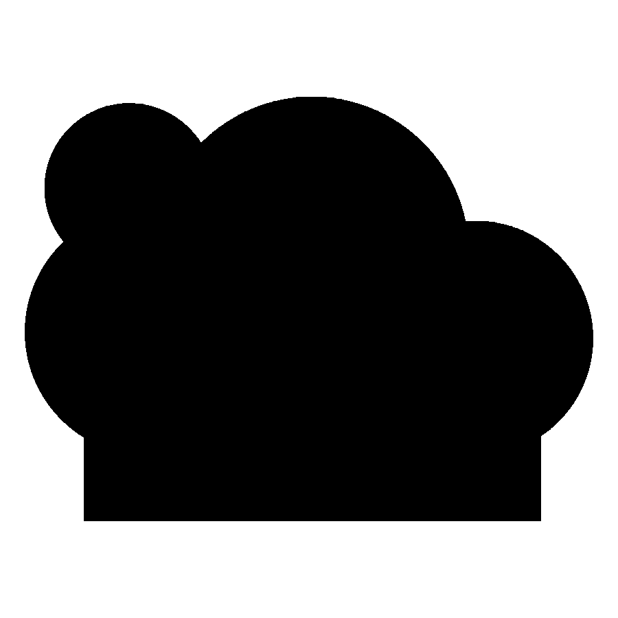

# Storm Reveal



A pocket-size three-piece sleepy cloud puzzle whose single guided quarter-turn reveals a standing rainbow-and-lightning storm scene, then reverses to reset.

[View the verified public product page](https://www.autonomous.ai/factory/product/storm-reveal)

| Frozen on this run | Value |
|---|---|
| Manager | Codex (`--manager codex`) |
| Effort | Spark (`--effort spark`) |
| Inventor | [Mira Fold](../../inventors/mira-fold/) |
| Factory | https://www.autonomous.ai/factory/product/storm-reveal |

## Workflow

Spark: `Wish -> Make -> Release`. Inventor selection is folded into Make.

| Stage | Attempts | Outcome |
|---|---|---|
| Wish | host | frozen |
| Match | 1 | accepted (Mira Fold) |
| Invent | skipped | Spark pass-through |
| Make | 1 | accepted |
| Playtest | not run | Spark omission |
| Release | 1 | accepted |
| Publication | host | public |

Counts come from each stage's public `ATTEMPTS.json`. Skipped stages created no turn, artifact, or gate. Private host rejections and native session resumes are not public.

## How this toy was created

1. **Wish.** Input: a pocket-size three-piece sleepy-cloud puzzle whose quarter-turn reveals a rainbow-and-lightning scene and reverses to reset. Output: the immutable [sanitized Wish binding](wish/wish.json); its exact wording is withheld.
2. **Invent.** Input: that Wish, the eligible Inventor roster, Taste, and blueprint. Output: Mira Fold was selected and defined *Storm Reveal*: a sleepy-cloud receiver, rainbow drive rotor, and lightning guide rotor coupled by a square drive and constrained to a 90-degree reveal. Spark folded this compact concept into Make; see [the concept](make/invented.json).
3. **Make.** Input: the accepted concept and Mira Fold's bound craft context. Output: the sealed three-piece twist puzzle, with 4 STEP, 4 STL, 1 GLB, 10 legacy-layout Make evidence PNGs, exact [CAD source](make/source/), [models](make/models/), and [verification](make/verification/), all bound by [made.json](make/made.json). This older run predates the standardized product-render directory.
4. **Playtest.** Input: the sealed Made product. Output: not run on the Spark route, recorded explicitly in [PLAYTEST-NOT-RUN.json](release/PLAYTEST-NOT-RUN.json).
5. **Release.** Input: the sealed product plus the truthful Playtest omission. Output: the hash-bound package and printable [customer manual](release/MANUAL.pdf), bound by [release.json](release/release.json).
6. **Publication.** Input: the exact Release package plus host-held Factory authorization. Output: the verified [Factory product](https://www.autonomous.ai/factory/product/storm-reveal) and sanitized [publication readback](publication/PUBLICATION.json).

## Run cost

| Measure | Value |
|---|---|
| Native Manager input tokens | unavailable — this run recorded only a combined legacy count |
| Native Manager output tokens | unavailable — this run recorded only a combined legacy count |
| Wish to verified publication | 1h 34m 10s (2026-08-29T02:11:01Z to 2026-08-29T03:45:11.966018+00:00) |

This run's schema-v1 `TOKENS.json` preserves a combined legacy counter, so its
input/output split cannot be reported truthfully. No dollar cost is inferred.
Elapsed time ends only after authenticated Factory public readback.

## Reproduce

From a checkout of this repository, verify the host and run the same Manager and effort route. This command uses the public product summary; a later run follows the same route but does not replay these exact CAD bytes.

```bash
uv run workshop doctor
uv run workshop wish --manager codex --effort spark --github 'A pocket-size three-piece sleepy cloud puzzle whose single guided quarter-turn reveals a standing rainbow-and-lightning storm scene, then reverses to reset.'
```

If a native turn stops before Release, continue the same Wish with `uv run workshop resume <wish-id>`.

## Snapshot contents

- `wish/` — sanitized Wish binding (exact text only with explicit consent).
- `match/` — accepted Match assignment.
- Invent was skipped by this effort route; its sealed compact concept is under `make/`.
- `make/` — the exact sealed Release facts, exact CAD source, models, product renders, verification, and sealed prior attempts.
- `release/MANUAL.pdf` — the exact sealed printable in-box manual.
- `release/` — accepted Release contract and exact package bytes.
- `publication/PUBLICATION.json` — sanitized public readback identities.
- `TOKENS.json` — legacy combined token evidence; the input/output split is unavailable.
- `MANIFEST.json` — hashes every workflow file except itself and this README.
- Playtest was not run; Release records that omission explicitly.

This archive contains no agent session, prompt, transcript, chain of thought, host state, credentials, or raw effect receipt. Publication is not proof of physical manufacture, fit, durability, or delivery.
