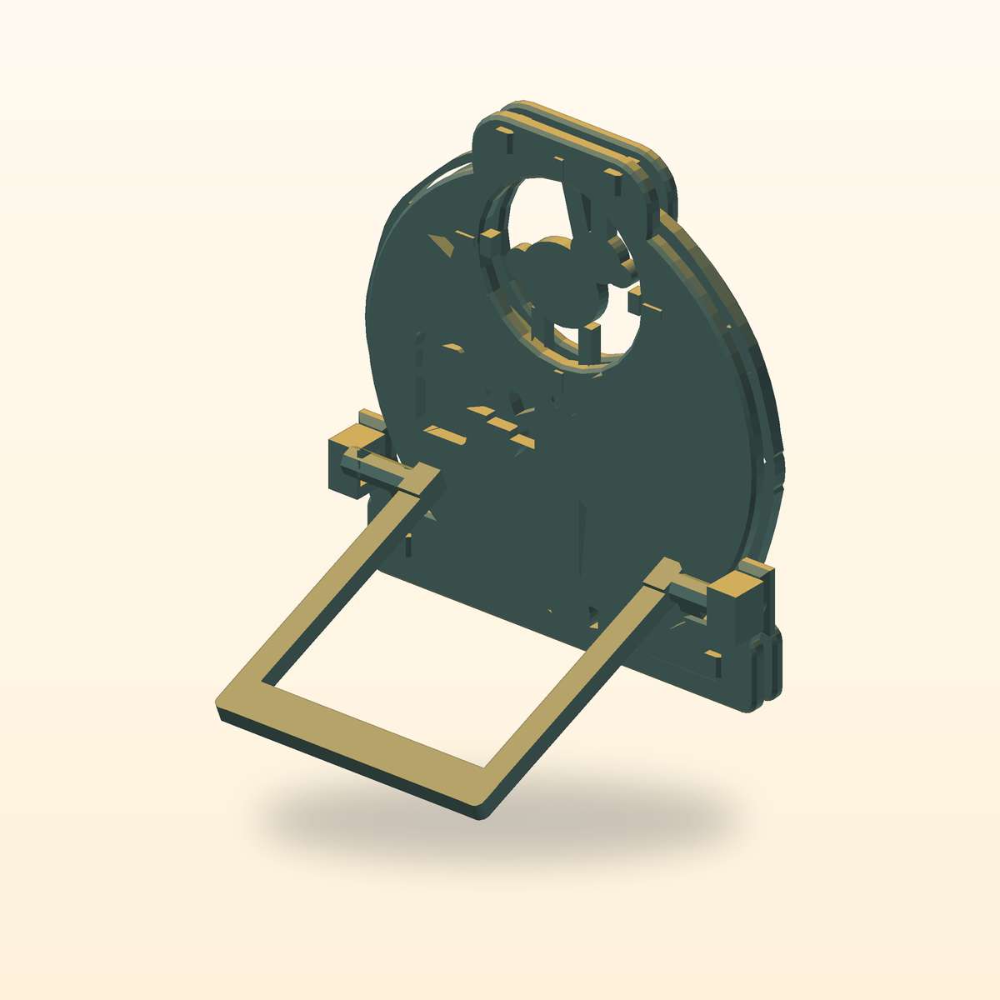

# Lantern Menagerie: The Three-Moon Shadow Reel



A four-part hand-powered moon gate with a captured reel that casts indexed rabbit, fox, and owl shadows from an ordinary external phone flashlight.

[View the verified public product page](https://www.autonomous.ai/factory/product/lantern-menagerie-the-three-moon-shadow-reel)

| Frozen on this run | Value |
|---|---|
| Manager | Codex (`--manager codex`) |
| Effort | Quest (`--effort quest`) |
| Inventor | [Orin Shadow](../../inventors/orin-shadow/) |
| Factory | https://www.autonomous.ai/factory/product/lantern-menagerie-the-three-moon-shadow-reel |

## Workflow

Quest: `Wish -> Invent -> Make -> Playtest -> Release`. Inventor selection is folded into Invent.

| Stage | Attempts | Outcome |
|---|---|---|
| Wish | host | frozen |
| Match | 1 | accepted (Orin Shadow) |
| Invent | 1 | accepted |
| Make | 4 | round 1 superseded; round 2 superseded; round 3 superseded; round 4 accepted |
| Playtest | 4 | round 1 revision-requested (agent-playtest, mechanical-check, printability-check); round 2 revision-requested (agent-playtest, mechanical-check); round 3 revision-requested (agent-playtest, printability-check); round 4 accepted |
| Release | 1 | round 4 accepted |
| Publication | host | public |

Counts come from each stage's public `ATTEMPTS.json`. Skipped stages created no turn, artifact, or gate. Private host rejections and native session resumes are not public.

## How this toy was created

### 1. Wish — freeze the request

**Input:** the creator's request. **This toy's input:** A four-part hand-powered moon gate with a captured reel that casts indexed rabbit, fox, and owl shadows from an ordinary external phone flashlight.

**Output:** an immutable, hash-bound Wish plus its frozen effort route. The exact wording is withheld; this is the sanitized public summary in [the Wish binding](wish/wish.json).

### 2. Invent — choose an Inventor and define the concept

**Input:** the frozen Wish, eligible Inventor roster with each bound Taste/skill bundle, and the product blueprint. **Output:** **Orin Shadow** was selected and produced **Lantern Menagerie: the Three-Moon Shadow Reel** — A palm-scale freestanding moon gate captures a flat three-creature open-carrier reel between front and rear shells. A phone flashlight shines from behind through the rear aperture, the currently indexed opaque creature, and the matching front portal, casting a bold dark rabbit, fox, or owl inside a circular field on a nearby wall. The two-sided scalloped rim is the single obvious control. Full rotation clicks through 0/120/240-degree states and returns to a uniquely deep rabbit-home click whose double-V mark meets a fixed crescent pointer. Four large support-conscious printed parts—front shell, rear shell, silhouette reel, and captured fold-out stand—use no electronics, magnets, glue, purchased hardware, or loose retainer. **Concept parts:** Front moon-gate shell and plinth, Rear moon-gate shell, bearing, index, and stand housing, Three-creature open-carrier silhouette reel, Fold-out projection stand. The complete compact concept is in [invent/invented.json](invent/invented.json). Invent was a separate native Goal.

### 3. Make — turn the concept into exact product bytes

**Input:** the accepted concept, selected Inventor identity/Taste, blueprint, and any bounded revision evidence. **Output:** A four-part hand-powered moon gate whose captured reel casts indexed rabbit, compact-eared fox, and beaked owl shadows from an ordinary phone flashlight. Round 4 preserves the verified two-way mechanism while clarifying both animal profiles, the assembled reset pairing, the phone/beam cue, and the rear-shell fine-wall margin. The sealed snapshot contains 5 STEP, 6 STL, 1 GLB and 5 product render PNGs, together with [CAD source](make/source/), [models](make/models/), and [deterministic verification](make/verification/). [The Made contract](make/made.json) binds those exact bytes.

### 4. Playtest — challenge the made product

**Input:** the sealed Made product, blueprint-required checks, and exact evidence. **Output:** verdict **pass** from 3 checks (agent-playtest, mechanical-check, printability-check); see [the sealed Playtest result](playtest/playtested.json).

### 5. Release — make the customer package

**Input:** the sealed product and the passed Playtest evidence or truthful not-run record. **Output:** the hash-bound Release package, product facts, and printable [customer manual](release/MANUAL.pdf); see [the Release contract](release/release.json).

### 6. Publication — perform and verify the external effect

**Input:** the exact sealed Release package plus host-held Factory authorization; credentials never enter the native session. **Output:** [the public Factory product](https://www.autonomous.ai/factory/product/lantern-menagerie-the-three-moon-shadow-reel) and a sanitized, hash-verified [publication readback](publication/PUBLICATION.json).

## Run cost

| Measure | Value |
|---|---|
| Native Manager tokens | 98,033,290 (partial; 10/14 turns measured) |
| Wish to verified publication | 6h 35m 37s (2026-08-29T14:35:18Z to 2026-08-29T21:10:55.155096+00:00) |

| Stage | Tokens | Turns | Coverage |
|---|---:|---:|---|
| Match | 0 | 0 | folded |
| Invent | 0 | 1 | partial |
| Make | 76,741,780 | 8 | partial |
| Playtest | 11,794,356 | 4 | partial |
| Release | 9,497,154 | 1 | measured |

Tokens are best-effort input-plus-output counts reported by the native Manager; no dollar cost is inferred. Elapsed time ends only after authenticated Factory public readback.

## Reproduce

From a checkout of this repository, verify the host and run the same Manager and effort route. This command uses the public product summary; a later run follows the same route but does not replay these exact CAD bytes.

```bash
uv run workshop doctor
uv run workshop wish --manager codex --effort quest --github 'A four-part hand-powered moon gate with a captured reel that casts indexed rabbit, fox, and owl shadows from an ordinary external phone flashlight.'
```

If a native turn stops before Release, continue the same Wish with `uv run workshop resume <wish-id>`.

## Snapshot contents

- `wish/` — sanitized Wish binding (exact text only with explicit consent).
- `match/` — accepted Match assignment.
- `invent/` — accepted Invent contract/source and sealed superseded attempts.
- `make/` — the exact sealed Release facts, exact CAD source, models, product renders, verification, and sealed prior attempts.
- `release/MANUAL.pdf` — the exact sealed printable in-box manual.
- `release/` — accepted Release contract and exact package bytes.
- `publication/PUBLICATION.json` — sanitized public readback identities.
- `TOKENS.json` — Manager-reported total tokens by stage; no dollar estimate.
- `TIMING.json` — Wish intake to authenticated public-readback elapsed time.
- `MANIFEST.json` — hashes every workflow file except itself and this README.
- `SANITIZATION.json` — source/public hashes for host-local path prefixes replaced by stable placeholders.
- `playtest/` — accepted Playtest contract/evidence and sealed superseded attempts.

This archive contains no agent session, prompt, transcript, chain of thought, host state, credentials, or raw effect receipt. Publication is not proof of physical manufacture, fit, durability, or delivery.
