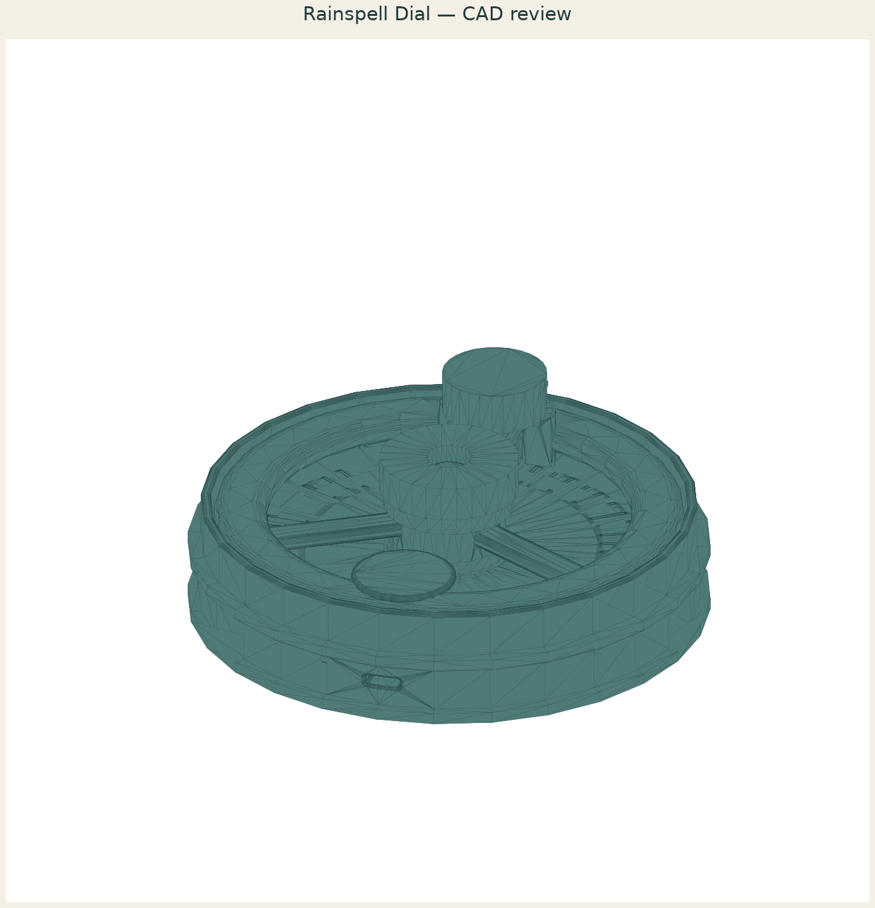

# Rainspell Dial: Three-Field Sound Garden

A palm-size, hand-powered desktop sound toy whose broad wheel carries a captive rounded gravity plectrum across three visibly different printed rib fields in the continuous sequence rain, frog-song, and crickets.

[View the verified public product page](https://www.autonomous.ai/factory/product/rainspell-dial-three-field-sound-garden)

## Workflow

Forge: `Wish -> Invent -> Make -> Release`. Inventor selection is folded into Invent.

| Stage | Attempts | Outcome |
|---|---|---|
| Wish | host | frozen |
| Match | 1 | accepted (Sonora Reed) |
| Invent | 1 | accepted |
| Make | 1 | accepted |
| Playtest | not run | Forge omission |
| Release | 1 | accepted |
| Publication | host | public |

Counts come from each stage's public `ATTEMPTS.json`. Skipped stages created no turn, artifact, or gate. Private host rejections and native session resumes are not public.

## How this toy was created

1. **Wish.** Input: a palm-size hand-powered sound toy whose broad wheel carries a captive gravity plectrum across rain, frog-song, and cricket rib fields. Output: the immutable [sanitized Wish binding](wish/wish.json); its exact wording is withheld.
2. **Invent.** Input: that Wish, the eligible Inventor roster, Taste, and blueprint. Output: Sonora Reed was selected and defined *Rainspell Dial: Three-Field Sound Garden*: a three-chamber resonator bowl, indexed 46-rib sound deck, broad wheel, captive gravity follower, sliding keeper, and quarter-turn cap. The complete concept is in [invented.json](invent/invented.json). Invent was its own native Goal.
3. **Make.** Input: the accepted concept and Sonora Reed's bound craft context. Output: the sealed six-part acoustic mechanism, with 7 STEP, 8 STL, 1 GLB, 6 legacy-layout Make evidence PNGs, exact [CAD source](make/source/), [models](make/models/), and [verification](make/verification/), all bound by [made.json](make/made.json).
4. **Playtest.** Input: the sealed Made product. Output: not run on the Forge route, recorded explicitly in [PLAYTEST-NOT-RUN.json](release/PLAYTEST-NOT-RUN.json); exact tone remains a physical unknown.
5. **Release.** Input: the sealed product plus the truthful Playtest omission. Output: the hash-bound package and printable [customer manual](release/MANUAL.pdf), bound by [release.json](release/release.json).
6. **Publication.** Input: the exact Release package plus host-held Factory authorization. Output: the verified [Factory product](https://www.autonomous.ai/factory/product/rainspell-dial-three-field-sound-garden) and sanitized [publication readback](publication/PUBLICATION.json).

## Run cost

| Measure | Value |
|---|---|
| Native Manager input tokens | unavailable — this run predates split token telemetry |
| Native Manager output tokens | unavailable — this run predates split token telemetry |
| Wish to verified publication | unavailable — the archived snapshot has no trustworthy Wish-start timestamp |

No dollar cost is inferred.

## Snapshot contents

- `wish/` — sanitized Wish binding (exact text only with explicit consent).
- `match/` — accepted Match assignment.
- `invent/` — accepted Invent contract/source and sealed superseded attempts.
- `make/` — the exact sealed Release facts, exact CAD source, models, product renders, verification, and sealed prior attempts.
- `release/MANUAL.pdf` — the exact sealed printable in-box manual.
- `release/` — accepted Release contract and exact package bytes.
- `publication/PUBLICATION.json` — sanitized public readback identities.
- `MANIFEST.json` — hashes every workflow file except itself and this README.
- `SANITIZATION.json` — source/public hashes for host-local path prefixes replaced by stable placeholders.
- Playtest was not run; Release records that omission explicitly.

This archive contains no agent session, prompt, transcript, chain of thought, host state, credentials, or raw effect receipt. Publication is not proof of physical manufacture, fit, durability, or delivery.
