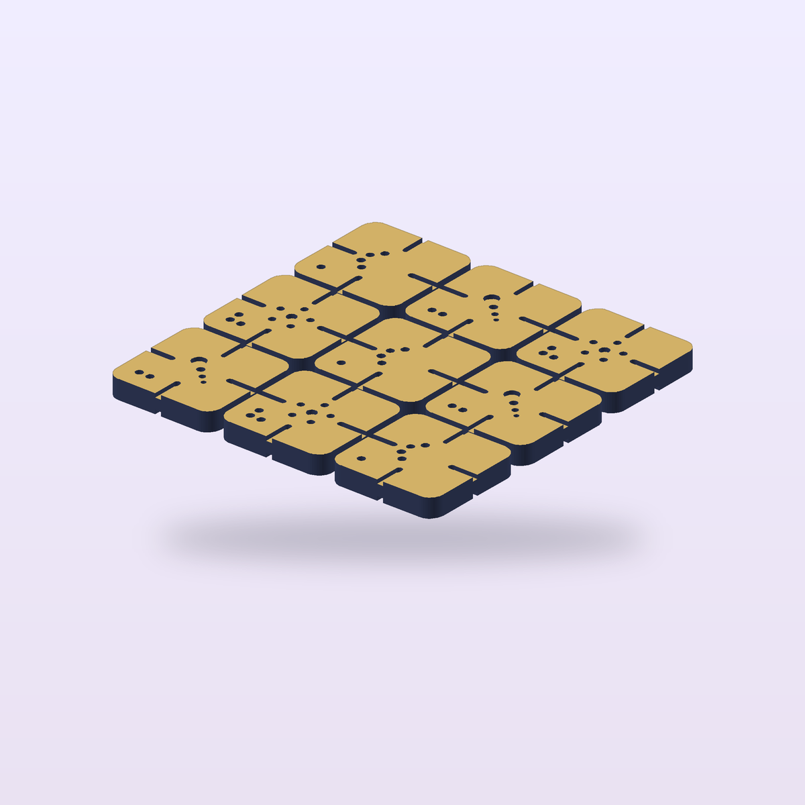

# Night-Sky Weave



Nine reversible Crescent, Comet, and Star tiles share centered edge gates, inviting loose mosaic play as snowflakes, dragons, crowns, and newly named constellations.

[View the verified public product page](https://www.autonomous.ai/factory/product/night-sky-weave)

| Frozen on this run | Value |
|---|---|
| Manager | Codex (`--manager codex`) |
| Effort | Spark (`--effort spark`) |
| Inventor | [Tess Loop](../../inventors/tess-loop/) |
| Factory | https://www.autonomous.ai/factory/product/night-sky-weave |

## Workflow

Spark: `Wish -> Make -> Release`. Inventor selection is folded into Make.

| Stage | Attempts | Outcome |
|---|---|---|
| Wish | host | frozen |
| Match | 1 | accepted (Tess Loop) |
| Invent | skipped | Spark pass-through |
| Make | 1 | accepted |
| Playtest | not run | Spark omission |
| Release | 1 | accepted |
| Publication | host | public |

Counts come from each stage's public `ATTEMPTS.json`. Skipped stages created no turn, artifact, or gate. Private host rejections and native session resumes are not public.

## How this toy was created

### 1. Wish — freeze the request

**Input:** the creator's request. **This toy's input:** Nine reversible Crescent, Comet, and Star tiles share centered edge gates, inviting loose mosaic play as snowflakes, dragons, crowns, and newly named constellations.

**Output:** an immutable, hash-bound Wish plus its frozen effort route. The exact wording is withheld; this is the sanitized public summary in [the Wish binding](wish/wish.json).

### 2. Invent — choose an Inventor and define the concept

**Input:** the frozen Wish, eligible Inventor roster with each bound Taste/skill bundle, and the product blueprint. **Output:** **Tess Loop** was selected and produced **Night-Sky Weave** — Nine chunky reversible tiles form a pocket field of continuous starlight paths. Three tactile families—Crescent, Comet, and Star—share one exact centered edge gate, so every quarter-turn or flip preserves a graceful line into the next tile while the interior symbols redirect it differently. **Concept parts:** Crescent tile family, Comet tile family, Star tile family. The complete compact concept is in [make/invented.json](make/invented.json). Spark has no separate Invent Goal; selection and this compact concept were folded into Make.

### 3. Make — turn the concept into exact product bytes

**Input:** the accepted concept, selected Inventor identity/Taste, blueprint, and any bounded revision evidence. **Output:** Nine chunky reversible constellation tiles whose centered starlight gates flow into snowflakes, dragons, crowns, and imaginary night-sky patterns, then return to a pocket-size three-by-three mosaic. The sealed snapshot contains 4 STEP, 5 STL, 1 GLB and 1 product render PNG, together with [CAD source](make/source/), [models](make/models/), and [deterministic verification](make/verification/). [The Made contract](make/made.json) binds those exact bytes.

### 4. Playtest — challenge the made product

**Input:** the sealed Made product, blueprint-required checks, and exact evidence. **Output:** not run on this effort route; Release preserves the explicit [omission record](release/PLAYTEST-NOT-RUN.json).

### 5. Release — make the customer package

**Input:** the sealed product and the passed Playtest evidence or truthful not-run record. **Output:** the hash-bound Release package, product facts, and printable [customer manual](release/MANUAL.pdf); see [the Release contract](release/release.json).

### 6. Publication — perform and verify the external effect

**Input:** the exact sealed Release package plus host-held Factory authorization; credentials never enter the native session. **Output:** [the public Factory product](https://www.autonomous.ai/factory/product/night-sky-weave) and a sanitized, hash-verified [publication readback](publication/PUBLICATION.json).

## Run cost

| Measure | Value |
|---|---|
| Native Manager input tokens | unavailable — this run recorded only a combined legacy count |
| Native Manager output tokens | unavailable — this run recorded only a combined legacy count |
| Wish to verified publication | 58m 2s (2026-08-29T10:35:15Z to 2026-08-29T11:33:17.663459+00:00) |

This run's schema-v1 `TOKENS.json` preserves a combined legacy counter, so its input/output split cannot be reported truthfully. No dollar cost is inferred. Elapsed time ends only after authenticated Factory public readback.

## Reproduce

From a checkout of this repository, verify the host and run the same Manager and effort route. This command uses the public product summary; a later run follows the same route but does not replay these exact CAD bytes.

```bash
uv run workshop doctor
uv run workshop wish --manager codex --effort spark --github 'Nine reversible Crescent, Comet, and Star tiles share centered edge gates, inviting loose mosaic play as snowflakes, dragons, crowns, and newly named constellations.'
```

If a native turn stops before Release, continue the same Wish with `uv run workshop resume <wish-id>`.

## Snapshot contents

- `wish/` — sanitized Wish binding (exact text only with explicit consent).
- `match/` — accepted Match assignment.
- Invent was skipped by this effort route; its sealed compact concept is under `make/`.
- `make/` — the exact sealed Release facts, exact CAD source, models, product renders, verification, and sealed prior attempts.
- `release/MANUAL.pdf` — the exact sealed printable in-box manual.
- `release/` — accepted Release contract and exact package bytes.
- `publication/PUBLICATION.json` — sanitized public readback identities.
- `TOKENS.json` — legacy combined token evidence; the input/output split is unavailable.
- `TIMING.json` — Wish intake to authenticated public-readback elapsed time.
- `MANIFEST.json` — hashes every workflow file except itself and this README.
- `SANITIZATION.json` — source/public hashes for host-local path prefixes replaced by stable placeholders.
- Playtest was not run; Release records that omission explicitly.

This archive contains no agent session, prompt, transcript, chain of thought, host state, credentials, or raw effect receipt. Publication is not proof of physical manufacture, fit, durability, or delivery.
