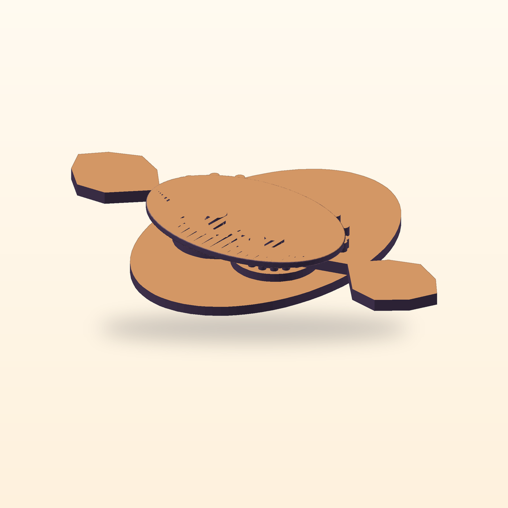

# Moon-Moth Bloom



A three-part, hardware-free hand-powered desk toy: sweeping the left wing rotates the meshed pair from a low crescent form toward a moth silhouette with six star apertures.

[View the verified public product page](https://www.autonomous.ai/factory/product/moon-moth-bloom)

| Frozen on this run | Value |
|---|---|
| Manager | Codex (`--manager codex`) |
| Effort | Forge (`--effort forge`) |
| Inventor | [Vela Bloom](../../inventors/vela-bloom/) |
| Factory | https://www.autonomous.ai/factory/product/moon-moth-bloom |

## Workflow

Forge: `Wish -> Invent -> Make -> Release`. Inventor selection is folded into Invent.

| Stage | Attempts | Outcome |
|---|---|---|
| Wish | host | frozen |
| Match | 1 | round 2 accepted (Vela Bloom) |
| Invent | 2 | round 1 superseded; round 2 accepted |
| Make | 2 | round 1 invent-revision-requested; round 2 accepted |
| Playtest | not run | Forge omission |
| Release | 1 | round 2 accepted |
| Publication | host | public |

Counts come from each stage's public `ATTEMPTS.json`. Skipped stages created no turn, artifact, or gate. Private host rejections and native session resumes are not public.

## How this toy was created

### 1. Wish — freeze the request

**Input:** the creator's request. **This toy's input:** A three-part, hardware-free hand-powered desk toy: sweeping the left wing rotates the meshed pair from a low crescent form toward a moth silhouette with six star apertures.

**Output:** an immutable, hash-bound Wish plus its frozen effort route. The exact wording is withheld; this is the sanitized public summary in [the Wish binding](wish/wish.json).

### 2. Invent — choose an Inventor and define the concept

**Input:** the frozen Wish, eligible Inventor roster with each bound Taste/skill bundle, and the product blueprint. **Output:** **Vela Bloom** was selected and produced **Moon-Moth Bloom — Inside-Stop Starplug Crescent** — A palm-size crescent chassis and two retained rigid wings form exactly three printed parts. Closed, both wings lie within a backed crescent face while fixed moon-skin bridges cover six tiny star apertures. A broad shoe integral to the left wing drives equal complete root gears, counter-rotating both wings through 82 degrees into a 136 mm moth silhouette. For tool-free assembly, both roots rotate raised from mirrored 118-degree loading gates across the 82-degree stop lands, descend together by 1.2 mm at marked 78-degree windows on the operating side, and enter low capture roofs by 76 degrees before approaching any entry lip or moon-skin bridge. **Concept parts:** Crescent pebble chassis with inside-stop paired-drop pockets, Left moon-moth wing with integral thumb slider and press moon, Right moon-moth driven wing with press moon. The complete compact concept is in [invent/invented.json](invent/invented.json). Invent was a separate native Goal.

### 3. Make — turn the concept into exact product bytes

**Input:** the accepted concept, selected Inventor identity/Taste, blueprint, and any bounded revision evidence. **Output:** A three-part hand-powered reveal toy whose paired geared wings bloom from a low moon-pebble chassis and uncover six star apertures. The sealed snapshot contains 4 STEP, 4 STL, 1 GLB and 1 product render PNG, together with [CAD source](make/source/), [models](make/models/), and [deterministic verification](make/verification/). [The Made contract](make/made.json) binds those exact bytes.

### 4. Playtest — challenge the made product

**Input:** the sealed Made product, blueprint-required checks, and exact evidence. **Output:** not run on this effort route; Release preserves the explicit [omission record](release/PLAYTEST-NOT-RUN.json).

### 5. Release — make the customer package

**Input:** the sealed product and the passed Playtest evidence or truthful not-run record. **Output:** the hash-bound Release package, product facts, and printable [customer manual](release/MANUAL.pdf); see [the Release contract](release/release.json).

### 6. Publication — perform and verify the external effect

**Input:** the exact sealed Release package plus host-held Factory authorization; credentials never enter the native session. **Output:** [the public Factory product](https://www.autonomous.ai/factory/product/moon-moth-bloom) and a sanitized, hash-verified [publication readback](publication/PUBLICATION.json).

## Run cost

| Measure | Value |
|---|---|
| Native Manager input tokens | unavailable — this run recorded only a combined legacy count |
| Native Manager output tokens | unavailable — this run recorded only a combined legacy count |
| Wish to verified publication | 2h 58m 27s (2026-08-29T11:34:12Z to 2026-08-29T14:32:39.386464+00:00) |

This run's schema-v1 `TOKENS.json` preserves a combined legacy counter, so its input/output split cannot be reported truthfully. No dollar cost is inferred. Elapsed time ends only after authenticated Factory public readback.

## Reproduce

From a checkout of this repository, verify the host and run the same Manager and effort route. This command uses the public product summary; a later run follows the same route but does not replay these exact CAD bytes.

```bash
uv run workshop doctor
uv run workshop wish --manager codex --effort forge --github 'A three-part, hardware-free hand-powered desk toy: sweeping the left wing rotates the meshed pair from a low crescent form toward a moth silhouette with six star apertures.'
```

If a native turn stops before Release, continue the same Wish with `uv run workshop resume <wish-id>`.

## Snapshot contents

- `wish/` — sanitized Wish binding (exact text only with explicit consent).
- `match/` — accepted Match assignment.
- `invent/` — accepted Invent contract/source and sealed superseded attempts.
- `make/` — the exact sealed Release facts, exact CAD source, models, product renders, verification, and sealed prior attempts.
- `release/MANUAL.pdf` — the exact sealed printable in-box manual.
- `release/` — accepted Release contract and exact package bytes.
- `publication/PUBLICATION.json` — sanitized public readback identities.
- `TOKENS.json` — legacy combined token evidence; the input/output split is unavailable.
- `TIMING.json` — Wish intake to authenticated public-readback elapsed time.
- `MANIFEST.json` — hashes every workflow file except itself and this README.
- `SANITIZATION.json` — source/public hashes for host-local path prefixes replaced by stable placeholders.
- Playtest was not run; Release records that omission explicitly.

This archive contains no agent session, prompt, transcript, chain of thought, host state, credentials, or raw effect receipt. Publication is not proof of physical manufacture, fit, durability, or delivery.
